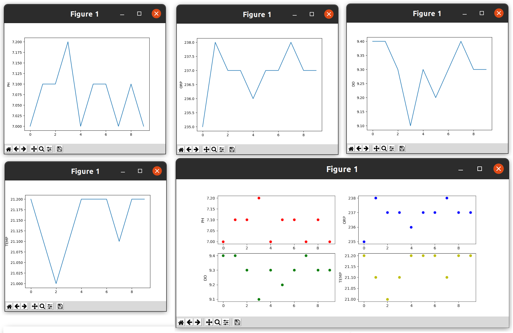
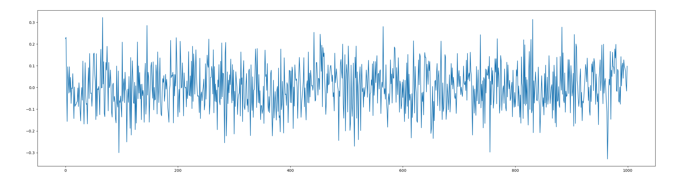
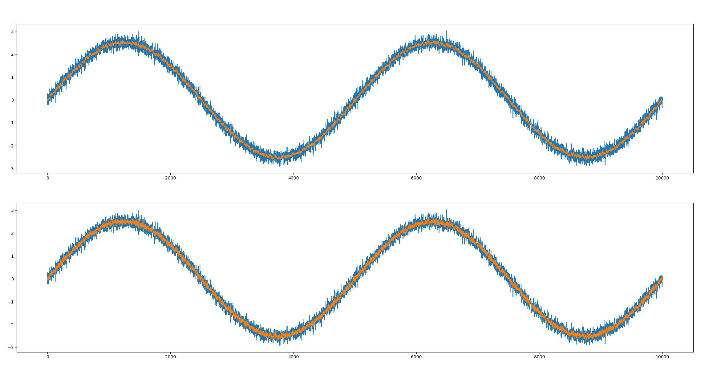

# Python 3 

Questa guida fornisce una veloce panoramica a quelli che sono gli aspetti sintattici e le funzionalità principali del linguaggio di programazzione **Python 3**.
Python è un linguaggio di programmazione ad _alto livello_ che fa della leggibilità e della semplicità il suo punto di forza principale.  
Python è caratterizzato da una sintassi snella e molto vicino al linguaggio umano, il che ne aumenta notavolmente la leggibilità e la comprensibilità da parte degli utenti programmatori; ad ultriore supporto alla leggibilità vi è l'obbligo di indentazione per separare i blocchi funzionali di codice  anziché le classiche parentesi.
Python è estremamente versatile, può essere usato e come linguaggio convenzionale e come linguaggio di scripting, supportando inoltre il paradigma di programmazione a oggetti esportando i principali costrutti delle classi e le funzionalità di ereditarietà multipla fra classi.  
Altro punto di forza di Python è la vasta gamma di librerie standard messe a disposizione che permettono una veloce e facile interazione con le principali funzionalità esportate dal sistema operativo, connessioni di rete, programmazione multi-thread e quant'altro. Sono inoltre disponibili un'enorme varietà di librerie aggiuntive che possono essere scaricate e importate in maniera semplicissima, messe a disposizione nel [repository ufficiale](https://pypi.org) di librerie software di terze parti per Python.  
Sebbene Python venga considerato un linguaggio **interpretato**, in realtà il codice sorgente non viene convertito direttamente in linguaggio macchina ma viene prima sottoposto a una fase di pre-compilazione in _bytecode_ (è un linguaggio intermedio - più astratto - tra il linguaggio macchina e il linguaggio di programmazione, usato per descrivere le operazioni che costituiscono un programma), che viene successivamente interpretato un comando per volta, traducendo ed eseguendo ogni singola istruzione del programma. Si può dunque dire che il  codice sorgente del programma viene eseguito senza la necessità di creare un file oggetto eseguibile. L'esecuzione è più lenta rispetto a un codice compilato, tuttavia il bytecode è quasi sempre riutilizzato dopo la prima esecuzione del programma, evitando così di reinterpretare ogni volta il sorgente e migliorando le prestazioni. Inoltre è possibile distribuire programmi Python direttamente in bytecode (file `.pyc`), saltando totalmente la fase di interpretazione da parte dell'utilizzatore finale e ottenendo programmi Python a sorgente chiuso.  
Ciò garantisce anche una più facile redistribuzione multi-piattaforma del codice, il quale può essere eseguito da un qualsiasi sistema (GNU/Linux, Windows, Mac OS, Android) che abbia installata una versione dell'interprete Python.  
## Interprete ed esecuzione
L'interprete Python 3 può essere scaricato dal [sito ufficiale](https://www.python.org/download/) selezionando la piattaforma che si sta utilizzando. La maggior parte delle distribuzioni Linux, tuttavia, forniscono già nativamente un'installazione dell'interprete Python 3, la cui versione dell'interprete può essere verificata digitando da terminale il comando 
```bash
$ python3 --version
```
In caso contrario, qualora non fosse installata nessuna versione dell'interprete, è possibile rimediare eseguendo da terminale il comando 
```bash
$ sudo apt get install python3
```

> :warning:  Attenzione a **non digitare** il comando `$ sudo apt get install python` anziché `python3`.  
`python` fa riferimento alla versione 2.x del linguaggio che oltre a differire nella sintassi da Python 3, ha raggiunto il suo _fine-vita_ il giorno 01/01/2020, ed è quindi consigliata la migrazione a Python 3.

Una volta installato l'interprete è possibile eseguire un programma Python in 3 modi diversi:
- utilizzando l'interprete interattivo
- invocando l'interprete da terminale per eseguire uno script
- rendendo eseguibile uno script Python

L'interprete interattivo può essere invocato da terminale digitando semplicemente
```python
$ python3
Python 3.8.5 (default, Jan 27 2021, 15:41:15) 
[GCC 9.3.0] on linux
Type "help", "copyright", "credits" or "license" for more information.
>>> 
```
che mostra le informazioni sulla versione correntemente installata dell'interprete e mette a disposizione un prompt dei comandi in cui è possibile eseguire i singoli comandi in real-time (l'analogo della `command window` di Matlab), mostrando immediatamente il risultato dell'operazione. L'interprete interattivo svolge un ruolo cruciale nel velocizzare la fase di testing iniziale in cui si vuole verificare la correttezza di una singola operazione o il funzionamento di un nuovo modulo o di una funzione. L'interprete interattivo mette inoltre a disposizione alcuni strumenti di supporto come il comando `help(<fun>)` per ricevere informazioni sull'utilizzo delle funzioni. 

> :pencil: Grazie all'interprete interattivo si possono provare istantaneamente le operazioni base per entrare in confidenza col linguaggio o con nuovi moduli e funzioni.
>```python
>$ python3
>Python 3.6.9 (default, Nov  7 2019, 10:44:02) 
>[GCC 8.3.0] on linux
>Type "help", "copyright", "credits" or "license" for more information.
>>>> a = 2
>>>> b = 3
>>>> a+b
>5                          <-- PREVIOUS OPERATON RESULT
>>>> print("Hello World")
>Hello World                <-- PREVIOUS FUNCTION RESULT
>>>> 
>```

Qualora le operazioni da eseguire siano più complesse e di numero tale per cui la loro esecuzione ripetitiva risulti onerosa dal punto di vista della riscrittura delle operazioni, può risultare conveniente creare uno script da eseguire periodicamente. Uno script non è altro che un file di testo con estensione `*.py` contenente istruzioni Python. Uno script non ha necessità di un metodo `main` da eseguire, i singoli comandi vengono eseguiti dal primo all'ultimo come se fossero inseriti manualmente nell'interprete interattivo. Unica differenza: le stampe a video sono esguite solo se fatte dalle apposite funzioni demandate a farlo (per intendersi: le `print`).
Il programma termina e rilascia tutte le risorse allocate dopo l'esecuzione dell'ultimo comando presente nello script. 
Uno script può essere lanciato da terminale mediante l'invocazione esplicita dell'interprete seguita dal nome del file `*.py`.

> :pencil: I comandi Python possono essere raggruppati in un file di testo con apposita estensione (`test.py`) per poi essere eseguiti da terminale.
> ```python
> a = 2
> b = 3
> a+b                      <-- OUTPUT NOT DISPLAYED
> print("Hello World")
> ```
> 
> ```python
> $ python3 test.py
> Hello World              <-- SCRIPT OUTPUT
> ```

Un altro modo per eseguire un programma Python è rendere eseguibile il codice sorgente aggiungendo l'_hashbang_ `#!/usr/bin/env python3` ad inizio file, per indicare al sistema operativo quale interprete utilizzare per eseguire lo script stesso. Oltre a tale operazione, è necessario conferire allo script i permessi di esecuzione affinché possa essere lanciato da terminale come un programma eseguibile qualsiasi.

> :pencil: Per rendere eseguibile un file Python bisogna aggiungere l'hashbang come prima riga del file `test.py` e modificare i suoi permessi.
> ```python
> #!/usr/bin/env python3   <-- SPECIFY PYTHON INTERPRETER
> a = 2
> b = 3
> a+b                      <-- OUTPUT NOT DISPLAYED
> print("Hello World")
> ```
> 
> ```python
> $ chmod +x test.py       <-- ADD EXECUTION PERMITS
> $ ./test.py
> Hello World              <-- SCRIPT OUTPUT
> ```

## Sintassi - Variabili & Operatori
Python è un linguaggio con **tipizzazione dinamica forte** delle variabili. La tipizzazione dinamica consente di modificare a runtime il tipo delle variabili, senza richiedere una loro preventiva dichiarazione del tipo. L'aggettivo _forte_ sta ad indicare che le operazioni aritmetiche sono ammesse solo tra variabili dello stesso tipo, sarà dunque necessario introdurre meccanismi di _casting_ delle variabili per poter eseguire le varie operazioni.
Le variabili sono classificate nei seguenti tipi (è interessante sottolineare come quasi tutto in Python sia realizzato per mezzo di classi, compresi i tipi di base che sono mappati attraverso le apposite classi _wrapper_):
- **Numeric**: i tipi primitivi raggruppati sotto tale categoria generica rispettano l'imposizione di tipizzazione forte e rientrano nella stesso tipo. Ne fanno parte:
    - **Integer** `<class 'int'>`: non vi è differenza tra interi a diversa precisione, gli interi in Python hanno precisione arbitraria.
    - **Float** `<class 'float'>`: rappresentano i numeri decimali in notazione a virgola mobile, con tutti i comuni problemi computazionali annessi.
    - **Complex** `<class 'complex'>`: introduce come tipo primitivo i numeri complessi, in cui l'unita immaginaria è espressa come `1j`.
- **String** `<class 'str'>`: non vi è differenza tra singoli caratteri (char) e stringhe. Le stringhe sono oggetti immutbili: una volta create non possono essere dunque modificate.
- **Boolean** `<class 'bool'>`: i valori che può assumere sono `True` o `False`.

Gli operatori elementari da usare fra variabili sono quelli classici di quasi tutti i linguaggi di programmazione, con qualche piccola eccezione - come l'elevazione a potenza ottenuta attraverso l'operatore `**` - o qualche novità - gli operatori di _membership_ o di appartenenza ad insiemi-. Gli operatori elementari possono essere raggruppati in nel seguente modo:
- **Aritmetici**: `+  ,  -  ,  *  ,  /  ,  %  ,  //  ,  **`
- **Relzionali**: `==  ,  !=  ,  <  ,  >  ,  <=  ,  >= `
- **Assegnazione**: `+=  ,  -=  ,  *=  ,  /=  ,  %=  ,  //=  ,  **=`
- **Binari**: `&  ,  |  ,  ^  ,  ~  ,  <<  ,  >>`
- **Logici**: `and  ,  or  ,  not`
- **Appartenenza**: `in  ,  not in`
- **Uguaglianza**: `is  ,  is not`

Alcune funzioni  utili messe a disposizione dalla libreria base di python sono le funzioni di conversione di tipo (_casting_), per trasformare le variabili da un tipo all'altro (qualora il passaggio sia compatibile): ` int(), float(), complex(), str(), bool()`, o alcune funzioni matematiche di base: `abs(), pow(), round()`.

> :pencil: Tramite l'interprete interattivo è possibile verificare i concetti di tipizzazione dinamica forte delle variabili
> ```python
> >>> a = 2                                               <-- Integer
> >>> b = 3.5                                             <-- Float
> >>> a+b
> 5.5                                                     <-- Float
> >>> b = 'hi'                                            <-- String (b change type)
> >>> a+b
> Traceback (most recent call last):                      <-- Error (b and c have different type)
>   File "<stdin>", line 1, in <module>
> TypeError: unsupported operand type(s) for +:'int' and 'str'
> >>>
> ```
> e verificare il risultato prodotto dall'utilizzo degli operatori.
> ```python
> >>> a = '2'             <-- String
> >>> b = 3.5             <-- Float
> >>> int(a)+b
> 5.5                     <-- Float
> >>> a+str(b)
> '23.5'                  <-- String (concatenation)
> >>> c = 11              <-- Integer
> >>> c/3.5
> 3.142857142857143       <-- Float (division)
> >>> round(c/3.5,3)
> 3.143                   <-- Approximation with 3 decimal positions
> >>> c//3.5
> 3.0                     <-- Float  (integer part of division)
> >>> c%3.5
> 0.5                     <-- Float  (remainder of division)
> ```
 
## Sintassi - Costrutti di Controllo Flusso
Al fine di mantenere un'elevata leggibilità del codice, i fondatori di Python scelsero di imporre l'uso dell'indentazione del codice per separare i blocchi di controllo nel codice, anziché fare ricorso all'uso delle parentesi (`{` `}`) o di parole chiave (come `begin` o `end`) come di prassi accade nella maggior parte dei linguaggi di programmazione. Inoltre, come da raccomandazioni della [PEP 8 - Style Guide for Python Code](https://www.python.org/dev/peps/pep-0008), è consigliato utilizzare 4 spazi bianchi come tabulazione (ogni editor di testo decente, e degno di questo nome, permette di configurare tale parametro nella sezione _preferenze_).

#### Blocchi di Alternativa
Il loro scopo e il loro utilizzo è alquanto triviale per chi ha una minima infarinatura di programmazione.
```python
if condition1:
    operation1
elif condition2:
    operation2
else:
    operation3
```
#### Blocchi Iterativi
I cicli `for` in Python utilizzano il concetto di _iteratore_ su strutture dati e prevede intrinsecamente la costruzione di una struttura contenente gli indici su cui iterare se si vuole fare ricorso a questi ultimi.
```python
for i in range(10):                # for i=0:9
    operation on the index
    
for i in range(2,10):              # for i=2:9
    operation on the index
    
for i in range(1,10,2):            # for i=1:2:9
    operation on the index
    
for e in l:
    operation on the element
```
Alternativa per iterare è data dal costrutto `while`:

```python    
while condition:
    operation
```
Entrambi i costrutti d'iterazione permettono l'interruzione del ciclo prima del raggiungimento naturale della fine attraverso l'istruzione di `break` (in caso di cicli innestati è interrotto il più interno), oppure l'interruzione dell'iterazione corrente mediante l'istruzione `continue`.

#### Blocchi di Intercettazione Eccezioni
Python supporta la gestione a runtime delle **eccezioni**, ovvero degli errori generati durante l'esecuzione del programma. Si tratta ovviamente di errori a runtime, quindi non di natura sintattica, ma di consistenza dei dati durante l'utilizzo di funzioni o l'esecuzione di operazioni. È possibile catturare eccezioni specifiche per gestire opportunamente il caso difforme o propagare l'eccezione a livello successivo mediante la parola chiave `raise`, oppure intercettare un'eccezione qualsiasi per evitare l'arresto anomalo del programma. È inoltre possibile utilizzare il blocco `finally` per eseguire operazioni delicate che devono essere eseguite qualsiasi sia l'esito di una determinata operazione, come ad esempio la chiusura di file aperti, rilasciare lucchetti per la gestione della concorrenza, chiusura socket e quant'altro.
```python
try:
    operations         <-- Operations that can be raise exception
except ErrorName:      <-- Cactch 'ErrorName' exception
    operations
except:                <-- Cactch others exception
    operations
finally:
    operations         <-- Operation executed in both cases
```

## Sintassi - Strutture Dati
In Python sono presenti diverse strutture base per l'organizzazione dei dati. 
### Liste
Le liste sono delle strutture di dati molto simili agli array, ma con profonde differenze. Le liste rappresentano una collezione ordinata (dal punto di vista posizionale), mutabile, di elementi eterogenei. Non è dunque necessario che gli elementi all'interno di una lista siano tutti di uno stesso tipo, è possibile accedere agli elementi facendo ricorso a parentesi quadre (`[` `]`) contenti l'indice dell'elemento a cui si vuole accedere; l'indicizzazione degli elementi parte dal valore 0. La differenza principale con gli array comunemente presenti negli altri linguaggi di programmazione è data dalla proprietà delle liste di essere oggetti mutabili, ovvero che possono variare la loro dimensione dinamicamente e risiedono perciò nella parte di memoria denominata _heap_. Python è dotato di un meccanismo di **garbage collection**, non è quindi richiesta la liberazione manuale dei blocchi di memoria utilizzati come accade ad esempio in C dove è prudente l'utilizzo della funzione `free` in seguito alla dismissione di alcune variabili.

> :pencil: Le liste possono essere inizializzate dirattamente tramite assegnamento a variabile utilizzando le parentesi quadre `[]` per delimitare i suoi elementi, separati a loro volta con virgole. È possibile sperimentare l'accesso agli elementi facendo uso dei meccanismi di _indexing_ e _slicing_.
> ```python 
> >>> l = [1,2,3,'c']   <-- create a list
> >>> l[0]              
> 1                     <-- element in position 0
> >>> l[0:2]
> [1, 2]                <-- elements in position 0:1
> >>> l[:]
> [1, 2, 3, 'c']        <-- all elements
> >>> l[1:-1]
> [2, 3]                <-- elements from second position to end (excluding) 
> >>> l[-1]
> 'c'                   <-- element in end position
> >>> l[1:]
> [2, 3, 'c']           <-- elements from second position to end (including)
> ```

La `<class 'list'>` permette l'invocazione di alcuni metodi di utilità sulle proprie istanze, per realizzare le funzioni di inserimento e rimozione di elementi nella lista, concatenazione e quant'altro. Un esempio è dato dai metodi seguenti:
- `.append(e)`: aggiunge in ultima posizione l'elemento `e`
- `.remove(e)`: rimuove la prima occorenza dell'elemento `e`
- `.extend(l1)`: concatena in coda la lista `l1`
- `.pop(i)`: rimuove l'elemento in posizione `i` e ritorna il suo valore

Altro metodo utile, appartenente alla libreria standard di Python è il metodo `len(l)`, che ritorna il numero di elementi di cui è composta la lista `l`.

> :warning: La caratteristica di dinamicità di strutture come le liste può sembrare una notevole comodità qualora il numero di elementi da conservare non sia fisso o non sia noto a priori, tuttavia tale caratteristica nasconde anche alcune criticità. Qualora si stia effettuando un ciclo iterativo **è fortemente sconsigliato** effettuare operazioni contestuali di modifica alla lista  onde evitare di incorrere in problematiche dovute alla modifica concorrente della struttura - in gergo noto agli sviluppatori Java: `ConcurrentModificationException` -. In altre parole la modifica della struttura dati può portare a problematiche di inconsistenza degli indici nel caso in cui le operazioni di modifica siano fatte contestualmente all'iterazione, tali problematiche possono scaturire `IndexError` per lo sforamento degli indici e causare l'interruzione del programma o, peggio ancora generare un'infida incosistenza dei dati.  
> 
> :pencil: È possibile analizzare nel dettaglio ciò che succede in memoria alla lista durante le iterazioni quando avvengono modifiche concorrenti.
> ```python
> l = [1,2,3,3,6]
> try:
>     for i in range(len(l)):
>         if(l[i]==3):
>             print(i)
>             l.pop(i)
> except:
>     print('IndexError:list index out of range,Concurrent modification Error')
> print(l)
> # [1,2,3,6]
> ```
> | Iteration   | Element   | List in memory |
> | ---------   | -------   | -------------- |
> |  i = 0      | l[0] = 1  | l=[1,2,3,3,6]  |
> |  i = 1      | l[1] = 2  | l=[1,2,3,3,6]  |
> |  i = 2      | l[2] = 3  | l=[1,2,3,3,6] --> [1,2,3,6] |
> |  i = 3      | l[3] = 6  | l=[1,2,3,6]    |
> |  i = 4      | l[4] = ?  | `IndexError`  |
> 
> Un algoritmo per la rimozione da una lista di tutti gli elementi con un certo valore può essere implementato evitando di utilizzare gli indici come mostrato di seguito:
> ```python
> l = [1,2,3,3,6]
> while 3 in l:
>     l.remove(3)
> print(l)
> # [1,2,6]
> ```

La presenza nativa di strutture come le liste, permette di realizzare in maniera semplice strutture di immagazzinamento spesso utilizzate durante la stesura di algoritmi di uso comune come le **code** o uno _stack_.

> :pencil:  Esempi di code con politiche di inserimento ed estrazione di tipo _first-in-first-out_ (FIFO) o _last-in-first-out_ (LIFO).
> #### FIFO QUEUE:
> ```python
> >>> fifo = []
> >>> fifo.append(1)  # [1]
> >>> fifo.append(1)  # [1,1]
> >>> fifo.append(2)  # [1,1,2]
> >>> fifo.append(3)  # [1,1,2,3]
> >>> fifo.append(5)  # [1,1,2,3,5]
> >>> fifo.pop(0)
> 1                   # [1,2,3,5]
> >>> fifo.pop(0)
> 1                   # [2,3,5]
> >>> fifo.pop(0)
> 2                   # [3,5]
> >>> fifo.append(8)  # [3,5,8]
> >>> fifo.pop(0)
> 3                   # [5,8]
> >>> fifo.append(13) # [5,8,13]
> ```
> #### LIFO QUEUE:
> ```python
> >>> lifo = []
> >>> lifo.append(1)  # [1]
> >>> lifo.append(1)  # [1,1]
> >>> lifo.append(2)  # [1,1,2]
> >>> lifo.append(3)  # [1,1,2,3]
> >>> lifo.append(5)  # [1,1,2,3,5]
> >>> lifo.pop(-1)
> 5                   # [1,1,2,3]
> >>> lifo.pop(-1)
> 3                   # [1,1,2]
> >>> lifo.pop(-1)
> 2                   # [1,1]
> >>> lifo.append(8)  # [1,1,8]
> >>> lifo.pop(-1)
> 8                   # [1,1]
> >>> lifo.append(13) # [1,1,13]


### Tuple
Le tuple sono strutture dati simili alle liste in quanto definizione e accesso agli elementi, la differenza principale è che le tuple sono collezioni immutabili, dunque non è possibile modificare, aggiungere o rimuovere elementi.
> :pencil: La definizione delle tuple avviene mediante parentesi tone `()`; i metodi di accesso agli elementi rimangono gli stessi usati per le liste. Una tupla contenene un solo elemento richiede comunque l'uso di una virgola dopo il primo elemento, senza che ve ne sia uno successivo.
> ```python
> >>> t = (1,2,3,'c')   <-- create a tuple
> >>> t[0]              
> 1                     <-- element in position 0
> >>> t[0:2]
> (1, 2)                <-- elements in position 0:1
> >>> t = (1)           <-- is not a tuple
> >>> t = (1,)          <-- tuple with only an element

### Dizionari
Python è uno dei pochi linguaggi di progrmmazione a fornire nativamente strutture dati di tipo **chiave-valore**. Tali strutture, note spesso in informatica come _mappe_, sono strutture in cui vi è una corrispodenza tra una chiave univoca e un dato ad essa associato: le chiavi di un dizionario sono un insieme di elementi distinti - non ci possono essere duplicati di una chiave - a cui possono essere associate istanze di una qualsiasi classe, come anche collezioni tipo liste, tuple o dizionari stessi. La definizione dei dizionari avviene mediante parentesi graffe (`{` `}`), in cui le coppie `chiave:valore` sono separate fra loro da virgole. L'accesso agli elementi avviene sempre attraverso parentesi quadre `[]` all'interno delle quali è specificata la chiave dell'elemento a cui si vuole accedere. L'ordinamento interna degli elementi nei dizionari avviene secondo l'ordine temporale di inserimento degli elementi, è possibile estrarre la lista delle chiavi e dei valori attraverso i metodi di classe `keys` e `values`.

> :pencil: L'aggiunta o la modifica di un elemento in un dizionario può essere effettuata mediante assegnazione diretta della coppia `chiave:valore`
> ```python
> >>> d = {'state0':12, 'state1':67, 'default':100}   <-- create a dictionary
> >>> d['state1']              
> 67                                                  <-- value of 'state1' element
> >>> d['state2'] = 13                                <-- add the pair 'state2':13
> >>> list(d.keys())
> ['state0', 'state1', 'default', 'state2']           <-- list of keys
> >>> list(d.values())
> [12, 67, 100, 13]                                   <-- list of values
> >>> 
> ```

Tra i metodi messi a disposizione da `<class 'dict'>` si annoverano:
- `.keys()`: restituisce la lista delle chiavi del dizionario.
- `.values()`: restituisce la lista dei valori associati alle chiavi del dizionario.
- `.items()`: restituisce una lista contenente tutte le tuple `(chiave,valore)` che compongono il dizionario. 
- `.clear()`: rimuove tutte le coppie `chiave:valore`, in termini di effetti equivale ad assegnare alla variabile il dizionario vuoto `{}`.
- `.copy()`: effettua una copia identica in memoria del dizionario.
- `.update(d1)`: aggiunge al dizionario su cui viene invocato il metodo tutte le coppie `chiave:valore` presenti nel dizionario `d1`.

> :pencil: L'operazione di unione di due dizionari `d1` `d2` può essere fatta in diversi modi: attraverso il metodo `update`, previa copia del primo dizionario attraverso il metodo `copy`, qualora non si volesse modificarne contenuto; oppure attraverso il costrutto `{**d1,**d2}` che implica la costruzioe di un nuovo dizionario ottenuto per copia dei dizionari `d1` e `d2`. Qualora tra i due dizionari siano presenti chiavi duplicate, il dizionario unione avrà come valore associato alla chiave il valore del secondo dizionario - secondo l'ultima sintassi - o del dizionario argomento del metodo `update` se si usa il primo aproccio.
> ```python
> >>> d1 = {1:'uno',2:'due'}
> >>> d2 = {1:'UNO',3:'TRE'}
> >>> {**d1,**d2}
> {1: 'UNO', 2: 'due', 3: 'TRE'}        <-- d1 U d2 (d2 override d1
> >>> {**d2,**d1}
> {1: 'uno', 3: 'TRE', 2: 'due'}        <-- d2 U d1 (d1 override d2)
> >>> d_union = d1.copy()
> >>> d_union.update(d2) 
> >>> d_union
> {1: 'UNO', 2: 'due', 3: 'TRE'}        <-- d1 U d2 (d2 override d1)
> >>> d_union = d2.copy()
> >>> d_union.update(d1) 
> >>> d_union
> {1: 'uno', 3: 'TRE', 2: 'due'}        <-- d2 U d1 (d1 override d2)
> >>> 
> ```

### Insiemi
Altra struttura dati _built-in_ di Python sono gli insiemi appartenenti a <class 'set'>. I set sono molto simili alla loro definizione matematica, ovvero sono delle collezioni non ordinate di elementi che non ammettono duplicati. La loro definizione avviene mediante parentesi graffe (`{` `}`) e gli elementi sono separati da vigole.
I metodi esportati dalla relativa classe, ricordano le operazioni matematiche comuni effettuate fra insiemi:
- `.difference(s2)`: 
- `.intersection(s2)`: 
- `.union(s2)`: 
- `.issubset(s2)`: 

> :pencil: Le operzioni insiemistiche possono essere verificate facilmente attraverso l'interprete interattivo
> ```python
> >>> s1 = {1,2,3,4,5,6,7,8,9}
> >>> s2 = {2,3,5,7}
> >>> s1.difference(s2)               <-- s1 \ s2
> {1, 4, 6, 8, 9}
> >>> s1.intersection(s2)
> {2, 3, 5, 7}                        <-- s1 ∩ s2
> >>> s1.union(s2)
> {1, 2, 3, 4, 5, 6, 7, 8, 9}         <-- s1 U s2
> >>> s1.issubset(s2)
> False                               <-- s1 ⊆ s2
> >>> s2.issubset(s1)
> True                                <-- s2 ⊆ s1
> >>> 
> ```


Per una visione completa delle strutture dati _built-in_ messe a disposizione da Python e una conscenza esaustiva delle funzionalità e dei metodi esportati, si invita a consultare la documentazione ufficiale presente sui siti:  
- https://docs.python.org/3/tutorial/datastructures.html  
- https://docs.python.org/3/library/stdtypes.html

## Sintassi - Funzioni
Python supporta come la stragrande maggioranza dei linguaggi di programmazione il paradigma di _programmazione funzionale_. Le funzioni vengono definite per mezzo della parola chiave `def` e non richiedono di specificare esplicitamente il tipo di ritorno della funzione.
```python
def fun_1(param1, param2):
    # operations
    return ret_val
```
Peculiarità di python è la possibilità di fare una return multipla, permettendo di restituire più risultati senza la necessità di dover incapsulare i valori all'interno di strutture.
> :pencil: È possibile creare una funzione che restituisca contemopraneamente due risultati d'interesse per una stessa operazione.  
> ```python
> >>> def integer_division(dividend, divider):
> ...     q = dividend//divider
> ...     r = dividend%divider
> ...     return q,r
> ... 
> >>> q, r = integer_division(5,3)
> >>> print('5/3: \n')
> >>> print('quotient: '+str(q))
> quotient: 1
> >>> print('rest: '+str(r))
> rest: 2
> >>> 
> ```

Python permette inoltre di specificare dei parametri opzionali nelle funzioni: i **keyword arguments**. Tali parametri sono caratterizzati dall'avere un nome significativo ed un valore di default qualora durante l'invocazione del metodo non sia stato specificato.
> :pencil: È sempre possibile fare ricorso all'interprete interattivo per prendere dimestichezza con l'utilizzo delle keyword arguments.
> ```python
> >>> def fun_1(param1, param2=3, param3=5):
> ...     return param1+param2+param3
> ... 
> >>> print(fun_1(2))
> 10
> >>> print(fun_1(2,1))
> 8
> >>> print(fun_1(2,param3=1))
> 6
> >>> 
> ```

## Librerie e Moduli Esterni
Un altro aspetto che ha reso Python uno dei linguaggi più utilizzati al giorno d'oggi è la vasta collezione di librerie e moduli messi a disposizione dalla libreria standard di Python, oltre alle librerie di terze parti messe a disposizione dalla vasta community di utilizzatori.
Librerie e moduli sono insiemi di funzioni, costanti o classi, definite in un file esterno, che possono essere incluse all'interno di uno script per permetterne l'utilizzo. L'inclusione delle librerie viene fatto attraverso la parola chiave `import` per importare tutte le entità del modulo, o, sfruttando prima la parola chiave `from`, si selezionano solo alcune funzionalità.  
La lista delle librerie standard di Python può essere consultata al seguente [link](https://docs.python.org/3/py-modindex.html). Tali librerie sono installate in automatico nelle cartelle di sistema quando si installa l'interprete Python, di seguito se ne riportano alcune tra le più usate a titolo d'esempio:
- `math`: contiene una larga varietà di funzioni matematiche come: `sqrt`,`log`,`sin`,`cos`.
- `decimal`: supporta delle funzioni per garantire la correttezza di operazioni aritmetiche con numeri a _virgola mobile_.
- `random`: libreria per la generazione di numeri e sequenze casuali.
- `_thread` e `threading`: librerie di utilità per la programmazione concorrente (_multithreading_).
- `time`: funzioni di utilità (`sleep`,`localtime`) e conversione dei dati temporali (`strftime`,`mktime`).
- `socket`: libreria per la gestione delle connessioni di rete (TCP, UDP).

> :warning: :pencil: I numeri decimali, appartenenti alla `<class 'float'>`, non possiedono una rappresentazione esatta nella notazione binaria a _virgola mobile_, ciò implica che possono verificarsi alcuni errori dovuti alla propagazione degli errori di approssimazione intrinseci alla rappresentazione decimale. Per comprendere meglio la problematica appena citata è possibile provare a verificare il risultato prodotto da alcune semplici operazioni tra numeri decimali.
> ```python
> >>> 3*0.1-0.3
> 5.551115123125783e-17
> ```
> Ciò comporta che quando si devono eseguire blocchi alternativi basati sull risultato di operazioni matematiche è fortemente raccomandato **non usare** gli operatori d'identità quali `==` o `!=`, bensì prevedere un valore di tolleranza di precisione e utilizzare gli operatori relazionali del tipo `<=` e `>=`. 

Oltre ai moduli della libreria standard, sono disponibili una grande varietà di moduli esterni sviluppati da terze parti, raccolti all'interno del repository ufficiale di pacchetti Python: [pypi](https://pypi.org/). I moduli presenti in tale libreria possono essere scaricati, installati e gestiti dall'apposito gestore di pachetti `pip`. Il gestore di pacchetti può essere installato direttamente da terminale attraverso il comando
```bash
$ sudo apt install python3-pip
```
Tale strumento aiuta nella gestione dei pacchetti esterni distribuiti attraverso il repository ufficiale, permettendo di effettuare operazioni di ricerca, installazione delle dipendenze, rimozione di paccheti, ecc. I comandi possono essere eseguiti direttamente da terminale:
- `$ python3 -m pip search PACKAGE_NAME`: ricerca il modulo specificato in pypi.
- `$ python3 -m pip install PACKAGE_NAME`: installa il modulo da pypi.
- `$ python3 -m pip check`: verifica che tutte le dipendenze dei moduli siano soddisfatte.
- `$ python3 -m pip uninstall PACKAGE_NAME`: rimuove un modulo precedentemente installato.
- `$ python3 -m pip list`: mostra la lista di tutti i pacchetti installati da pypi.

Tra i moduli presenti nel repository pypi vi sono:
- `Matplotlib`: che racchiude una serie di strumenti e funzioni per la visualizzazione grafica di dati in stile Matlab
- `numpy`: mette a disposizione gli strumenti per lavorare con matrici e array multidimensionali di grandi dimensioni, e fornisce una vasta collezione di funzioni matematiche per poter operare efficientemente su queste strutture dati.
- `Flask`: è un _micro-framework_ molto leggero per lo sviluppo di web application.
- `Psycopg2`: framework per la gestione di database _PostgreSQL_.
- `Opencv-Python`: versione non ufficiale, precompilata, della libreria di elaborazione grafica _OpenCV_. 

Oltre alle librerie ufficiali messe a disposizone, sono presenti una miriade di moduli creati dagli utenti e messi a disposizione in versione open-source sulla piattaforma [github](https://github.com/) o attraverso altri canali di condivisione. È inoltre possibile definire anche dei propri moduli contenenti funzioni d'utilità personalizzate da importare al momento in cui se ne ha la necessità.

> :pencil: È possibile creare un modulo personalizzato contenente funzioni e costanti, andandole a definire in un unico file avente il nome che si vorrà dare al modulo. Supponiamo di creare un modulo denominato `qed.py` contenente delle costanti e le seguenti funzioni senza apparente utilità:
> ```python
> alpha = 1/137.035999174
> h = 6.62607015e-34
> 
> def en(n,v):
>     return n*h*v
> 
> def wl(p):
>     return h/p
> ```
> Per utilizzare tali funzioni è posibile aprire un terminale nella stessa cartella del file e aprire un interprete interattivo e importare il file:
> ```python
> >>> import qed
> >>> qed.wl(10e4)
> 6.62607015e-39
> >>> qed.en(2,10)
> 1.32521403e-32
> >>> from qed import alpha
> alpha
> 0.007297352564491179
> >>> 1/alpha
> 137.035999174

## File ed elaborazione dati
### File
Uno dei vantaggi più apprezzati di Python è la semplicità e l'intuitività dei della sintassi e delle operazioni chiave, spesso in Python si dice che _"una cosa la si fa come la si pensa"_. Ne sono un esempio le operazioni di accesso ai file, a differenza di tanti altri linguaggi di programmazione (vedi Java o C++), i comandi necessari sono di immediata comprensione:
- `open(nome_file, mode)`: apre il file specificato in una delle modalità `r`, `w`, `r+`, `a`.
- `.readline()`: legge una singola riga del file fino al delimitatore `'\n'`; la stringa vuota `''` indica la fine del file.
- `.write(string)`: scrive la stringa all'interno del file.
- `.close()`: chiude il file (operazione da fare sempre, soprattutto dopo la scrittura, perna la non efficacia delle operazioni i scrittura su disco).

In genere le operazioni di lettura da file possono seguire la seguente logica per avere che la garanzia che la chiusura del file avvenga qualsiasi sia l'esito delle operazione effettuate sul file:
```python
f = open('file.txt','r+')
try:
    # do some operation on file
except Exception as e:
    print('I/O ERROR:\n)
    print(e)
finally:
    f.close()
```
Tali operazioni possono essere evitate grazie a un costrtto equivalente messo a disposizione da Python: l'utilizzo della parola chiave `with` prevede in automatico la chiusura del file al termine delle operazioni:
```python
with open('file.txt','r+') as f:
    # do some operation on file
```
alla fine delle operazioni si può controllare che il file sia effettivamente chiuso verificando che la flag `closed` associata all'oggetto file sia stata posta a `True`. 
### Manipolazione Stringhe 
I file che spesso ci si trova ad analizzare sono file di testo contnenti dei dati salvati secondo una certa formattazione dipendente magari dal _data logger_ o dal software di simulazione da cui sono stati esportati. Per questo motivo è bene fare una panoramica dei metodi principali messi a disposizione per gli oggetti di tipo `<class 'str'>` per l'elaborazione dei dati e la loro estrapolazione.

> :pencil: Prima di addentrarsi nei metodi per l'elaborazione di stringhe, è bene ricordare alcune proprietà degli oggetti `<class 'str'>`. Le stringhe sono oggetti immutabili molto simili alle tuple in termini del loro funzionamento e dei metodi di accesso.
> ```python
> >>> s1 = 'Hello world!'                <-- string assignment
> >>> s2 = "This is Python."             <-- equivalent string assignment
> >>> s1[0:5]
> 'Hello'                                <-- character in position 0:5 (5 excluded)
> >>> s1[6] = 'W'
> Traceback (most recent call last):     <-- error: string are immutable objects
>   File "<stdin>", line 1, in <module>
> TypeError: 'str' object does not support item assignment
> >>> 'world' in s1
> True                                   <-- check the presence of the substring
> >>> len(s1)
> 12                                     <-- length of string
> >>> for c in s1:
> ...     print(c)
> ... 
> H
> e
> l
> l
> o
>  
> w
> o
> r
> l
> d
> !
> ```
> Tra i caratteri che possono essere inclusi in una stringa vi è anche una serie di **escape character**, ovvero caratteri speciali che equivalgono a una specifica funzione di formattazione testo.
> 
> | Carattere Speciale | Funzione |
> | ------------------ | -------- |
> | \newline           | Backslash and newline ignored |
> | \\ | Backslash |
> | \' | Single quote |
> | \" | Double quote |
> | \a | ASCII Bell |
> | \b | ASCII Backspace |
> | \f | ASCII Formfeed |
> | \n | ASCII Linefeed |
> | \r | ASCII Carriage Return |
> | \t | ASCII Horizontal Tab |
> | \v | ASCII Vertical Tab |
> | \ooo | Character with octal value ooo |
> | \xHH | Character with hexadecimal value HH |
> 
> ```python
> >>> print('\t is a tab')
>     is a tab                            <-- '\t' is a escape char
> >>> print('\\t is a tab')
> \t is a tab                             <-- use double '\\' for print single backslash
> >>>  print(r'\t is a tab')
> \t is a tab                             <-- raw string ignore escape char
> >>> bs = b'Hello'                       <-- define byte string
> >>> s[0]
> 72                                      <-- ASCII code of char 'H'
> >>> s = 'Hello'                         <-- define standard string
> >>> s[0]
> 'H'                                     <-- s[0] is a character
> ```

Tra le operazioni di manipolazione delle stringhe vi sono la **concatenzaione** che può essere eseguita attraverso l'operatore aritmetico `+` oppure attraverso la funzione `join` che permette di unire due o più stringhe per mezzo di un carattere - o un'altra stringa - concateante. L'operazione opposta, ovvero la divisione di stringhe secondo criteri ben specifici (come l'individuazione di caratteri designati _separatori_), nota in informatica (per merito - o colpa - di Java) col termine di **tokenizzazione**, viene fatta mediante la funzione `split`.

> :pencil: È bene ricordare che le stringhe sono oggetti immutabili, quindi tutte le operazioni di manipolazione come la concatenazione e lo _splitting_ non fanno altro che creare nuove stringhe qualora necessario
> ```python
> # CONCATENATION
> >>> s1 = 'Hello world!'
> >>> s2 = 'This is Python.'
> >>> print(s1+s2)
> 'Hello world!This is Python.'            <-- string concatenation
> >>> print(' '.join((s1,s2)))
> 'Hello world! This is Python.'           <-- string concatenation with ' ' as separator 
> >>> print('\n'.join((s1,s2)))
> Hello world!                             <-- string concatenation with '\n' as separator
> This is Python.
> 
> # SPLITTING
> >>> s = 'one,two,three,four'
> >>> s.split(',')
> ['one', 'two', 'three', 'four']          <-- split the string using ',' as separator
> ```

>  :mag: Nella libreria standard Python è presente il modulo `re` per il supporto alle _espressioni regolari_ (**regex**) con cui è possibile effettuare operazioni di _splitting_ più sofisticate e più eleganti. La documentazione può essere consultata sul sito ufficiale nella [sezione](https://docs.python.org/3/library/re.html) dedicata all'argomento. 

Sono inoltre disponibili altre funzioni di base per la classe `'str'`, come i metodi `upper` e `lower` per la conversione della stringa in lettere maiuscole o minuscole, o i metodi `encode` e `decode` per la conversione delle stringhe tra i formati ASCII, UTF-8, Unicode.  
Nelle operazioni di analisi di dati spesso ci si ritrova a dover lavorare con file di testo in cui sono conservati i record delle letture efettuate da sensori o estrapolate in seguito ad una simulazione, formattati secondo una struttura ben precisa. Una delle formattazioni testo più comuni in cui ci si può imbattere è il formato **comma-separated value** (file `*.csv`), in cui i dati sono separati da caratteri quali `;`,`,`,`'\t'`. Di seguito è riportato un esempio di file `*.csv` in cui la prima riga identifica i nomi delle colonne
```
PH;ORP;DO;TEMP
7.0;235;9.4;21.2
7.1;238;9.4;21.1
7.1;237;9.3;21.0
7.2;237;9.1;21.1
7.0;236;9.3;21.2
7.1;237;9.2;21.2
7.1;237;9.3;21.2
7.0;238;9.4;21.1
7.1;237;9.3;21.2
7.0;237;9.3;21.2
```
L'estrpolazione dei dati dal file e la loro manipolazione affinché siano inseriti in una opportuna struttura dati per l'elaborazione, può essere effettuata attraverso le funzioni di I/O su file e di splitting e manipolazione sulle singole righe del file.

> :pencil: Di seguito è riportato un'esempio di algoritmo per l'estrazione dei dati dal file e il loro salvataggio in un'opportuna struttura dati.
> ```python
> file = open('data.txt','r')
> data_dic = {}
> first_line = file.readline()                 # <-- 'PH;ORP;DO;TEMP\n'
> keys = first_line[:-1].split(';')            # <-- ['PH','ORP','DO','TEMP']
> for k in keys:
> 	data_dic[k] = []                         # <-- {'PH':[],'ORP':[],'DO':[],'TEMP':[]}
> for line in file:
> 	data = line[:-1].split(';')              # <-- ['ww.w','xx.x','yy.y','zz.z']
> 	for k in keys:
> 		data_dic[k].append(float(data.pop(0)))
> file.close()
> print('### DATA:')
> for k in keys:
> 	print(k+':\t'+str(data_dic[k]))
> print('\n### MEAN VALUES:')
> for k in keys:
> 	mean = sum(data_dic[k])/len(data_dic[k])
> 	print(k+':\t'+str(round(mean,2)))
> ```

### Visualizzazione Dati
La visualizzazione dei dati può essere effettuata senza troppo sforzo da parte di utenti conoscitori del linguaggio `Matlab`, grazie alla libreria `matplotlib` presente su **pypi**. Tale modulo esporta funzioni per la visualizzazione dei dati che sono simili nel nome e nei parametri a quelle del software della Matworks: `plot`, `subplot`, `xLabel`, `yLabel`, ecc.

> :pencil: A partire dall'esempio precedente di lettura dati, è possibile visualizzare i dati contenuti nelle singole strutture associati ai dati.
> ```python
> import matplotlib.pyplot as plt
> 
> # Plot a figure and stop at each loop cycle
> for k in keys:
>   plt.figure()
> 	plt.plot(data_dic[k])
> 	plt.ylabel(k)
> 	plt.show()
> 
> # Subplot
> plt.figure()
> plt.subplot(221)
> plt.plot(data_dic['PH'],'ro')
> plt.ylabel('PH')
> plt.subplot(222)
> plt.plot(data_dic['ORP'],'bo')
> plt.ylabel('ORP')
> plt.subplot(223)
> plt.plot(data_dic['DO'],'go')
> plt.ylabel('DO')
> plt.subplot(224)
> plt.plot(data_dic['TEMP'],'yo')
> plt.ylabel('TEMP')
> 
> plt.show()
> ``` 
> 
> <p align="center">
> 
> </p>


> ## :pencil: Filtraggio Digitale
> Si supponga di voler realizzare una libreria che metta a disposizione delle funzioni di utilità che permettano di filtrare digitalmente un segnale di misura che potrebbe essere acquisito ad esempio da un sensore. Ovviamente, quando si parla di sistemi meccatronici bisogna pensare che le tecniche che si vogliono realizzare devono agire in tempo reale, non in post processamento; inoltre non si vuole fare ricorso a software di terze parti che permettano di eseguire le operazioni attraverso comode interfacce grafiche, è necessario che le operazioni iano gestite in modo automatizzato e che i risultati siano così fruibili dalle altre componenti del sistema.  
> Tra le tecniche di filtraggio più comuni vi è l'uso di filtri con _risposta all'impulso finita_ (FIR). Lungi dal voler entrare nel dettaglio della teoria del filtraggio, una delle tecniche più semplici per la riduzione di un rumore di misura prevede di utilizzare un **filtro digitale a media mobile**. Formalmente tale filtro può essere espresso nel seguente modo:  
> <center> <a href="https://www.codecogs.com/eqnedit.php?latex=y(t)=\frac{1}{N}\sum_{k=0}^{N-1}x(t-k)" target="_blank"></a> </center>
>  
> dove `x(t)` rappresenta il segnale di misura, `y(t)` il segnale filtrato e `N` è la dimensione del filtro. L'implementazione in Python di tale filtro può essere realizzata in maniera quasi immediata, all'interno del file `filter.py` si può inserire il seguente codice:
> ```python
> def ma_fir(x):
>     N = len(x)
>     s = 0
>     for k in range(N):
>         s += x[k]
>     return round(s/N,2)
> ```
> > :mag: In realtà, grazie alle funzioni messe a disposizione dalla libreria standard di Python, si potrebbe scrivere l'intera funzione in una sola riga di codice: `return round(sum(x)/len(x),2)`.
>
> Una generalizzazione del filtro precedente porta alla definizione del **filtro a media mobile pesata**. Tale tecnica prevede di effettuare una combinazione convessa dei valori presenti nel buffer dando pesi diversi in funzione della posizione temporale degli elementi (in genere, una scelta logica, prevede di assegnare un peso maggiore a misure più recenti). Matematicamente, il filtro a media pesata può essere definito nel seguente modo:
> <center> <a href="https://www.codecogs.com/eqnedit.php?latex=y(t)=\sum_{k=0}^{N-1}w_k\cdot&space;x(t-k)&space;\qquad&space;\sum_{k=0}^{N-1}w_k=1&space;\quad&space;w_k\geq&space;0" target="_blank"></a> </center>
> 
> È possibile notare come basti scegliere <a href="https://www.codecogs.com/eqnedit.php?latex=\inline&space;w_k&space;=&space;\frac{1}{N}&space;\quad&space;\forall&space;k" target="_blank"></a> (peso uguale a tutti i campioni) per ricondursi allo scenario precedente del filtro a media mobile.  
> Un'implementazione del filtro a media mobile pesata può essere aggiunta nel file `filter.py`:
> ```python
> def wma_fir(x,w):
>     N = len(x)
>     s = 0
>     for k in range(N):
>         s += w[k]*x[k]
>     return round(s,2)
> ```
> Non disponendo di un sensore che fornisca dei dati in tempo reale, è possibile simularne il comportamento grazie alla libreria `numpy' di pypi. Un segnale reale è intrinsecamente formato dal segnale utile e da un rumore che può essere dato dallo strumento di misura stesso o da altri fattori di disturbo. È frequente, nell'ingegneria, modellare tali senali di disturbo con **rumori gaussiani** che hanno come funzione di densità di probabilità delle _distribuzioni normali_
> <center> <a href="https://www.codecogs.com/eqnedit.php?latex=p(x)&space;=&space;\frac{1}{\sqrt{2\pi\sigma^2}}e^{-\frac{(x-\mu)^2}{2\sigma^2}}" target="_blank"></a> </center>
> 
> Grazie alla libreria `numpy` è possibile generare facilmente una sequenza di numeri pseuocasuali che rappresentino un _rumore bianco campionato_. Utilizzando l'interprete interattivo è possibile provare a costuire delle sequenze di numeri random che rispettano una distribuzione normale con media `mu` e deviazione standard `sigma`:
> ```python
> >>> import numpy as np
> >>> mu, sigma = 0, 0.1
> >>> noise = np.random.normal(mu, sigma, 1000)
> ```
> È posibile verificare come all'aumentare del numero di campioni generati, la probabilità di generare all'interno della sequenza un numero più lontano dalle code aumenti per la _legge dei grandi numeri_. Usando la funzione built-in di Python `max` è possibile verificare istantaneamente qual'è il numero generato più lontano.
> <p align="center">
> 
> </p>
> 
> | Numero di campioni | Massimo generato   |
> | ------------------ | ------------------ |
> | 1,000              | 0.3291792197641081 |
> | 10,000             | 0.3775182107150272 |
> | 100,000            | 0.4390371470091182 |
> | 1,000,000          | 0.5267381115616180 |
> | 10,000,000         | 0.5344882578566871 |
> | 100,000,000        | 0.5705869263244009 |
> 
> Si supponga che il segnale proveniente dal sensore sia una sinusoide di 5 V picco-picco, affetta da un rumore di misura del 3%. Il segnale sinusoidale può essere costruito sempre con l'ausilio della libreria `numpy` a cui si aggiunge un rumore bianco costruito come già visto. Successivamente è possibile, attraverso un file `main_filtering.py`, simulare la ricezione delle misure e il filtraggio del segnale in tempo reale con le due tecniche implementate.
> ```python
> import numpy as np
> import matplotlib.pyplot as plt
> from filter import *
> 
> if __name__ == '__main__':
>     T = 10000                     # number of samples
>     Vpp = 5                       # peak-to-peak voltage
>     noise_perc = 0.03             # noise percentage
>     mu, sigma = 0, noise_perc*Vpp # mean and standard deviation
>     noise = np.random.normal(mu, sigma, T)
>     
>     th = np.linspace(0, 4*np.pi, T)
>     signal = (Vpp/2)*np.sin(th)
>     real_signal = signal + noise
>     
>     N = 10 # buffer size
>     w = [0.01,0.01,0.02,0.03,0.05,0.08,0.13,0.17,0.21,0.29]
> 
>     x = [0.0]*N # measurement buffer
>     y_ma = [] # mobile average filtered measure
>     y_wma = [] # weighted mobile average filtered measure
> 
>     t = 0 # time
>     while t < len(real_signal):
>         if len(x) >= N:
>             x.pop(0)
>         x.append(real_signal[t])
>         y_ma.append(ma_fir(x))
>         y_wma.append(wma_fir(x,w))
>         t += 1
>     
>     plt.figure()
>     plt.subplot(211)
>     plt.plot(real_signal)
>     plt.plot(y_ma)
>     plt.subplot(212)
>     plt.plot(real_signal)
>     plt.plot(y_wma)
>     plt.show()
> ```
> <p align="center">
> 
> </p>

