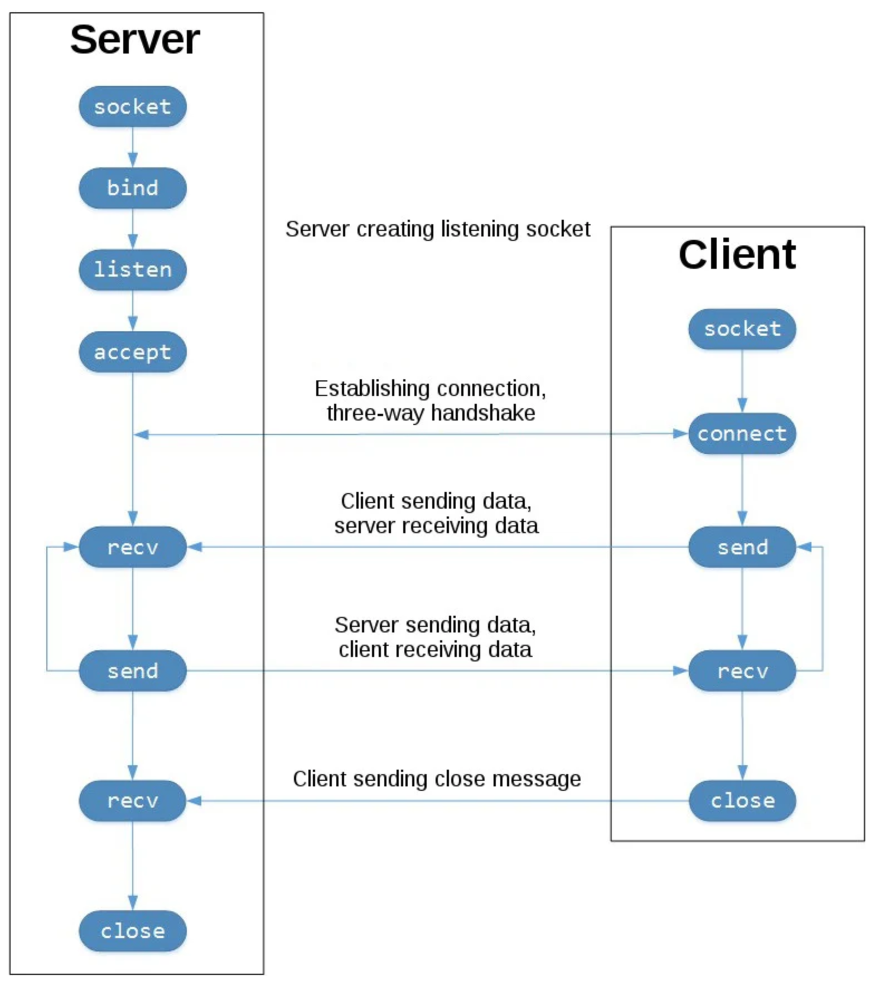

# Classi e Oggetti
Python supporta, oltre alla programmazione funzionale, anche il paradigma di **programmazione orientata agli oggetti**. Lungi dal voler dare una trattazione esaustiva di tale argomento, si procede ad illustrare i concetti principali che carattarezziano tale approccio di progettazione e implementazione software.  
Elemento principale sono le **classi**: una classe definisce una struttura base che modella una qualche entità astratta. In particolare, una classe ha lo scopo di fornire una modellizzazione di un entità astratta fornendone una descrizione in termini di:
- **attributi**: rappresentati da variabili e parametri
- **comportamenti**: modellati attraverso funzioni (dette anche _metodi_).

La classe costituisce uno "stampo" per creare **oggetti** del tipo definito dalla classe, ogni oggetto creato a partire dalla classe è detto _istanza_ della classe.  
Una classe è definita attrverso la parola chiave `class` e implementa una serie di funzioni proprie (blocco di codice innestato) che rappresentano i comportamenti esportati dall'entità che questa rappresenta. Tra tali metodi ve ne sono alcuni speciali, tra cui il metodo `__init__` che è il metodo che viene chiamato (implicitamente) quando si vuole creare una nuova istanza della classe; tale metodo è detto anche _costruttore_.  
> :mag: La realtà dei fatti è un po' diversa e si invita chi è già esperto del paradigma di programmazione ad oggetti ad approfondire la questione: il metodo `__init__` non equivale ai costruttori presenti negli altri linguaggi, poiché non crea l’istanza, ma la inizializza solamente. Dietro le quinte viene invocato dapprima il metodo `__new__` che crea un'istanza della classe. 

```python
class ClassName:
    def __init__(self, params):
        '''Constructor'''
        self.params = params
        
    def method(self, a, b):
        '''Method'''
        operations on self.params, a, b
```

Tutti i metodi di una classe devono definire un parametro aggiuntivo chiamato `self` (un po' come il famoso `this` di Java) che rappresenta l'istanza dell'oggetto che invoca il metodo. Per intenderci meglio: quando si invoca il metodo, il parametro `self` non deve essere passato esplicitamente, ma è automaticamente sostituito dall'istanza su cui è stato invocato il metodo secondo la notazione `instance.method()`. L'espressione precedente è puro _zucchero sintattico_ in quanto dietro le quinte Python effettua una chiamata del tipo `ClassName.method(instance)` perciò i due modi producono lo stesso risultato.

> :pencil: È possibile fare chiarezza sui concetti di classe e istanze effettuando qualche prova attraverso l'interprete interattivo.
> ```python
> >>> class Test:
> ...     def __init__(self):
> ...         pass
> ...     def method(self):
> ...         print('self is:', self)
> ... 
> >>> t1 = Test()
> >>> t1
> <__main__.Test object at 0x7f39f5689cd0>
> >>> t2 = Test()
> >>> t2
> <__main__.Test object at 0x7f39f567d550>
> >>> t1.method()
> self is: <__main__.Test object at 0x7f39f5689cd0>
> >>> t2.method()
> self is: <__main__.Test object at 0x7f39f567d550>
> >>> Test.method(t1)
> self is: <__main__.Test object at 0x7f39f5689cd0>
> >>> Test.method(t2)
> self is: <__main__.Test object at 0x7f39f567d550>

Gli attributi di una classe sono espressi da variabili che identificano delle proprietà che ogni istanza deve possedere, come un nome, un numero di serie, ecc. Ogni istanza potrà avere dunque un valore diverso associato ai propri attributi, i quali sono definiti all'interno del metodo `__init__` e prendono il nome di _attributi d'istanza_. Qualora invece ci debbano essere dei parametri condivisi tra tutte le istanze di una stessa classe, si definiscono delle variabili appena dentro la classe e vengono identificate come _attributi di classe_.

> :pencil: Un classico esempio per entrare in confidenza con classi, istanze e metodi è fornito dalla seguente classe:
> ```python
> class Person:
>     planet = 'Earth'                            <-- class atribute
>     def __init__(self, name, dd, mm, yy):
>         self.name = name                        <-- instance atribute
>         self.date = (dd,mm,yy)                  <-- instance atribute
>   
>     def get_age(self, curr_year):
>         age = curr_year-self.date[-1]
>         if age < 0:
>             print('Year must be bigger then '+str(self.date[-1]))
>             return 0
>         return age
> ```
> Di seguito è riportato il codice relativo alla creazione di due istanze della stessa classe, rappresentanti due oggetti - entità - diversi, ognuna con i propri tratti caratteristici.
> ```python
> p1 = Person('Bobby',1,10,1970)
> p2 = Person('Jim',29,2,1984)
> print('Age of '+p1.name+', living on '+p1.planet+': '+str(p1.get_age(2021)))
> print('Age of '+p2.name+', living on '+p2.planet+': '+str(p2.get_age(2021)))
> ```
>
> Eseguire il file `person.py` da terminale per mostrare i risultati delle operazioni
> ```bash
> $ python3 person.py
> ```

Le classi supportano anche diversi metodi "speciali" che sono identificati dalla presenza di due _underscore_ prima e dopo il nome. Questi metodi, in genere, non vengono chiamati direttamente con la sintassi `instance.__method__`, ma vengono invocati implicitamente e automaticamente in situazioni particolari; un esempio, già incontrato, è dato dal metodo `__init__` che viene invocato automaticamente quando si fa ricorso alla sintassi `ClassName(param)` per creare un nuovo oggetto di quel tipo. Altri metodi speciali sono quelli che vengono invocati dietro le quinte quando si utilizzano gli operatori relazionali, aritmetici, ecc, fra oggetti di una stessa classe, oppure metodi come `__str__`, `__len__`, `__hash__`.  
| Operatore | Metodo   | Descrizione |
| --------- | ------   | ----------- |
| `==`      | `__eq__` | Definisce il criterio di uguaglianza fra oggetti diverso da quello standard basato sugli indirizzi di memoria.|
| `>` `>=`  | `__gt__` `__ge__`| Definisce il criterio di maggioranza tra oggetti. |
| `<` `<=`  | `__lt__` `__le__` | Definisce il criterio di minoranza tra oggetti. |
| `+` | `__add__` `__radd__` `__iadd__`| Definisce l'operazione di somma tra oggetti. |
| `-` | `__sub__` `__rsub__` `__isub__`| Definisce l'operazione di sottrazione tra oggetti. |
| `*` | `__mul__` `__rmul__` `__imul__`| Definisce l'operazione di prodotto tra oggetti. |
| `/` | `__truediv__` `__rtruediv__` `__itruediv__`| Definisce l'operazione di divisione tra oggetti. |

Come si può notare i metodi speciali assocciati ad ogni operatore aritmetico (vale anche quelli non riportati o quelli binari: `//`, `%`, `>>`, `<<`, `&`, `|`, `^` ) sono tre. Il metodo principale associato all'operatore (supponiamo `+`) è `__add__`, questo è usato dal linguaggio per risolvere espressioni del tipo `myobj + obj`, in tal caso l'interprete effettua una chiamata del tipo `myobj.__add__(obj)`. Ma cosa succede se l'istruzione è scritta al contrario, ovvero `obj + myobj`? Se l'oggetto `obj` è un'altra istanza della stessa classe di `myobj` allora poco cambia, in quanto l'invocazione `obj.__add__(myobj)` darebbe lo stesso risultato del caso precedente; se invece `obj` è di un tipo diverso da quello di `myobj`, che magari non implementa il metodo `__add__`, o non ha conoscenza del tipo di `myobj`, allora viene restituito il valore speciale `NotImplemented`, che l'interprete non è in grado di gestire, sollevando un errore di tipo `TypeError` che può interreompere l'esecuzione del programma. Affinché la proprietà commutativa degli operatori sia posibile è possibile implementare il metodo `__radd__` il quale viene invocato proprio nei casi in cui l'operazione `obj.__add__(myobj)` non vada a buon fine a causa di un `NotImplemented`, in questa situazione l'interprete Python provvede a verificare se l'operando a destra implementa tale metodo e, in caso affermativo, provvede ad eseguire l'istruzione `myobj.__radd__(obj)`. I metodi speciali con una "i" davanti al nome servono invece a implementare le operazioni di assegnamento immediato, ad esempio `__iadd__` è invocato quando viene usato l'operatore `+=`.

> :pencil: È possibile aggiungere alla classe precedente dei metodi _naive_ per stabilire quale persona abbia l'età maggiore usando gli operatori relazionali.
> ```python
> class Person:
>     planet = 'Earth'
>     def __init__(self, name, dd, mm, yy):
>         self.name = name
>         self.date = (dd,mm,yy)
>   
>     def get_age(self, curr_year):
>         age = curr_year-self.date[-1]
>         if age < 0:
>             print('Year must be bigger then '+str(self.date[-1]))
>             return 0
>         return age
>     
>     # used when call '>'
>     def __gt__(self, p):
>         if self.date[2] < p.date[2]:
>             return True
>         elif self.date[2] > p.date[2]:
>             return False
>     
>      # used when call '<'
>     def __lt__(self, p):
>         return self.date[2] > p.date[2]
> 
> p1 = Person('Bobby',1,10,1970)
> p2 = Person('Jim',29,2,1984)
> 
> if p1 > p2:
>     print(p1.name+' is older than '+p2.name)
> elif p1 < p2:
>     print(p1.name+' is younger than  '+p2.name)
> else:
>     print(p1.name+' and '+p2.name+' have the same age')
> ```

## Ereditarietà
Python supporta il meccanismo dell'ereditarietà che permettere di _estendere_ (**extends**) una classe già esistene - più generale - con una classe - più specializzata - che ne eredita tutti gli attributi e i metodi, e ne esporta di nuovi più specifici. La creazione di una classe erede prevede di specificare in fase di dichiarazione la classe padre che vuole estendere, ciò viene fatto con la seguente sintassi: `class ChildClass(SuperClass):`. Python supporta anche il meccanismo più complesso dell'**ereditarietà multipla**, consentendo di specificare tutte le _super class_ da cui eredità, separate da virgole. È anche possibile, nella sottoclasse, sovrascrivere (_override_) e quindi ridefinire metodi definiti dalla superclasse.  
All'interno della sottoclasse, se si vuole far riferimento ad un metodo della superclasse è possibile usare la funzione built-in `super` (la quale restituisce un riferimento alla classe base) per accedere al metodo corrispondente definito nella classe base.

> :pencil: Una classe erede _specializza_ una classe precedentemente creata, rappresentando una entità più specifica della precedente. Per ereditare da una classe definita in un altro file (ad esempio `person.py`) è necessario ricorrere all'operazione di `import`
> ```python
> from person import Person
> class Student(Person):
>     def __init__(self, name, dd, mm, yy, id_num):
>         super().__init__(name,dd,mm,yy) # call super class constructor
>         self.id_num = id_num
>   	
>     # Override methods
>     # used when call '>'
>     def __gt__(self, p):
>         return self.id_num < p.id_num
>       
>     # Override methods
>     # used when call '<'
>     def __lt__(self, p):
>         return self.id_num > p.id_num
> ```
> Nell'esempio la classe `Student` eredita dalla classe `Person`, in quanto uno studente è sì una persona generica, ma con degli attributi in più come un numero di matricola. In questo caso è probabilmente più interessante sapere quale studente si sia immatricolato prima di un altro per avere un criterio di ordinamento, anziché basarsi sull'età anagrafica. È da notare che uno studente è una persona, ma una persona non necesariamente deve essere uno studente: l'ereditarietà è una relazione unidirezionale.

> ## :pencil: Controllori PID
> Nella pratica industriale e generalmente del controllo automatico, si utilizzano molto spesso dei regolatori "standard", grazie ai quali è possibile ottenere le prestazioni desiderate tramite la taratura (_tuning_) di pochi parametri. I controllori **PID** rientrano in questa famiglia, e possono essere implementati in forma digitale in diversi modi. Di seguito si farà uso del paradigma ad oggetti per creare delle entità del tutto generiche che potranno essere inizializzate caso per caso, in funzione del problema di controllo che si deve risolvere.  
Il **PID** è un controllore dinamico che fornisce un'azione di controllo proporzionale all'errore `e(t)`, al suo integrale e alla sua derivata. Matematicamente si può definire attraverso la seguente equazione:  
> <center> <a href="https://www.codecogs.com/eqnedit.php?latex=u(t)&space;=&space;K_p&space;e(t)&space;&plus;&space;K_i&space;\int_0^t&space;e(\tau)d\tau&space;&plus;&space;K_d&space;\frac{d}{dt}e(t)" target="_blank"></a> </center> 
>  
> Affinché sia possibile implementarne una versione digitale è necessario trasformare l'equazione precedente nella sua forma discretizzata:  
> <center> <a href="https://www.codecogs.com/eqnedit.php?latex=u_k&space;=&space;K_p&space;e_k&space;&plus;&space;K_i&space;\sum_{i=0}^k&space;e_i&space;&plus;&space;K_d&space;\frac{e_k-e_{k-1}}{T_c}" target="_blank"></a> </center>
> 
> Sebbene l'implementazione di questa formula sia possibile senza troppo dispendio di energie dal punto di vista della programmazione, dal punto di vista computazionale risulta poco performante in quanto il calcolo dell'integrale mediante sommatoria richiederebbe la memorizzazione di tutti i campioni passati e, ad ogni istante, un ciclo di somme il cui numero di addendi cresce di continuo. Una formulazione ricorsiva più efficiente è la seguente:
> <center> <a href="https://www.codecogs.com/eqnedit.php?latex=u_k&space;=&space;K_p&space;e_k&space;&plus;&space;K_i&space;\underbrace{(S_{k-1}&space;&plus;&space;T_c&space;e_k)}_{S_k}&space;&plus;&space;K_d&space;\frac{e_k-e_{k-1}}{T_c}" target="_blank"></a> </center>
> 
> Dove il termine `Sk` rappresenta un accumulatore dell'errore passo dopo passo e sostituisce la sommatoria.
> > :mag: I controllisti già sanno che la derivazione della formula discreta del PID dipende dal tipo di approssimazione utilizzata (_differenze in avanti_, _differenze all'indietro_, _metodo di Tustin_), come anche conoscono l'esistenza della formulazione del PID con l'annesso filtro passa-basso o, ancora, l'esistenza di criteri di taraura dei parametri (la taratura "per tentativi" è un'invenzione degli ultimi tempi, da non considerarsi autorevole, un ingegnere del controllo dovrebbe dunque ricorrere a tecniche più scientifiche. Attenzione che le tecniche _empiriche_ non sono equivalenti alla scelta aleatoria dei parametri).  
>
> L'entità PID può essere modellata attraverso una classe. Dalla precedente formula ricorsiva è possibile inferire sia l'algoritmo di controllo da implementare nell'apposito metodo, sia gli attributi (parametri e variabili) di cui ogni oggetto PID deve disporre.
> ```python
> class PID:
>     def __init__(self, Kp, Ki=0, Kd=0, Tc=0.1):
>         self.Kp = Kp
>         self.Ki = Ki
>         self.Kd = Kd
>         self.Tc = Tc
>         self.Sk = 0
>         self.ek_1 = 0
>         
>     def calculate(self, yk, r):
>         ek = r-yk
>         self.Sk += ek*self.Tc
>         uk = self.Kp*ek + self.Ki*self.Sk + self.Kd*(ek - self.ek_1)/self.Tc
>         self.ek_1 = ek
>         return uk
>       
>     def reset(self):
>         self.Sk = 0
>         self.ek_1 = 0
> ```
> Quando si lavora con attuatori reali, questi presentano dei limiti fisici di funzionamento in termini del segnale di controllo (forza, coppia, tenisione) che riescono a generare. Tali valori rappresentano il limite di **saturazione** dell'attuatore, ed è dunque opportuno fare in modo che l'algoritmo di controllo non generi azioni di controllo superiori a questi valori: sia perché irrealizzabili, sia perchè lavorare ai limiti fisici porta a una maggiore usura degli attuatori. In caso di saturazione, è consigliato inoltre gestire opportunamente l'effetto integrale, il quale, altrimenti, potrebbe generare fenomeni di _windup_. Gli algoritmi di **anti-windup** prevedono di bloccare o decrementare l'accumulo dell'integrale qualora il sistema vada in saturazione, per evitare un rallentamento della reattività del controllo. È possibile definire una nuova classe che aggiunga tali funzionalità alla classe PID precedente, in accordo con il meccanismo dell'ereditarietà. 
> ```python
> class PID_Saturation(PID):
>     def __init__(self, Kp, Ki=0, Kd=0, Tc=0.1 u_max=1):
>         super().__init__(Kp,Ki,Kd,Tc) # call super class constructor
>         self.u_max = abs(u_max)
>         
>     # Override methods
>     def calculate(self, yk, r):
>         uk = super().calculate(yk,r)
>         if not(-self.u_max <= uk <= self.u_max):
>             self.Sk -= (r-yk)*self.Tc # anti-windup
>             return (uk/abs(uk))*self.u_max
>         return uk
> ```

# Multithreading
Nella progettazione software può succedere spesso di trovarsi nella situazione in cui sia necessario parallelizzare diversi task per compiere in maniera contemporanea più operazioni. Python supporta il paradigma di _programmazione concorrente_, anche detta **multithreading**. Con il termine **thread** si identificano i sotto-processi, eseguiti generalmente in parallelo, generati da un processo padre.  
> :mag: Gli odierni processori sono generalmente _multi-core_, consentendo l'effettiva esecuzione parallela dei thread; in contesti single-core, invece, la parallelizzazione è virtualizzata mediante processi di _context-switch_ che permettono la condivisione alternata del processore secondo algoritmi di scheduling _round-robin_.

I diversi thread in esecuzione possono cooperare al fine di raggiungere un obiettivo comune, oppure eseguire ognuno il proprio task in maniera indipendente. È frequente che i diversi thread condividano alcune risorse oppure che debbano sincronizzarsi di tanto in tanto nelle operazioni che eseguono, ciò richiede particolare attenzione in termini degli algoritmi sviluppati al fine di evitare di incorrere in problematiche di incosistenza dei dati (dovuto al fenomeno dell'_interleaving_ - o "interfogliamento" delle istruzioni-) o situazioni di **deadlock**.  
Python mette a disposizione principalmente due librerie per il supporto alla programmazione concorrente: i moduli della libreria standard `_thread` e `threading`.  
La creazione di un thread in Python necessita della definizione di una classe che erediti dalla classe `Thread`. Quest’ultima è inclusa nel modulo `threading`, che andrà quindi importato. La classe erede rappresentante il thread dovrà rispettare una precisa struttura: dovrà innanzitutto definire il metodo `__init__` in cui verrà richiamato il costruttore della super classe, e, soprattutto, dovrà effettuare l'_override_ del metodo `run`. Il metodo `run` definisce le operazioni caratteristiche del thread: il task che deve eseguire. Tuttavia tale metodo non verrà richiamato direttamente, bensì sarà eseguito dietro le quinte dal metodo `start` invocato sull'istanza dell'oggetto creato. Questo poiché altrimenti il metodo `run` risulterebbe bloccante per il programma principale, che non riuscirebbe ad avviare contestualmente gli altri thread sino a quando il primo non terminasse. Il metodo `start` non fa altro che avviare il thread in background.  
```python
from threading import Thread
class ThreadClassName(Thread):
    def __init__(self, params):
        super().__init__(self)
        # do something with params

    def run(self):
        # do some operation
```
Per evitare che il programma principale termini dopo aver lanciato i thread, ma prima che questi abbiano terminato, si utilizza il metodo `join` che attende che il thread su cui viene invocato termini le proprie operazioni.  
```python
if __name__ == '__main__':
    # Create 2 threads
    t1 = ThreadClassName(params)
    t2 = ThreadClassName(params)
    # Run the threads
    t1.start()
    t2.start()
    # Wait the end of both threads
    t1.join()
    t2.join() 
```
La gestione di risorse condivise (variabili) richiede l'utilizzo di opportuni strumenti di sincronizzazione onde evitare che si possano verificare problemi di inconsistenza dei dati dovuti all'accesso e alla modifica simultanea delle stesse. Il modulo `threading` mette a disposizione gli oggetti `Lock` (_lucchetti_), i quali sono degli oggetti la cui istanza è condivisa tipicamente dai diversi thread; un thread deve "entrare in possesso" del lucchetto prima di poter procedere all’esecuzione di una sezione protetta (sezione critica) di un programma, che accede alle variabili condivise con gli altri. Il lucchetto deve essere acquisito (metodo `acquire`) prima di entrare nella sezione critica e rilasciato (metordo `release`) non appena ne è uscito. Tale meccanismo permette di realizzare l'accesso in _mutua esclusione_ alle sezioni critiche del codice, garantendo che un solo thread per volta possa accedere alle variabili condivise. Un thread che trova il lucchetto chiuso - occupato - rimane in attesa che chi lo sta utilizzando lo rilasci prima di poter proseguire nell'esecuzione del suo codice.  
> :mag: Qualora si voglia eseguire un task abbastanza semplice, parallelamente al thread principale, magari senza che vi siano risorse condivise fra i due, è possibile seguire una strada alternativa: se infatti è possibile racchiudere il task da eseguire all'interno di una funzione, è possibile fare ricorso al modulo `_thread` e alla funzione `start_new_thread` che riceve come parametro il nome della funzione contenente il task da eseguire e una tupla contenente i parametri da passare alla funzione; ciò permette di evitare l'_overhead_ dovuto alla definizione di costrutti come le classi qualora non sia necessario.

> ## :pencil: Buffer Produttore-Consumatore
> Un noto esempio di programmazione concorrente può essere ritrovato nel classico problema dei produttori e dei consumatori. Il problema mette di fronte alla seguente situazione: esistono uno o più produttori che inseriscono all'interno di un buffer, di dimensione limitata e nota, dei prodotti di qualsiasi tipo; dall'altra parte vi sono uno o più consumatori che al contempo prelevano i prodotti precedentemente inseriti secondo una politica FIFO. La problematica sorge nell'accesso contemporaneo al mezzo di più attori: nel caso di più produttori, ad esempio, potrebbe succedere che entrambi verifichino contestualmente la capienza residua del buffer e la confrontino con la quantità di elementi che ciascuno di essi vuole inserire. In caso di spazio sufficiente entrambi potrebbero provvedere ad inserire i propri prodotti all'interno del buffer, tuttavia, se la capienza registrata inizialmente dai singoli non è suffiiente ad ospitare la somma dei prodotti dei diversi produttori, si andrà incontro ad un _overflow_ del buffer. Situazione analoga si potrebbe presentare nel caso di più consumatori che si accingono a prelevare degli elementi dal buffer: dopo aver valtato singolarmente che ci sono sufficienti elementi nel buffer, potrebbero andare a prelevare contemporaneamente i prodotti, ritrovandosi a voler prelevare da un buffer vuoto poiché qualcun altro è riuscito a prelevare prima del consumatore "sfortunato". Tali problematiche possono portare ora ad errori di accesso in memoria (`IndexError`) ora ad inconsistenza dei dati. Per tale motivo è necessario rendere **atomiche** le operazioni critiche di verifica, riempimento e prelievo dal buffer attraverso sistemi di mutua esclusione nell'accesso alla risorsa condivisa.  
> Il buffer condiviso può essere modellato come una classe che oltre a contenere il buffer stesso, mette a disposizione i metodi per la verifica dei posti disponibili e l'aggiunta o la rimozione di elementi da esso, oltre a dei metodi per l'accesso esclusivo all'insieme di elementi. Affinché sia in grado di fornire tali funzionalità, è necessario che in fase di inizializzazione provveda ad istansiare un oggetto di tipo `Lock` per garantire l'atomicità delle operazioni.  
> ```python
> class Buffer:
>     def __init__(self, size):
>         self.size = size
>         self.buffer_queue = []
>         self.mutex = Lock()
>         
>     def acquire_lock(self):
>         self.mutex.acquire()
> 
>     def release_lock(self):
>         self.mutex.release()
> 
>     def empty_pos(self):
>         return self.size - len(self.buffer_queue)
> 
>     def full_pos(self):
>         return len(self.buffer_queue)
> 
>     def add(self, product):
>         self.buffer_queue.extend(product)
>         print('BUFFER: '+str(self.buffer_queue))
> 
>     def get(self, n):
>         for i in range(n):
>             self.buffer_queue.pop(0)
>         print('BUFFER: '+str(self.buffer_queue))
> ```
> Le entità dei produttori e consumatori possono essere modellate mediante apposite classi eredi della classe `Thread`.  
> Un produttore può essere identificato da un nome proprio inoltre deve avere il riferimento ad un oggetto di tipo `Buffer` che sarà condiviso con gli altri produttori/consumatori. Il ciclo di vita di un produttore - implementato nell'_override_ del metodo `run` - consiste nel voler caricare un certo numero di prodotti (casuale) nel buffer, a patto di non saturarlo. Il suo _modus operandi_ prevede dunque di effettuare le seguenti operazioni in maniera atomica: prima verificare la disponibilità di posto nel buffer e, successivamente, caricare i gli elementi da esso prodotti nel buffer, nel limite della capienza. Dopo aver compiuto tali operazioni il thread può andare a dormire per un certo tempo fisso per ricominciare successivamente con tali attività. È possibile dotare la classe di una variabile d'istanza booleana che permetta al thread principale che lancia i thread figli di interrompere l'esecuzione dei vari produttori/consumatori istanziati.
> ```python
> class Producer(Thread):
>     def __init__(self, name, buffer):
>         super().__init__()
>         self.name = name
>         self.buffer = buffer
>         self.stop_flag = False
> 
>     def run(self):
>         while not self.stop_flag:
>             n = random.randint(1,5)
>             product = []
>             for i in range(n):
>                 product.append(random.randint(0,100))
>             print(self.name+' wait lock')
>             self.buffer.acquire_lock()
>             print(self.name+' get lock')
>             ##### Critical Section #####
>             if self.buffer.empty_pos() < n:
>                 n = self.buffer.empty_pos()
>             self.buffer.add(product[0:n])
>             print('Producer '+self.name+' put '+str(n)+' elements')
>             #############################
>             print(self.name+' release lock')
>             self.buffer.release_lock()
>             time.sleep(3)
> ```
> Analogamente, i consumatori sono caratterizzati da un nome e dal riferimento al buffer. Il loro ciclo di vita è speculare a quello del produttore: in maniera atomica verifica la presenza di prodotti nel buffer e provvede a prelevare un numero aleatorio di elementi da questo. In seguito a tali operazioni il thread si pone a riposo per un certo periodo dopodicché riprende nuovamente a consumare.
> ```bash
> class Consumer(Thread):
>     def __init__(self, name, buffer):
>         super().__init__()
>         self.name = name
>         self.buffer = buffer
>         self.stop_flag = False
> 
>     def run(self):
>         while not self.stop_flag:
>             n = random.randint(1,2)
>             print(self.name+' wait lock')
>             self.buffer.acquire_lock()
>             print(self.name+' get lock')
>             ##### Critical Section #####
>             if self.buffer.full_pos() < n:
>                 n = self.buffer.full_pos()
>             self.buffer.get(n)
>             print('Consumer '+self.name+' get '+str(n)+' elements')
>             #############################
>             print(self.name+' release lock')
>             self.buffer.release_lock()
>             time.sleep(2)
> ```
> Le classi sopra presentate possono essere definite all'interno di un unico file o di file separati (nel qual caso sarà necessario importarle nel file principale che manda in esecuzione i diversi thread). Nel `__main__` è necesario dapprima istanziare un oggetto della classe buffer, successivamente creare diverse istanze di produttori e consumatori i quali saranno posti in _run_ attraverso l'apposita chiamata al metodo `start` esportato da ciascuno di essi. La simulazione di attività può essere stoppata dopo un certo tempo prefisato settando a `True` tutte le `stop_flag` dei vari thread
> ```python
> if __name__ == '__main__':
>     buffer = Buffer(10)
>     p1 = Producer('P1',buffer)
>     c1 = Consumer('C1',buffer)
>     c2 = Consumer('C2',buffer)
>     p1.start()
>     c1.start()
>     c2.start()
>     time.sleep(10)
>     p1.stop_flag = True
>     c1.stop_flag = True
>     c2.stop_flag = True
> ```
> Di seguito è riportato uno scenario di simulazione in cui è possibile notare, analizzando le stampe a video, le fasi di _contxt-switch_ che hanno alternato le operazioni dei vari thread (_interleaving_) senza però generare problemi di inconsistenza dati o errori grazie alla corretta gestione della risorsa condivisa. È possibile notare come i thread che trovano il lucchetto occupato rimangano in attesa che questo venga rilasciato pirma di proseguire con le proprie operazioni. 
> ```bash
> P1 wait lock
> P1 get lock
> BUFFER: [29, 28, 88]
> C1 wait lock
> Producer P1 put 3 elements
> P1 release lock
> C2 wait lock
> C1 get lock
> BUFFER: [28, 88]
> Consumer C1 get 1 elements
> C1 release lock
> C2 get lock
> BUFFER: [88]
> Consumer C2 get 1 elements
> C2 release lock
> C1 wait lock
> C2 wait lock
> C1 get lock
> BUFFER: []
> Consumer C1 get 1 elements
> C1 release lock
> C2 get lock
> BUFFER: []
> Consumer C2 get 0 elements
> C2 release lock
> P1 wait lock
> P1 get lock
> ... ...
> ```

# Comunicazioni di rete
Altra attività di largo impiego e di grande utilità è la comunicazione tra processi, e che questo avvenga tra processi in esecuzione su uno stesso calcolatore, e che siano in esecuzione su dispositivi diversi. Uno dei mezzi più utilizzati, sopattutto quando si tratta di calcolatori dislocati geograficamente tra loro, è la rete (che sia locale - anche _punto-punto_ - o, tramite accesso a internet, globale). I principali metodi di comunicazione sulla rete sono disciplinati dal _Transmission
Control Protocol/Internet Protocol_ (**TCP/IP**), una famiglia di protocolli ormai _standard de facto_ da anni.  
Affinché lo scambio di messaggi tra computer possa avvenire, il protocollo TCP/IP prevede l'assegnazione, ad ogni macchina appartenente alla stessa rete, di un **indirizzo IP** univoco e, per ogni applicazione, una **porta** su cui effettuare lo scambio di pacchetti. L'indirizzo IP ha la classica forma `185.39.10.101` che sta a identificare una determinata macchina da qualche parte nel mondo. Poiché tale notazione è poco _human-friendly_ è stato messo a disposizione un servizio denominato _Domain Name System_ (**DNS**) che consente di associare un indirizzo IP ad un nome testuale (il classico nome che segue la sigla `www`) più facile da ricordare.  
La comunicazione avviene mediante lo scambio di opportuni pacchetti che contengono, oltre al dato utile vero e proprio, una serie di informazioni inglobate all'interno di un apposito _header_, come l'indirizzo e la porta di destinazione, la lunghezza del pacchetto o un campo contenente il _checksum_ per controllare l'integrità del dato.  
Fra i protocolli basati su indirizzamento IP, i due principalmente utilizzati sono il _Transmission Control Protocol_ (**TCP**) e lo _User Datagram Protocol_ (**UDP**). Il **TCP** è un protocollo _orientato alla connessione_, ovvero prima di poter trasmettere dati deve stabilire la comunicazione, negoziando una connessione tra mittente e destinatario, la quale rimane attiva anche in assenza di scambio di dati e viene esplicitamente chiusa quando non più necessaria. TCP è inoltre considerato un protocollo di scambio dati _affidabile_, in quanto garantisce la consegna dei pacchetti al destinatario  e il corretto ordine di ricezione, sfruttando un meccanismo basato sullo scambio di _ack_. **UDP** è invece un protocollo _senza connessione_ che non gestisce né il riordinamento dei pacchetti, né la ritrasmisisone di quelli persi. L'affidabilità di tale protocollo è dunque inferiore rispetto al precedente, tuttavia, grazie alla diminuizione dell'_overhead_ dato dall'_header TCP_, e l'assenza del meccanismo di _acknowledgements_ e riordino dati, risulta essere un protocollo di utile impiego qualora lo scambio dati debba essere più veloce (ad esempio applicazioni di streaming o _time-sensitive_).

## Architettura Client/Server
Una delle architetture di rete più utilizzite è quella **Client/Server**, in cui è presente un processo _server_ il quale si pone in ascolto su una determinata porta e rimane in attesa di connessioni in ingresso da parte di processi _client_, i quali inviano una richiesta di fruizione di un servizio o comunicano determinate informazioni. Python mette a disposizione dei moduli di _networking_ presenti nella libreria standard che consentono la gestione delle connessioni di rete. Tali librerie mascherano l'interazione con il sistema operativo e la gestione di tutti i processi di ritrasmisisone e controllo integrità dei pacchetti permettendo lo sviluppo di codice a livello _applicazione_. Python mette inoltre a disposizione servizi di tipo **SSL/TLS** per la crittografia del canale di comunicazione qualora sia necessario realizzare un'applicazione con determinati livelli di sicurezza.  
Il modulo `socket` permette l'apertura di canali di comunicazione (_socket_) tra client e server, e, tramite appositi metodi, l'invio (`send`) e la ricezione (`recv`) dei pacchetti. In fase di instaurazione del socket è necessario specificare alcuni parametri: l'_address family_ che specifica la tipologia di indirizzi con cui si intende lavorare (a titolo d'esempio: `AF_INET` racchiude gli indirizzi IPv4, `AF_INET6` gli indirizzi compatibili con IPv6, `AF_UNIX` indirizzi locali); e il tipo di protocollo che si intende utilizzare (`SOCK_STREAM` per comunicazioni TCP, `SOCK_DGRAM` per UDP).
> :mag: Per una descrizione più accurata delle opzioni e delle tipologie di connessione, si invita a consultare la [documentazione ufficiale](https://docs.python.org/3/library/socket.html) del modulo `socket`.

### Socket TCP
Di seguito è riportato a titolo d'esempio uno script per realizzare un semplice client che si connette a un server per effettuare uno scambio di messaggi:
```python
#! /usr/bin/env python3
import socket

SERVER_ADDR = '127.0.0.1' 
SERVER_PORT = 10110 

# Create a socket object
client_sock = socket.socket(socket.AF_INET, socket.SOCK_STREAM) # address family:IPv4, socket type:TCP 
 
# Connect to Server 
client_sock.connect((SERVER_ADDR,SERVER_PORT))

for i in range(3):
	# Send some data to Server
	msg = f'This is the message {i} from client'
	print(msg)
	client_sock.send(msg.encode())
	# Wait response from Server
	msg = client_sock.recv(256)
	print('Received from server: %s' %msg.decode())

# Close connection
client_sock.close()

```
È importante ricordarsi che i metodi `send` e `recv` lavorano con dati in formato byte e non direttamente con stringhe, è necessario dunque utilizzare oppurtunamente i metodi `encode` e `decode` per effettuare le conversioni delle stringhe.  
L'implementazione di un server richiede qualche operazione aggiuntiva al fine di instaurare connessioni con i client. Una volta creato un socket, infatti, è necessario legare tale oggetto all'indirizzo del server e alla porta su cui potranno avvenire le connessioni, tale operazione è svolta dal metodo `bind`. Successivamente il server si deve mettere in ascolto di connessioni in ingresso (`listen`) e in fine potrà accettare (`accept`) eventuali connessioni in ingresso. I server possono supportare anche più connessioni in entrata contemporanee, tuttavia, le operazioni da effettuare in seguito ad una connessione in ingresso dovrebbero essere implementate all'interno di appositi thread per supportare correttamente tale metodo di funionamento.  
Di seguito è riportato un semplice script che implementa un server che aspetta connessioni in ingresso da parte di client conformi a quanto precedentemente implementato:
```python
#! /usr/bin/env python3
import socket

SERVER_ADDR = '127.0.0.1'   # Standard loopback interface address (localhost)
SERVER_PORT = 10110         # Port to listen on (non-privileged ports are > 1023)

# Create a socket object
server_sock = socket.socket(socket.AF_INET,socket.SOCK_STREAM) # address family:IPv4, socket type:TCP
server_sock.setsockopt(socket.SOL_SOCKET, socket.SO_REUSEADDR, 1) # options
server_sock.bind((SERVER_ADDR,SERVER_PORT)) 
server_sock.listen(1) # accept only one simultaneously connection

while True:
	# Wait client connections
	print('Wait connections...\n')
	conn, client_addr = server_sock.accept()
	try:
		print('Client %s connected' %str(client_addr))
		# Read data from client
		while True:
			msg = conn.recv(256)
			print('Received : ' + str(msg.decode()))
			if msg:
				conn.send('OK'.encode())
			else:
				break;
	finally:
		print('Closing connection...\n')
		conn.close()
```
È possibile settare la flag `SO_REUSEADDR` per rendere più semplice la fase di debug degli script, normalmente, infatti, dopo che un processo server termina il sistema operativo riserva la porta da questo usata per alcuni minuti, ciò per evitare che altri processi possano occuparla, ad esempio nel caso di iavvio el processo server. Settando la `SO_REUSEADDR` il sistema operativo provvede al rilascio immediato della porta utilizzata dal server e non è necessario dunque attendere che si raggiunga il timeout prima di poter lanciare nuovamente il processo server.  
Gli script presentati possono essere eseguiti in 2 terminali separati, lo script `server_TCP_test.py` può essere eseguito una volta sola 
```bash
$ python3 server_test.py
```
poiché rimane in run in maniera perpetua per via del ciclo infinito (`CTRL+C` per interrompere il processo), mentre lo script `client_TCP_test.py` può essere rilanciato quante volte si vuole alla fine della sua esecuzione
```bash
$ python3 client_test.py
```
In figura sono sintetizzate con un diagramma le fasi lato client e lato server per instaurare una comunicazione di tipo TCP.

<p align="center">

</p>

### Socket UDP
In connessioni UDP non vi è, invece, la necessità di mantenere connessioni durature tra client e server; la configurazione di un server che implementa tale protocollo risulta essere dunque differente in quanto non vi è la necessità di rimanere in attesa di connessioni in ingresso (`accept`), bensì si pone direttamente in ascolto di messaggi in ingresso sulla porta prestabilita. Affinché gli sia possibile però rispondere ad un eventuale client che invia un messaggio, è necessario memorizzare volta per volta l'indirizzo e la porta da cui il client sta inviando i messaggi, a tale fine sono usate le funzioni `recvfrom` e `sendto` che consentono di inviare e ricevere contestualmente al dato le informazioni necessarie all'indirizzamento dei messaggi.

```python
#! /usr/bin/env python3
import socket

SERVER_ADDR = '127.0.0.1'   # Standard loopback interface address (localhost)
SERVER_PORT = 10110         # Port to listen on (non-privileged ports are > 1023)

# Create a socket object
server_sock = socket.socket(socket.AF_INET,socket.SOCK_DGRAM) # address family:IPv4, socket type:UDP
server_sock.setsockopt(socket.SOL_SOCKET, socket.SO_REUSEADDR, 1) # options
server_sock.bind((SERVER_ADDR,SERVER_PORT)) 

# Wait incoming messages
while True:
    print('Waiting to receive message...')
    msg, client_addr = server_sock.recvfrom(256)
    print('Received from %s: %s' %(client_addr,msg.decode()))
    server_sock.sendto('OK'.encode(),client_addr)
```
Di seguito è riportato uno script per il client:
```python
#! /usr/bin/env python3
import socket

SERVER_ADDR = '127.0.0.1' 
SERVER_PORT = 10110 

# Create a socket object
client_sock = socket.socket(socket.AF_INET, socket.SOCK_DGRAM) # address family:IPv4, socket type:UDP 

for i in range(3):
	# Send some data to Server
	msg = f'This is the message {i} from client'
	client_sock.sendto(msg.encode(),(SERVER_ADDR,SERVER_PORT))
	# Wait response from Server
	msg, server_addr = client_sock.recvfrom(256)
	print('Received from %s : %s' %(server_addr,msg.decode()))

```