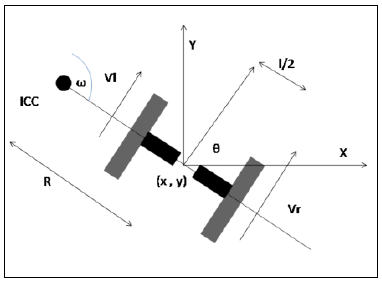
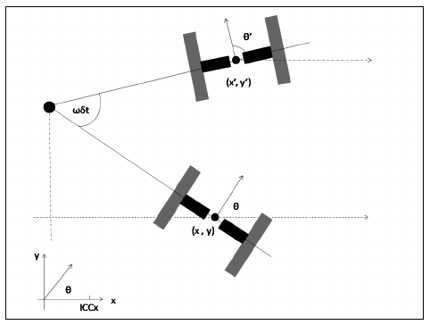
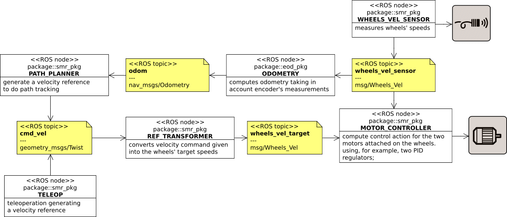
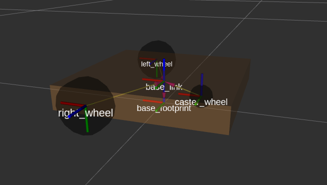
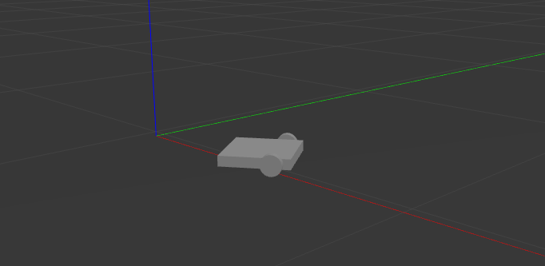
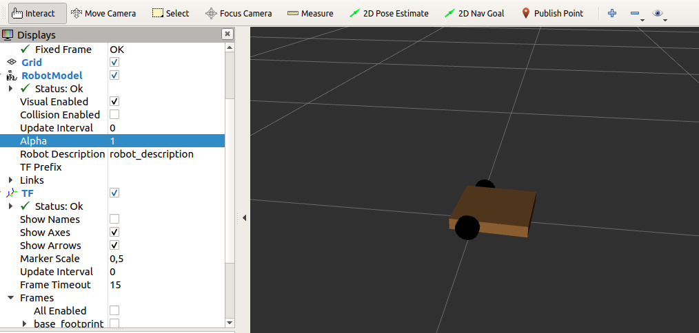
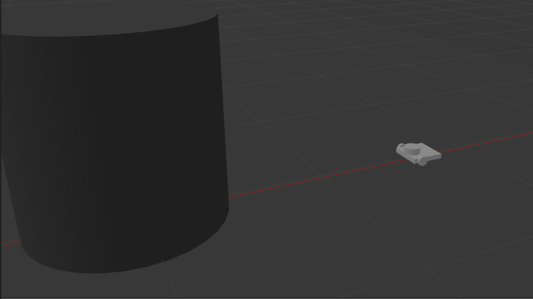
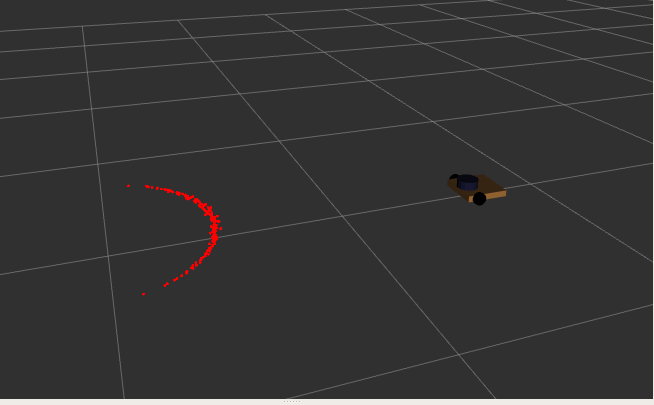

# Differential Drive
A **differential-drive robot** consists of two main wheels mounted on a common axis controlled by separete motors. One or more caster wheels are added to improve the stability of the platform. Its sterring system is nonholonomic, which means it has constraints on the pose change (is not allowed side traslations).

## Kinematics Model
**Robot kinematics** is the study of the mathematics of motion without considering the forces that affect motion. It mainly deals with the geometric relationships that govern the system.  
In general a body in the space has 6 **degrees of freedom (DOF)** expressed by the **pose** (_position + orientation_). It consists of cartesian position (_x, y, z_) and attitude (_roll, pitch, yaw_). **Roll** refers to sidewise rotation, **pitch** refers to forward and backward rotation, and **yaw** (called often _heading_ or _orientation_ for robot that moves on a plane) refers to rotation on itself (on z-axis).  
Differential-drive robot moves on the x-y plane, so is sufficient three coordinates to describe its pose; the 2D pose consists of x, y and θ, where θ is the heading of the robot, identified as the angle between the x-axis and the forward direction of the robot.  
In a differential-drive robot the motion can be controlled by adjusting the velocity of the two independently controlled motors attached on the wheels.  
**Forward kinematics equations** is used for know the pose of the robot given its velocities. The objective is determinate a discrete-time model that relates pose and velocities.  

> ![\begin{bmatrix} x_{k+1}\\\y_{k+1}\\\theta_{k+1}\end{bmatrix} = f\big( \[ x_k,\y_k,\theta_k\]^\T \big) + g\big(\[v_k,\omega_k\]^\T \big)](https://render.githubusercontent.com/render/math?math=%5Cbegin%7Bbmatrix%7D%20x_%7Bk%2B1%7D%5C%5C%5Cy_%7Bk%2B1%7D%5C%5C%5Ctheta_%7Bk%2B1%7D%5Cend%7Bbmatrix%7D%20%3D%20f%5Cbig(%20%5B%20x_k%2C%5Cy_k%2C%5Ctheta_k%5D%5E%5CT%20%5Cbig)%20%2B%20g%5Cbig(%5Bv_k%2C%5Comega_k%5D%5E%5CT%20%5Cbig))

Where  is the forward speed of the robot and  is angular velocity around the robot center point.  
Kinematic equations can be obtained from simple physical and geometric considerations. When the robot is about to perform a rolling motion, the robot must rotate around a point that lies along its common left and right wheel axes. The point that the robot rotates around is known as **Instantaneous Center of Curvature (ICC)**.  



Actuators and some kind of sensors don't work with this values, instead control the single wheel angular velocity }_k),}_k) and their linear velocities }_k), }_k). The relationship between linear and angular velocities is given by  

> 

Where  is the distance from the axis of rotation, for a wheel it's the radius.  

Assuming that there are sensors on the wheels that provide the values of the angular velocities of the wheels and from these it is possible to obtain the linear velocities.
> :vertical_traffic_light: ENCODER  
 For a rotary encoder with resolution ,  
  
where  is the numbers of ticks counted in the last time interval , so the velocities can be computed as
%7D_k%20%3D%20%5Cfrac%7B2%5Cpi%20n%5E%7B(i)%7D%7D%7BN%20%5CDelta%20t%7D%20%5Cqquad%20v%5E%7B(i)%7D_k%3D%5Cfrac%7B2%5Cpi%20r%20n%5E%7B(i)%7D%7D%7BN%20%5CDelta%20t%7D)

For the two wheels the angular velocity is the same but the distance between the ICC differs about the length of the axis :
> %7D_k%20%3D%20(R-%5Cfrac%7B%5Cell%7D%7B2%7D)%20%5Ctimes%20%5Comega_k%5C%5Cv%5E%7B(R)%7D_k%20%3D%20(R%2B%5Cfrac%7B%5Cell%7D%7B2%7D)%20%5Ctimes%20%5Comega_k%20%5Cend%7Bcases%7D)

The above system consists of 2 equation and 2 unknow factors, so is possible to obtain
> %7D_k%2Bv%5E%7B(L)%7D_k%7D%7Bv%5E%7B(R)%7D_k-v%5E%7B(L)%7D_k%7D%5Cfrac%7B%5Cell%7D%7B2%7D%5C%5C%20%5Comega_k%20%3D%20%5Cfrac%7Bv%5E%7B(R)%7D_k-v%5E%7B(L)%7D_k%7D%7B%5Cell%7D%5Cend%7Bcases%7D%20%5Cquad%20%5CLongrightarrow%20%5Cquad%20%5Cv_k%20%3D%20%5Cfrac%7Bv%5E%7B(R)%7D_k%2Bv%5E%7B(L)%7D_k%7D%7B2%7D)

To write kinematic model, first calculate the coordinates of the ICC given the pose of the robot and its velocities. It can be obtained doing simple trigonometric considerations

> %20%3D%20x_k%20-%20R%20%5C%2C%20%5Csin(%5Ctheta_k))
%20%3D%20y_k%20%2B%20R%20%5C%2C%20%5Ccos(%5Ctheta_k))



Therefore, it's possible to write the new pose of the robot after the time interval , supposing that the velocities are constant in this time.  

> %20%3D%20ICC_x%20%2B%20R%5C%2C%5Csin(%5Ctheta_%7Bk%2B1%7D)%5C%5C%20y_%7Bk%2B1%7D%20%3D%20ICC_y%20%2B%20R%5C%2C%5Csin(%5Cfrac%7B%5Cpi%7D%7B2%7D-%5Ctheta_%7Bk%2B1%7D)%20%3D%20ICC_y%20%2B%20R%5C%2C%5Ccos(%5Ctheta_%7Bk%2B1%7D)%5C%5C%20%5Ctheta_%7Bk%2B1%7D%3D%20%5Ctheta_k%20%2B%20%5Comega_k%20%5CDelta%20t%20%5Cend%7Bcases%7D)

replacing the coordinates of ICC and writing R in function of the linear and angular velocities, it's possible to write the kinematic model of the differential-drive:

> -%5Csin(%5Ctheta_k)%5Cbig)%5C%5C%20%20y_%7Bk%2B1%7D%20%3D%20y_k%20%2B%20%5Cfrac%7Bv_k%7D%7B%5Comega_k%7D%5Cbig(%5Ccos(%5Ctheta_k%2B%5Comega_k%20%5CDelta%20t)-%5Ccos(%5Ctheta_k)%5Cbig)%5C%5C%20%20%5Ctheta_%7Bk%2B1%7D%3D%20%5Ctheta_k%20%2B%20%5Comega_k%20%5CDelta%20t%20%5Cend%7Bcases%7D)

A particular case is given when , that means the robot is moving in a straight line, in this case the model become:

> %5C%5C%20%20y_%7Bk%2B1%7D%20%3D%20y_k%20%2B%20v_k%5CDelta%20t%20%5Csin(%5Ctheta_k)%5C%5C%20%20%5Ctheta_%7Bk%2B1%7D%3D%20%5Ctheta_k%20%5Cend%7Bcases%7D)

## ROS Architecture
In this section is showed an example of a simple ROS software architecture development for a differential-drive robot. The main purpose is write a set of nodes that receive actuate the wheels motors to tracking the ![\[ v_k, \omega_k\]](https://render.githubusercontent.com/render/math?math=%5B%20v_k%2C%20%5Comega_k%5D) reference velocities computed to follow a selected path.



> :bookmark: NODE COMMON STRUCTURE  
In order to improve the readability and reusability of the code it's a good practice define a standard way to implements a node for each entity which will be realized. The structure proposed plans to use a _python class_ for each node which will implemented that specifies in the ```init``` node all parameters, variables, topic, services or actions that will be used, and run at a specified rate its _life cycle_ defined in the ```loop``` function.
```python
import rospy
class NodeName:
  def __init__(self):
    rospy.init_node('node_name')
    # ------- PARAMETERS ------- 
    self.freq = rospy.get_param('freq', 10)
    self.rate = rospy.Rate(self.freq)
    # ------- VARIABLES -------
    self.var1 = ...
    self.var2 = ...
    # -------   TOPICS   -------
    rospy.Subscriber(...
    self.publisher = ...
    # -------   SERVICES   -------
    ...
    # -------   ACTIONS   -------
    ...

  # -------   LIFE CYCLE   -------
  def loop(self):
    while not rospy.is_shutdown():
      ...  # node operations
      self.rate.sleep()
	
  # -------   CALLBACK   -------
  def topic_callback(self, msg):
    ... # operations on msg coming from topic
	
  # -------   UTILITY FUNCTIONS   -------
  def fun_00(self):
    ...

# -------   INITIALIZE INSTANCE  -------
if __name__ == '__main__':
  node = NodeName()
  node.loop()
```

As a _top-down_ approach let's analyze the main components of the architecture that can be implemented in a new package for this _simple mobile robot_ (```smr_pkg```).

#### :repeat: REF_TRANSFORMER NODE
The desidered reference velocities ![\[ v_k, \omega_k\]](https://render.githubusercontent.com/render/math?math=%5B%20v_k%2C%20%5Comega_k%5D) can be computed by a classic path-following algorithm, implemented in the ```path_planner``` node, given the current pose of the robot or by a teleoperation system like a keyboard or a joystick. This reference velocities are advertise on the ```cmd_vel``` topic, publishing ```Twist``` messages contains the following data:
```
Vector3  linear
Vector3  angular
```
where ```Vector3``` is another message from the ```geometry_msgs``` package which contains 3 values
```
float64 x
float64 y
float64 z
```
For a differential drive robot only linear velocity on x-axis () and angular velocity around z-axis () are selectable, so the relation is
> twist.linear.x =   
twist.angular.z = 

The target velocities of the center of mass must be transformed in wheels rotation velocities, according to the inverse formula showing in the previous section:
> %7D_k%20%3D%5Cfrac%7B1%7D%7Br%7D%20%5Cbig(%20v_k%2B%5Cfrac%7B%5Cell%7D%7B2%7D%5Comega_k%20%5Cbig)%20%5Cqquad%20%5Comega%5E%7B(L)%7D_k%20%3D%20%5Cfrac%7B1%7D%7Br%7D%20%5Cbig(v_k-%5Cfrac%7B%5Cell%7D%7B2%7D%5Comega_k%20%5Cbig))

This transformation is performed by the ```ref_transformer``` node that is subscribed at the ```cmd_vel``` topic and publish ![\[\omega^{(R)}_k,\omega^{(L)}_k\]](https://render.githubusercontent.com/render/math?math=%5B%5Comega%5E%7B(R)%7D_k%2C%5Comega%5E%7B(L)%7D_k%5D) on the ```wheels_vel_target``` topic using a custom message that contains two float values.
```
# Wheels_Vel.msg
float32 w_R
float32 w_L
```
A naive implementation of this node is the following:
```python
#! /usr/bin/env python3
import rospy
from smr_pkg.msg import Wheels_Vel
from std_msgs.msg import Float32
from geometry_msgs.msg import Twist

class RefTransformer():
  def __init__(self):
    rospy.init_node('ref_transformer')
		
    # ------ PARAMETERS ------
    self.l = rospy.get_param('smr/physics/l') # wheels distance
    self.r = rospy.get_param('smr/physics/r') # wheels radius

    # ------ TOPICS ------
    rospy.Subscriber('cmd_vel', Twist, self.transform_callback)
    self.v_target_pub = rospy.Publisher('wheels_vel_target', Wheels_Vel, queue_size=1)
		
  def loop(self):
    rospy.spin()

  def transform_callback(self, msg):
    v_k = msg.linear.x
    w_k = msg.angular.z

    w_R = (1/self.r) * (v_k + (self.l/2) * w_k)
    w_L = (1/self.r) * (v_k - (self.l/2) * w_k)
	
    msg_vel = Wheels_Vel()
    msg_vel.w_R = w_R
    msg_vel.w_L = w_L
    self.v_target_pub.publish(msg_vel)

if __name__ == '__main__':
  rt = RefTransformer()
  rt.loop()
```

#### :steam_locomotive: MOTOR_CONTROLLER NODE
The ```motor_controller``` node reads the target velocities for the wheels on the previous topic and the current wheels velocity from ```wheels_vel_sensor``` topic. With this information it calculates the control signals and send them as input to the motors. The life-cycle of this node is performed each sample time ```Ts``` and implements a classic control algorithm. The following node is implemented supposing that is using a _Raspberry_ and ```gpiozero``` library for command 12V DC motor with _H-bridge_ controller.
```python
#! /usr/bin/env python3
import rospy
from smr_pkg.msg import Wheels_Vel
from smr_pkg.lib.PID_Sat_controller import PID_Saturation
import RPi.GPIO as GPIO
from gpiozero import Motor

class MotorController():
  def __init__(self):
    rospy.init_node('motor_controller')
		
    # ------ PARAMETERS ------
    self.Ts = rospy.get_param('/smr/control/Ts', 10)
    self.rate = rospy.Rate(self.Ts)
        
    Kp = rospy.get_param('/smr/control/Kp')
    Ki = rospy.get_param('/smr/control/Ki')
    Kd = rospy.get_param('/smr/control/Kd', 0)
    u_max = rospy.get_param('/smr/control/u_max', 12)
        
    self.N = rospy.get_param('/smr/sensor/buffer_len', 10)

    # Motors pin using Raspberry
    GPIO.setmode(GPIO.BCM)
    pin_forward_R = rospy.get_param('/smr/motor/FPR')
    pin_backward_R = rospy.get_param('/smr/motor/BPR')
    pin_forward_L = rospy.get_param('/smr/motor/FPL')
    pin_backward_L = rospy.get_param('/smr/motor/BPL')

    # ------ VARIABLES ------
    self.pid_R = PID_Saturation(Kp,Ki,Kd,u_max)
    self.pid_L = PID_Saturation(Kp,Ki,Kd,u_max)

    self.motor_R = Motor(self.pin_forward_R, self.pin_backward_R, True)
    self.motor_L = Motor(self.pin_forward_L, self.pin_backward_L, True)

    self.buffer_R = []
    self.buffer_L = []
    self.w_R_meas = 0
    self.w_L_meas = 0
    self.w_R_ref = 0
    self.w_L_ref = 0

		# ------ TOPICS ------
    rospy.Subscriber('wheels_vel_target', Wheels_Vel, self.reference_callback)
    rospy.Subscriber('wheels_vel_sensor', Wheels_Vel, self.measurement_callback)
		
  def loop(self):
    while not rospy.is_shutdown():
      u_R = self.pid_R.compute(self.w_R_meas, self.w_R_ref, self.Ts)
      u_L = self.pid_L.compute(self.w_L_meas, self.w_L_ref, self.Ts)
            
      __actuate_motors(u_R,u_L)
            
      self.rate.sleep()

  def reference_callback(self, msg):
    self.w_R_ref = msg.w_R
    self.w_L_ref = msg.w_L

  def measurement_callback(self, msg):
    if len(self.buffer_R) = self.N:
      self.buffer_R.pop(0)
    self.buffer_R.append(msg.w_R)
        
    if len(self.buffer_L) = self.N:
      self.buffer_L.pop(0)
    self.buffer_L.append(msg.w_L)
        
    self.w_R_meas = sum(self.buffer_R)/len(self.buffer_R)
    self.w_L_meas = sum(self.buffer_L)/len(self.buffer_L)

  def __actuate_motors(self, u_R, u_L):
    if u_R >= 0:
      self.motor_R.forward(u_R)
    else:
      self.motor_R.backward(abs(u_R))
    if u_L >= 0:
      self.motor_L.forward(u_L)
    else:
      self.motor_L.backward(abs(u_L))
            
if __name__ == '__main__':
  mc = MotorController()
  mc.loop()
```

#### :round_pushpin: WHEELS_VEL_SENSOR NODE
The ```wheels_vel_sensor``` node comunicate with the rotary encoders on the two wheels and provide the instant angular velocities for each wheel at a fixed rate. A naive implementation of the node is proposed, supposing that is used 2 channel rotary encoder with resolution .
```python
#! /usr/bin/env python3
import rospy
from smr_pkg.msg import Wheels_Vel
import RPi.GPIO as GPIO
import math
import threading

class WheelsVelSensor():
  def __init__(self):
    rospy.init_node('wheels_vel_sensor')
		
    # ------ PARAMETERS ------
    self.f = rospy.get_param('/smr/sensor/freq', 20)
    self.rate = rospy.Rate(self.f)

    self.l = rospy.get_param('smr/physics/l') # wheels distance
    self.r = rospy.get_param('smr/physics/r') # wheels radius
    N = rospy.get_param('smr/sensor/enc_N') # encoder resolution
    self.step = 2*math.pi/N

    # Encoders pin using Raspberry
    GPIO.setmode(GPIO.BCM)
    self.pin_channel_A_R = rospy.get_param('/smr/sensor/CAR')
    self.pin_channel_B_R = rospy.get_param('/smr/sensor/CBR')
    self.pin_channel_A_L = rospy.get_param('/smr/sensor/CAL')
    self.pin_channel_B_L = rospy.get_param('/smr/sensor/CBL')
    GPIO.setup(self.pin_channel_A_R, GPIO.IN, pull_up_down = GPIO.PUD_DOWN)
    GPIO.setup(self.pin_channel_B_R, GPIO.IN, pull_up_down = GPIO.PUD_DOWN)
    GPIO.add_event_detect(self.pin_channel_A_R, GPIO.RISING, callback=callback_enc_R)
    GPIO.setup(self.pin_channel_A_L, GPIO.IN, pull_up_down = GPIO.PUD_DOWN)
    GPIO.setup(self.pin_channel_B_L, GPIO.IN, pull_up_down = GPIO.PUD_DOWN)
    GPIO.add_event_detect(self.pin_channel_A_L, GPIO.RISING, callback=callback_enc_L)

    self.lock = threading.Lock()

    # ------ VARIABLES ------
    self.ticks_R = 0
    self.ticks_L = 0
    self.prev_ticks_R = 0
    self.prev_ticks_L = 0

    # ------ TOPICS ------
    self.v_sensor_pub = rospy.Publisher('wheels_vel_sensor', Wheels_Vel, queue_size=10)

  def loop(self):
    msg_vel = Wheels_Vel()
    while not rospy.is_shutdown():
      with self.lock:
        msg_vel.w_R = (self.ticks_R-self.prev_ticks_R)*self.step*self.f
        msg_vel.w_L = (self.ticks_L-self.prev_ticks_L)*self.step*self.f
        self.prev_ticks_R = self.ticks_R
        self.prev_ticks_L = self.ticks_L
      self.v_sensor_pub.publish(msg_vel)
      self.rate.sleep()

def callback_enc_R(ch):
  global wvs
  with wvs.lock
    # Rising-edge detected on channel A
    if GPIO.input(wvs.pin_channel_B_R) == 1 
      wvs.ticks_R += 1
    else # GPIO.input(wvs.pin_channel_B_R) == 0
      wvs.ticks_R -= 1

def callback_enc_R(ch):
  global wvs
  with wvs.lock
    # Rising-edge detected on channel A
    if GPIO.input(wvs.pin_channel_B_R) == 1 
      wvs.ticks_R += 1
    else # GPIO.input(wvs.pin_channel_B_R) == 0
      wvs.ticks_R -= 1

if __name__ == '__main__':
  wvs = WheelsVelSensor()
  wvs.loop()
```

#### :curly_loop: ODOMETRY NODE
The odometry is the process needed to obtain the pose of the mobile robot in the world for applying feedback algorithm. Incremental encoders measure the rotation of the wheels, but not directly the position and orientation of the vehicle with respect to a fixed world frame. It is therefore necessary to devise a localization procedure that estimates in real-time the robot configuration. This computation is performed using the kinematic equations that models the differential-drive robot.  
Therefore the ```odometry``` node read wheels velocities information from the ```wheels_vel_sensor``` topic and calculate an estimation of the current pose of the robot and advertise it using an ```Odometry``` message from ```nav_msgs``` ROS package. 

#### :chart_with_upwards_trend: PATH_PLANNER NODE
A ```path_planner``` entity mainly consists of an algorithm that receives a target point and calculate the velocities references to reach the goal. The path planning can be use sofisticated algorithm based on different techniques or euristic algorithm. For example a simple control scheme can be divided such as 
- rotate on it-self until the orientation is on the line that connect the current point and the target
- move in straight line until the goal is reached
- rotate on it-self until the target orientation is reached

#### :video_game: TELEOP NODE
Teleopration can be performed using any control such as keyboard, joystick, radio-transmitter, etc. The purpose of this node is genereate ```Twist``` messages on the ```cmd_vel``` topic. ROS provides a lot of already implemented solution for many purpose, for keyboard teleoperation it's possible to use any of the following node ```teleop_twist_keyboard```, ```turtlebot3_teleop_key``` or develop an own code. An example of teleoperation code, that works for _root installation_ of ROS is the following:
```python
#!/usr/bin/env python3
import rospy
import time
import keyboard
from geometry_msgs.msg import Twist

class Teleop:
  def __init__(self):
    rospy.init_node('teleop_node')

    # ------- PARAMETERS -------
    self.f = rospy.get_param('/smr/control/Ts', 10)
    self.rate = rospy.Rate(self.f)
    # Velocities bounds
    self.v_max = rospy.get_param('/smr/physics/v_max', 0.2)
    self.v_min = rospy.get_param('/smr/physics/v_min', 0.01)
    self.w_max = rospy.get_param('/smr/physics/w_max', 3)
    self.w_min = rospy.get_param('/smr/physics/w_min', 0.7)
    self.v_step = rospy.get_param('/smr/physics/v_step', 10)
		
    # ------- VARIABLES ------- 
    self.cmd = Twist()
    self.cmd.linear.x = 0.0
    self.cmd.angular.z = 0.0

    # -------   TOPICS   -------
    self.cmd_vel_pub = rospy.Publisher('cmd_vel', Twist, queue_size = 1)

  def loop(self):
    while not rospy.is_shutdown():
      # Detect new command
      if keyboard.is_pressed('up'):
        self.cmd.linear.x = min([self.cmd.linear.x + (self.v_max - self.v_min)/self.v_step, self.v_max])
      elif keyboard.is_pressed('down'):
        self.cmd.linear.x = max([self.cmd.linear.x - (self.v_max - self.v_min)/self.v_step, -self.v_max])
      else:
        self.cmd.linear.x = 0.0
      if keyboard.is_pressed('left'):
        self.cmd.angular.z = min([self.cmd.angular.z + (self.w_max - self.w_min)/self.v_step, self.w_max])
      elif keyboard.is_pressed('right'):
        self.cmd.angular.z = max([self.cmd.angular.z - (self.w_max - self.w_min)/self.v_step, -self.w_max])
      else:
        self.cmd.angular.z = 0.0
				
      self.cmd_vel_pub.publish(self.cmd)
      self.rate.sleep()

if __name__ == '__main__':
  t = Teleop()
  t.loop()
```

## Physics Model
In ROS, robot models are rapresented in an _XML format_ called **Unified Robot Description Format** (**URDF**). This format is designed to represent:
- The kinematic and dynamic description of the robot
- The visual representation of the robot
- The collision model of the robot

The description of the robot consists of a set of **link** elements, and a set of **joint** elements, which connect these links together. A link is a rigid body, such as a chassis or a wheel; a joint connects two links, defining how they can move with respect to each other. For each link are defined some visual (```<visual>```) properties like geometry shape (```<geometry>```) or the body material/color (```<material>```), moreover is defined a fixed frame reference in the body center. For the joints is specified its type according to the table
Type      | Description
----------| -----------------
```continuous``` | A joint that can rotate indefinitely about a single axis  
```revolute``` | Like a continuous joint, but with upper and lower angle limits  
```prismatic``` | A joint that slides linearly along a single axis, with upper and lower position limits  
```planar``` | A joint that allows translation and rotation perpendicular to a plane  
```floating``` | A joint that allows full six-dimensional translation and rotation  
```fixed``` | A special joint type that allows no motion

and the two link that are interconnected as ```<parent>``` and ```<child>``` frame, and the point of connection expressed as a child position relative to the parent frame, used for building the rototranslation matrix between the frames.  
In addition to URDF is possible to use **Xacro** (_XML Macros_ language) for create shorter and more readable XML files.  
In order to realize a simple model of a differential-drive, assume it is composed by the base chassis (a squared box with size 0.3x0.2x0.03m), 2 actuated wheels (with radius 3cm and tickness 2cm) and a caster wheel (a ball height 3cm) for improve the stability. The mobile robot is modelled by the ```smr.urdf.xacro``` file in the ```/description/urdf``` folder of the package.
```xml
<?xml version="1.0"?>
<robot name="smr">

  <link name="base_footprint"/>

  <link name="base_link">
    <visual>
      <geometry>
        <box size="0.3 0.2 0.03"/>
      </geometry>
	  <material name="avana brown">
	    <color rgba="0.6314 0.4275 0.2157 1"/>
      </material>
    </visual>
  </link>

  <joint name="base_joint" type="fixed">
    <parent link="base_footprint"/>
    <child link="base_link" />
    <origin xyz="0 0 0.03" rpy="0 0 0"/>
  </joint>

  <link name="right_wheel">
    <visual>
      <geometry>
        <cylinder length="0.02" radius="0.03"/>
      </geometry>
      <material name="black">
	    <color rgba="0 0 0 1"/>
      </material>
    </visual>
  </link>

  <joint name="right_wheel_joint" type="continuous">
    <axis xyz="0 0 1"/>
    <parent link="base_link"/>
    <child link="right_wheel"/>
    <origin rpy="-1.5708 0 0" xyz="0.05 -0.11 0"/>
  </joint>

  <link name="left_wheel">
    <visual>
      <geometry>
        <cylinder length="0.02" radius="0.03"/>
      </geometry>
      <material name="black">
	    <color rgba="0 0 0 1"/>
      </material>
    </visual>
  </link>

  <joint name="left_wheel_joint" type="continuous">
    <axis xyz="0 0 1"/>
    <parent link="base_link"/>
    <child link="left_wheel"/>
    <origin rpy="-1.5708 0 0" xyz="0.05 0.11 0"/>
  </joint>
  
  <link name="caster_wheel">
    <visual>
      <geometry>
        <sphere radius="0.015"/>
      </geometry>
      <material name="black">
	    <color rgba="0 0 0 1"/>
      </material>
    </visual>
  </link>

  <joint name="caster_wheel_joint" type="fixed">
    <axis xyz="0 1 0"/>
    <parent link="base_link"/>
    <child link="caster_wheel"/>
    <origin rpy="0 0 0" xyz="-0.1 0 -0.015"/>
  </joint>
  
</robot>
```
It's also possible using more complex shapes including high-quality _meshes_ (as ```*.stl``` file from 3D CAD model) and using them instead the base shapes, using the ```<mesh>``` tag and specifing the 3D model file name.  
To visualize the result of the assembled model is useful to run the **ROS visualization tool** ```rviz```. For run ```rviz``` and load the robot URDF model we can configure a ```*.launch``` file as follow
```xml
<launch>
  <arg name="model" default="$(find smr_pkg)/description/urdf/smr.urdf.xacro"/>

  <param name="robot_description" command="$(find xacro)/xacro.py $(arg model)" />
  <param name="use_gui" value="true"/>

  <node name="joint_state_publisher" pkg="joint_state_publisher" type="joint_state_publisher" />
  <node name="robot_state_publisher" pkg="robot_state_publisher" type="state_publisher" />
  <node name="rviz" pkg="rviz" type="rviz" args="-d $(find urdf_tutorial)/rviz/urdf.rviz" required="true" />
</launch>
```
The line
```xml
<arg name="model" default="$(find smr_pkg)/description/urdf/smr.urdf.xacro"/>
```
specify the path of the model file as _argument_  that will call in next lines.
```xml
<param name="robot_description" command="$(find xacro)/xacro.py $(arg model)" />
```
The URDF model of the robot was loaded into the parameter server, under the standard name ```robot_description```.
```xml
<node name="joint_state_publisher" pkg="joint_state_publisher" type="joint_state_publisher" />
```
The ```joint_state_publisher``` node advertise in real-time the position of each joint in the system, using ```sensor_msgs/JointState``` messages on the ```joint_states``` topic.
```xml
<node name="robot_state_publisher" pkg="robot_state_publisher" type="state_publisher" />
```
Another node, the ```robot_state_publisher```, read the URDF model from the parameter server and is subscribed to ```/joint_states```. This node combines the 1D position of each joint to calculate a tree of 6D (position and orientation) coordinate transforms that describe where in space the robot’s links are with respect to each other (in other words, it performs _forward kinematics_). This tree of transforms is published as ```tf2_msgs/TFMessage``` messages on the ```/tf ``` topic.  
```xml
<node name="rviz" pkg="rviz" type="rviz" args="-d $(find urdf_tutorial)/rviz/urdf.rviz" required="true" />
```
Starting ```rviz``` that read the URDF model and is subscibed to ```/tf```, allowing it to visualize the positions and orientations of the robot's links.  
Save the ```*.launch``` file in the ```/launch``` folder of the package and run ```rviz``` typing in a terminal
```bash
$ roslaunch smr_pkg display_rviz.launch 
```


URDF model of the robot captures the kinematics and visual appearance of the differential-drive, but it doesn’t say anything about the physical characteristics that are needed to simulate it. To simulate a robot in **Gazebo**, it's needed to add two new tags to every link in the model:
- ```<collision>```: similar to ```<visual>```, this tag defines the size and shape of the robot bodies, for determining how it will interact with other object. The collision geometry can be the same of the visual geometry, but if are used complex meshes for a good visual apparence, simple shapes (boxes, cylinders, etc) are efficient for collision detection.
- ```<inertial>```: this tag defines the mass and the moment of inertia of the link, which are needed to move according to Newton's laws. Doing this for a real robot is often very difficult, but is possible to use specific software (like _MeshLab_) for obtain more accurate parameters from an ```*.stl``` file.  

A simple way to add at the model this dynamic informations is using the same shape and size as collision geometry and using the well-know formula for computing moments of inertia for elementary object. Assume that the weight of the chassis is 1Kg and for each wheel (also the caster wheel) 0.1Kg, using the formula for the elementary shapes (cuboid, cylinder and ball)
> %5C%5CI_%7Byy%7D%3D%5Cfrac%7B1%7D%7B12%7Dm(%7Bdx%7D%5E2%2B%7Bdz%7D%5E2)%5C%5CI_%7Bzz%7D%3D%5Cfrac%7B1%7D%7B12%7Dm(%7Bdx%7D%5E2%2B%7Bdy%7D%5E2)%5Cend%7Bcases%7D)
%5C%5CI_%7Byy%7D%3D%5Cfrac%7B1%7D%7B12%7Dm(3r%5E2%2Bh%5E2)%5C%5CI_%7Bzz%7D%3D%5Cfrac%7B1%7D%7B12%7Dmr%5E2%5Cend%7Bcases%7D)


is possible to obtain a simple estimation of this values.  
The decription ```*.urdf.xacro``` file become
```xml
<?xml version="1.0"?>
<robot name="smr">

  <link name="base_footprint"/>

  <link name="base_link">
    <visual>
      <geometry>
        <box size="0.3 0.2 0.03"/>
      </geometry>
	  <material name="avana brown">
	    <color rgba="0.6314 0.4275 0.2157 1"/>
      </material>
    </visual>
    <collision>
      <geometry>
        <box size="0.3 0.2 0.03"/>
      </geometry>
    </collision>
    <inertial>
      <mass value="1.0"/>
      <inertia ixx="3.408e-3"
               ixy="0"       iyy="7.575e-3"
               ixz="0"       iyz="0"       izz="1.083e-2"/>
    </inertial>
  </link>

  <joint name="base_joint" type="fixed">
    <parent link="base_footprint"/>
    <child link="base_link" />
    <origin xyz="0 0 0.03" rpy="0 0 0"/>
  </joint>

  <link name="right_wheel">
    <visual>
      <geometry>
        <cylinder length="0.02" radius="0.03"/>
      </geometry>
      <material name="black">
	    <color rgba="0 0 0 1"/>
      </material>
    </visual>
    <collision>
      <geometry>
        <cylinder length="0.02" radius="0.03"/>
      </geometry>
    </collision>
    <inertial>
      <mass value="0.1"/>
      <inertia ixx="2.583e-5"
               ixy="0"       iyy="2.583e-5"
               ixz="0"       iyz="0"       izz="7.5e-6"/>
    </inertial>
  </link>

  <joint name="right_wheel_joint" type="continuous">
    <axis xyz="0 0 1"/>
    <parent link="base_link"/>
    <child link="right_wheel"/>
    <origin rpy="-1.5708 0 0" xyz="0.05 -0.11 0"/>
  </joint>

  <link name="left_wheel">
    <visual>
      <geometry>
        <cylinder length="0.02" radius="0.03"/>
      </geometry>
      <material name="black">
	    <color rgba="0 0 0 1"/>
      </material>
    </visual>
    <collision>
      <geometry>
        <cylinder length="0.02" radius="0.03"/>
      </geometry>
    </collision>
    <inertial>
      <mass value="0.1"/>
      <inertia ixx="2.583e-5"
               ixy="0"       iyy="2.583e-5"
               ixz="0"       iyz="0"       izz="7.5e-6"/>
    </inertial>
  </link>

  <joint name="left_wheel_joint" type="continuous">
    <axis xyz="0 0 1"/>
    <parent link="base_link"/>
    <child link="left_wheel"/>
    <origin rpy="-1.5708 0 0" xyz="0.05 0.11 0"/>
  </joint>
  
  <link name="caster_wheel">
    <visual>
      <geometry>
        <sphere radius="0.015"/>
      </geometry>
      <material name="black">
	    <color rgba="0 0 0 1"/>
      </material>
    </visual>
    <collision>
      <geometry>
        <sphere radius="0.015"/>
      </geometry>
    </collision>
    <inertial>
      <mass value="0.1"/>
      <inertia ixx="9e-6"
               ixy="0"   iyy="9e-6"
               ixz="0"   iyz="0"   izz="9e-6"/>
    </inertial>
  </link>

  <joint name="caster_wheel_joint" type="fixed">
    <axis xyz="0 1 0"/>
    <parent link="base_link"/>
    <child link="caster_wheel"/>
    <origin rpy="0 0 0" xyz="-0.1 0 -0.015"/>
  </joint>
  
</robot>
```
For each _link_ it's also possible to specify other intrinsic parameters:

*Name* | *Type* | *Description*
-------|--------|--------------
```material``` | value | Material of visual element
```gravity``` | bool | Use gravity
```dampingFactor``` | double | Exponential velocity decay of the link velocity - takes the value and multiplies the previous link velocity by (1-dampingFactor)
```maxVel``` | double | maximum contact correction velocity truncation term
```minDepth``` | double | minimum allowable depth before contact correction impulse is applied
```mu1``` , ```mu2``` | double |  Friction coefficients μ for the principal contact directions along the contact surface as defined by the Open Dynamics Engine (ODE) (see parameter descriptions in ODE's user guide)
```fdir1``` | string | 3-tuple specifying direction of mu1 in the collision local reference frame
```kp```, ```kd``` | double | Contact stiffness k_p and damping k_d for rigid body contacts as defined by ODE (ODE uses erp and cfm but there is a mapping between erp/cfm and stiffness/damping)
```selfCollide``` | bool | If true, the link can collide with other links in the model
```maxContacts``` | int | Maximum number of contacts allowed between two entities. This value overrides the max_contacts element defined in physics
```laserRetro``` | double | intensity value returned by laser sensor

## Robot Simulation
For simulate a robot we need to add a controller to actuate the wheels and calculate the current position like an architecture that export the ```cmd_vel/odom``` interface. On a real robot, this interface would be implemented by a hardware driver (like a microcontroller or a raspberry) which implements an architecture similar to the one proposed. In simulation is used **Gazebo plugins** for simulate this mechanism. The _differential-drive plugin_ export the ```cmd_vel/odom``` interface that allow to control the robot via ```cmd_vel``` messages, which the plugin will convert into appropriate velocities for the left and right wheels.  
For add the differential-drive plugin is needed to add some tag in  the ```*.urdf.xacro``` file
```xml
<gazebo>
  <plugin name="differential_drive_controller" filename="libgazebo_ros_diff_drive.so">
    <commandTopic>cmd_vel</commandTopic>
    <odometryTopic>odom</odometryTopic>
    <leftJoint>left_wheel_joint</leftJoint>
    <rightJoint>right_wheel_joint</rightJoint>
    <robotBaseFrame>base_link</robotBaseFrame>
    <wheelSeparation>0.2</wheelSeparation>
    <wheelDiameter>0.06</wheelDiameter>
    <wheelTorque>10</wheelTorque>
    <publishWheelJointState>true</publishWheelJointState>
  </plugin>
</gazebo>
```
Open the ```<gazebo>``` tag in the ```<robot>``` area, next
```xml
<plugin name="differential_drive_controller" filename="libgazebo_ros_diff_drive.so">
```
load the differential-drive plugin for control the robot, that is implement in the ```libgazebo_ros_diff_drive.so``` library.
```xml
<commandTopic>cmd_vel</commandTopic>
<odometryTopic>odom</odometryTopic>
```
set the name of the topic on which will be sent the velocities command and the odometry of the robot.
```xml
<leftJoint>left_wheel_joint</leftJoint>
<rightJoint>right_wheel_joint</rightJoint>
<robotBaseFrame>base_link</robotBaseFrame>
```
Hook to the urdf object the two wheels and the ```base_link``` frame, next
```xml
<wheelSeparation>0.2</wheelSeparation>
<wheelDiameter>0.06</wheelDiameter>
<wheelTorque>10</wheelTorque>
```
define the physics parameters.
```xml
<publishWheelJointState>true</publishWheelJointState>
```
Enable the plugin to publish ```/joint_states``` messages for wheels positions.    
For load the robot model in Gazebo there are different ways. Next is proposed a ```*.launch``` file for load the robot model in the parameter server, run Gazebo with an _empty world_ and call a ROS service to spawn an instance of the robot in Gazebo, reading the URDF description file.
```xml
<launch>
  <!-- Load the URDF model into the parameter server -->
  <param name="robot_description" textfile="$(find smr_pkg)/description/urdf/smr.urdf.xacro" />
  
  <!-- Start Gazebo with an empty world -->
  <include file="$(find gazebo_ros)/launch/empty_world.launch"/>
  
  <!-- Spawn a smr in Gazebo, taking the description from the
  parameter server -->
  <node name="spawn_urdf" pkg="gazebo_ros" type="spawn_model"
  args="-param robot_description -urdf -model smr" />
</launch>
```
Save the ```*launch``` file and run in a terminal
```bash
$ roslaunch smr_pkg gazebo_sim.launch
```
the Gazebo environment will open and an instance of the robot are spawned in the world.  
For check if the robot properly works with the ```diff_drive``` plugin, let's run a ```teleop_node``` and try to move the robot:
```bash
$ roslaunch turtlebot3_teleop turtlebot3_teleop.launch
```


>##### :children_crossing: GAZEBO PROBLEM
>If _Gazebo_ raise the error:
> > [Err] [REST.cc:205] Error in REST request
> >libcurl: (51) SSL: no alternative certificate subject name matches target host name 'api.ignitionfuel.org'  
>
> modify _~/.ignition/fuel/config.yaml_ file changing 'api.ignitionfuel.org' with 'api.ignitionrobotics.org'


Gazebo and Rviz look pretty similar: both gives a 3D view of the robot and allow to visualize the aspect of the robot in the environment. However they play very different roles: Gazebo simulates the robot, while Rviz visualizes the robot and its knowledge. Gazebo is a substitute for a real robot in a physic environment, computing the effect of forces and generating synthetic sensor data. In the other hand, Rviz visualize the state of the robot: what's happen in the real or simulated world and show what the robot _thinks_: display the informations acquired from the sensors.  
So, Rviz can be used in sinergy with Gazebo to visualize the robot perception in the simulated world.
For display correctly the robot ```rviz``` require the knowledge of the states of the robot (its reference frames), so is needed to publish the ```/joint_states``` using the _joint states publisher plugin_ for add the frame of the caster wheel, not included in the ```diff_drive``` plugin
```xml
<plugin name="joint_state_publisher"
filename="libgazebo_ros_joint_state_publisher.so">
<jointName>front_caster_joint, front_wheel_joint</jointName>
</plugin>
```
and run the ```robot_state_publisher``` node adding it to the ```*.launch``` file
```xml
  <node name="robot_state_publisher" pkg="robot_state_publisher" type="robot_state_publisher"/>
```
Now, try to run Gazebo with the previous modify 
```bash
$ gazebo_sim.launch
```
and, in other terminal, run Rviz
```bash
$ rviz
```
and do the follow modify to the settings:
- In ```Displays```→ ```Global Options```, set the ```fixed_frame``` to ```odom```; this allow to see the robot moving around with respect to its odometric origin.
- In ```Displays```, use the ```Add``` button to insert a new ```Robot Model```; this will cause ```rviz``` to read the ```*.urdf.xacro``` file from the _parameter server_ and display it.



It's possible to verify if all properly works, checking with ```rostopic echo``` if the transform frames are published on the ```/tf``` topic and the ```/joints_states``` topic.  

### Custom World
Gazebo allow to customize an own world using base shapes (boxes, cylinders, etc) or more sophisticated model stored in the built-in library.  
The objects models can be dragged in the space and the world can be saved in a ```*.world``` file in the ```worlds``` folder of the package. For load a custom world it's possible to specify in a ```*.launch``` file the ```world_name``` argument
```xml
<launch>
  <!-- Load the URDF model into the parameter server -->
  <param name="robot_description" command="$(find xacro)/xacro $(find smr_pkg)/description/urdf/smr.urdf.xacro" />
  
  <!-- Start Gazebo with a custom world -->
  <include file="$(find gazebo_ros)/launch/empty_world.launch">
    <arg name="world_name" value="$(find smr_pkg)/worlds/test.world"/>
    <arg name="paused" value="false"/>
    <arg name="use_sim_time" value="true"/>
    <arg name="gui" value="true"/>
    <arg name="headless" value="false"/>
    <arg name="debug" value="false"/>
  </include>  

  <!-- Spawn a smr in Gazebo, taking the description from the parameter server -->
  <node name="spawn_urdf" pkg="gazebo_ros" type="spawn_model" args="-param robot_description -urdf -model smr" />

  <node name="robot_state_publisher" pkg="robot_state_publisher" type="robot_state_publisher"/>

</launch>
```

## Robot Sensors
It's possible to add sensors at the robot model, using the _gazebo plugin_ mechanism. For example, let's try to equip a robot with a **laser range-finders** sensor. A laser sensor gives an accurate view of the world around the robot.  
For including a sensor in the robot model is needed to build a URDF link that will represent the sensor and a joints to attach it to the robot. In this example the laser sensor will be modelled as a cylinder mountend on the forward of the robot:
```xml
<link name="laser_link">
  <visual>
    <geometry>
      <cylinder length="0.04" radius="0.05"/>
    </geometry>
    <material name="gray">
      <color rgba="0.1 0.1 0.2 1"/>
    </material>
  </visual>
  <collision>
    <geometry>
      <cylinder length="0.04" radius="0.05"/>
    </geometry>
  </collision>
  <inertial>
    <mass value="0.4"/>
    <inertia ixx="3.03e-4"
             ixy="0"       iyy="3.03e-4"
             ixz="0"       iyz="0"       izz="8.3e-5"/>
  </inertial>
</link>

<joint name="laser_joint" type="fixed">
  <axis xyz="0 0 0"/>
  <parent link="base_link"/>
  <child link="laser_link"/>
  <origin rpy="0 0 0" xyz="0.05 0 0.035"/>
</joint>
```
Next, it's needed to specify that this is a sensor for Gazebo; to perform this use the ```<sensor>``` tag in Gazebo to specify the type of sensor and its parameters:
```xml
<gazebo reference="laser_link">
  <sensor type="ray" name="laser_sensor">
    <pose>0 0 0 0 0 0</pose>
    <visualize>false</visualize>
    <update_rate>40</update_rate>
    <ray>
      <scan>
        <horizontal>
          <samples>720</samples>
          <resolution>1</resolution>
          <min_angle>-1.570796</min_angle>
          <max_angle>1.570796</max_angle>
        </horizontal>
      </scan>
     <range>
        <min>0.10</min>
        <max>10.0</max>
        <resolution>0.015</resolution>
      </range>
      <noise>
        <type>gaussian</type>
        <mean>0.0</mean>
        <stddev>0.01</stddev>
      </noise>
    </ray>
    <plugin name="laser_sensor" filename="libgazebo_ros_laser.so">
      <topicName>scan</topicName>
      <frameName>laser_link</frameName>
    </plugin>
  </sensor>
</gazebo>
```
Where the key points are the following:
- Create a sensor of type ```ray``` and hook it on the ```laser_link```.
- Configure the base sensor parameters according to the real sensor that will be modelled, in this example the scanning rate is 40 Hz, with 720 samples per scan over a field of view of 180 degrees, with a resolution of 1 degree and a range from 0.1 m to 10 m. It's also possible to add ```<noise>``` property to better simulate a real sensor.
- At last, add the gazebo plugin using the ```libgazebo_ros_laser.so``` library, that publishes data from the laser via ```sensor_msgs/LaserScan``` on the ```/scan``` topic.  
Saving this robot model as ```smr_equip.urdf.xacro``` it's possible to run a simulation in a custom world with a cylinder in front of the robot to test if the laser sensor works.
```xml
<launch>
  <!-- Load the URDF model into the parameter server -->
  <param name="robot_description" command="$(find xacro)/xacro $(find smr_pkg)/description/urdf/smr_equip.urdf.xacro" />
  
  <!-- Start Gazebo with a custom world -->
  <include file="$(find gazebo_ros)/launch/empty_world.launch">
    <arg name="world_name" value="$(find smr_pkg)/worlds/test.world"/>
    <arg name="paused" value="false"/>
    <arg name="use_sim_time" value="true"/>
    <arg name="gui" value="true"/>
    <arg name="headless" value="false"/>
    <arg name="debug" value="false"/>
  </include>  

  <!-- Spawn a smr in Gazebo, taking the description from the parameter server -->
  <node name="spawn_urdf" pkg="gazebo_ros" type="spawn_model" args="-param robot_description -urdf -model smr" />

  <node name="robot_state_publisher" pkg="robot_state_publisher" type="robot_state_publisher"/>

</launch>
```
Run Gazebo with the new robot in the custom world
```bash
$ roslaunch smr_pkg gazebo_custom_sim.launch
```
then start a simple instance of ```rviz```
```bash
$ rviz
```
an execute the following steps:
- In ```Displays```→```Global Options```, set the ```fixed_frame``` to ```odom```.
- In ```Displays```, use the ```Add``` button to insert a new ```Robot Model``` loaded in the _parameter server_.
- In ```Displays```, use the ```Add``` button to insert a ```LaserScan``` and select the ```/scan``` topic on the side palette.
- Run the ```turtlebot3_teleop``` node and try to move around the cylinder.



