# TURTLEBOT 3
Robots supported by ROS can be found on the Wiki page (http://robots.ros.org/). Over 200 robots are developed based on ROS. Some of these include custom robots that are publicly released by developers, and it is a noticeable list considering a single system supports such diverse robots. One of the most well-known robots among these is the **TurtleBot**.  
**Turtlebot 3** is a small, programmable, ROS-based mobile robot very used in education, research and prototyping. There are three official model: TurtleBot3 Burger, Waffle, Waffle Pi.  
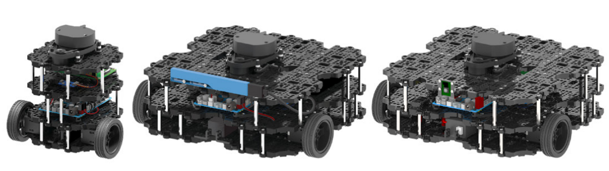
Both hardware and software (also ```*.stl``` files of the 3D models) are open-source and distribuited on cloud by the _ROBOTIS Co. Ltd_, so users can modify and customize their platform for any purpose.

## Hardware
Turtlebot 3 is a differential drive based on _Dynamixel_ actuators for move the wheels, a _single-board computer_ for opetrating with ROS (Raspbarry Pi or Intel Joule), an _embedded board_ based on _Cortex-M7_ microcontroller used as sub-controller, and can be equipped with various sensors such as imu, depth camera for 3D recognition, LiDaR, etc.
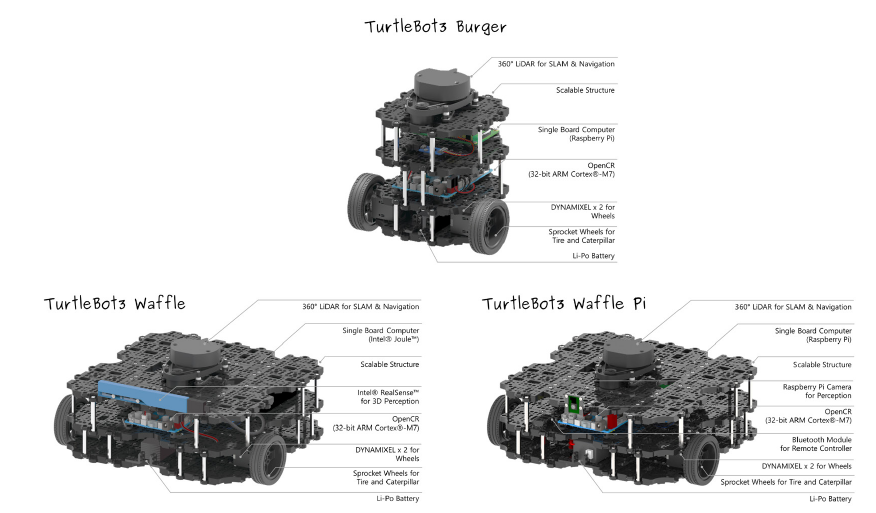

ROS requires an operating system such as Linux for run, but conventional O.S. does not guarantee real-time operation, and microcontrollers suitable for real-time control are required to control actuators and sensors.
TurtleBot3 use a ARM Cortex-M7 series microcontroller placed on the **OpenCR** (_Open-source Control Module for ROS_) board for performs this low level task.  
OpenCR board use the _STM32F746_ chip as main MCU, and provides _Arduino UNO_ compatible interface, so various libraries, source code and shield modules made for
Arduino development environment can be used.  
OpenCR board supports the main communication interfaces such as UART, I2C, SPI, CAN, TTL, RS485, and includes _MPU925010_ chip, which is integrated triple-axis gyroscope, triple-axis accelerometer, and triple-axis magnetometer sensor in one chip, therefore, various applications using IMU sensor can be used without adding a sensor.  
OpenCR provides a firmware to communicate with the peripherals that can be download directly by the Arduino IDE.
  
## Software
The Turtlebot 3 software consists of a firmware for the embedded board used as sub-controller and 4 ROS packages.  
The firmware is also knowed ```turtlebot3_core``` and is loaded on the embedded board located on the real platform. It provides the management of the motors, the reading of the encoder values and the estimation of the robot location, collecting also the values from the imu.  
For use ROS topic/messages communication mechanism on a embedded system is possible to use ```rosserial```, that is a protocol for wrapping standard ROS serialized messages and multiplexing multiple topics and services over a serial port. ```rosserial``` works as client/server mechanism to exchange messages between the single-board PC and the microcontroller: the PC running ROS is the server and the microcontroller becomes a client.
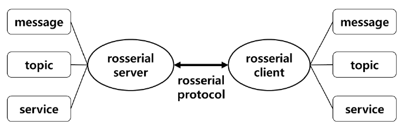

The server is performed using a ROS node related to the language used (refers to ROS packages ```rosserial_python```, ```rosserial_server``` for C++, ```rosserial_java```), whereas the client library supports all _Arduino platforms_ or _mbed platforms_.  
The rosserial server and client send and receive data in packets based on serial communication. The rosserial protocol is defined in byte level and contains information for packet synchronization and data validation.
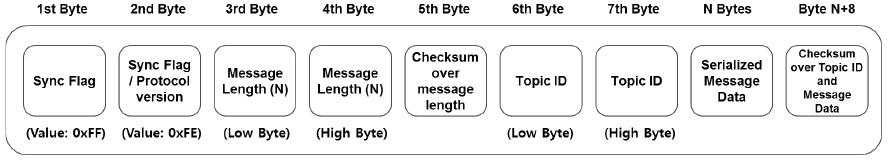

The rosserial packet includes the header field to send and receive the ROS standard message and the checksum field to verify the validity of the data:
- **Sync Flag**: this flag byte is always 0xFF and indicates the start of the packet.
- **Sync Flag / Protocol version**: this field indicates the protocol version of ROS where Groovy is 0xFF and Hydro, Indigo, Jade, Kinetic, Melodic are 0xFE.
- **Message Length**: this 2 bytes field indicates the data length of the message transmitted through the packet. The Low byte comes first, followed by the High byte.
- **Checksum over message length**: the checksum verifies the validity of the message length and is calculated as  
```255 - ((message_length_low_byte + message_length_high_byte) % 256)```
- **Topic ID**: the ID field consists of 2 bytes and is used as an identifier to distinguish the message type. Topic IDs from 0 to 100 are reserved for system functions. The main topic IDs used by the system are shown below.  
```uint16 ID_PUBLISHER=0```  
```uint16 ID_SUBSCRIBER=1```  
```uint16 ID_SERVICE_SERVER=2```  
```uint16 ID_SERVICE_CLIENT=4```  
```uint16 ID_PARAMETER_REQUEST=6```  
```uint16 ID_LOG=7```  
```uint16 ID_TIME=10```  
```uint16 ID_TX_STOP=11 ```
- **Serialized Message Data**: this data field contains the serialized messages.
- **Checksum over topic ID and Message Data**: this checksum is for validating Topic ID and message data, and is calculated as follows.  
```255 - ((topic_ID_low_byte + topic_ID_high_byte + data_byte_values) % 256)```
- **Query Packet**: when the rosserial server starts, it requests information such as topic name and type to the client. When requesting information, the query packet is used. The Topic ID of query packet is 0 and the data size is 0. The data in the query packet is shown below.  
```0xff 0xfe 0x00 0x00 0xff 0x00 0x00 0xff```  
When the client receives the query packet, it sends a message to the server with the following data, and the server sends and receives messages based on this information.  
```uint16 topic_id```  
```string topic_name```  
```string message_type```  
```string md5sum```  
```int32 buffer_size```  

> #### :warning: ROSSERIAL LIMITATION
> With ```rosserial``` is possible to send and receive ROS standard messages with the embedded system using the UART protocol, but there are some hardware limitations of the embedded system that may cause an
issue. For example, memory constraints (more then 25 topic can be arise some issue) or ```Float64``` and ```String``` type, that are not supported by several microcontroller.

Whereas, the ROS packages running on the PC are organized as follow:
- ```turtlebot3```: contains Turtlebot's robot models, SLAM and navigation package, remote control package and bringup package.
- ```turtlebot3_msgs```: contains message files used in ```turtlebot3```.
- ```turtlebot3_simulations```: contains packages used for simulation in Gazebo.
- ```turtlebot3_applications```: provides some application examples with the Turtlebot 3.

## TurtleBot3 Install
#### Install dependent packages
Install dependent packages in ROS main folder: ```/opt/ros/melodic```.
```bash
$ sudo apt-get install ros-melodic-joy ros-melodic-teleop-twist-joy ros-melodic-teleop-twist-keyboard ros-melodic-laser-proc ros-melodic-rgbd-launch ros-melodic-depthimage-to-laserscan ros-melodic-rosserial-arduino ros-melodic-rosserial-python ros-melodic-rosserial-server ros-melodic-rosserial-client ros-melodic-rosserial-msgs ros-melodic-amcl ros-melodic-map-server ros-melodic-move-base ros-melodic-urdf ros-melodic-xacro ros-melodic-compressed-image-transport ros-melodic-rqt-image-view ros-melodic-gmapping ros-melodic-navigation ros-melodic-interactive-markers
```

#### Install TurtleBot3 packages
Install TurtleBot3 packages in the workspace, from the official github repository https://github.com/ROBOTIS-GIT.
```bash
$ cd ~/ros_ws/src/
$ git clone https://github.com/ROBOTIS-GIT/turtlebot3.git
$ git clone https://github.com/ROBOTIS-GIT/turtlebot3_msgs.git
$ git clone https://github.com/ROBOTIS-GIT/turtlebot3_simulations.git
$ cd ..
$ catkin_make
```
>##### :children_crossing: BUILDING PROBLEM
>If there are problems in building phase with python _em_ module install the library:
> ```
> $ python -m pip install empy
> $ python3 -m pip install empy 
> ```

## Simulation
For work in simulation environment with Gazebo and Rviz is needed to choose which model of Turtlebot we want to use (choose between ```burger```,```waffle``` and ```waffle_pi```), setting the environment variable as follow
```bash
$ export TURTLEBOT3_MODEL=waffle_pi
```
> ####  :fast_forward: SET ENVIRONMENT VARIABLE
> For improve the working flow, it's possible to include the setting of this environment variable in the ```.bashrc``` file, adding the following lines:
> ```
> # Export Robot Model
> export TURTLEBOT3_MODEL=waffle_pi
> ```
> This allows not having to specify this setting in each new terminal.

### Spawn model in Gazebo
For run the Gazebo simulation environment, type
```bash
$ roslaunch turtlebot3_gazebo turtlebot3_empty_world.launch 
```
or 
```bash
$ roslaunch turtlebot3_gazebo turtlebot3_world.launch 
```
in the ```turtlebot3_description``` package there are the files that describes the Turtlebot by the urdf, the Gazebo specifications for physical simulations and the meshes files used for modelling the parts of the robot. The ```turtlebot3_gazebo``` package mainly contains the launch file for spawn the robot model in different Gazebo scenarios.

### Teleop Turtlebot 3
For teleoperate the Turtlebot is available a node in the ```turtlebot3_teleop``` package for send the velocities commands on the ```cmd_vel``` topic, reading from the keyboard. Type in a terminal:
```bash
$ roslaunch turtlebot3_teleop turtlebot3_teleop_key.launch
```

### Visualize Turtlebot 3 on Rviz
For visualize the belief of the robot, such as his position, his configuration or the data information from his sensors, advertised on the topic, run Rviz using the ```*.launch``` file
```bash
$ roslaunch turtlebot3_gazebo turtlebort3_gazebo_rviz.launch
```
or manually start Rviz and select which information would to display adding the related object
```bash
$ rviz
```
If you choose to start Rviz standalone, you have to run the ```robot_state_publisher``` from the homonym package
```bash
$ rusrun robot_state_publisher robot_state_publisher
```
Depending on the Turtlebot model chosen, it's possible to adding different sensor on Rviz, for know what sensor are equipped on your model, browse the related```*.gazebo.xacro``` file in the ```turtlebot3_description``` package.  
For example, using the Turtlebot 3 Waffle Pi, it's possible to get environmental information from the LiDaR and from a RGB Camera. After adding the robot model, try to add the sensors using ```LaserScan``` and ```Camera``` object, next select the ```/scan``` topic for the laser and the ```/camera/rgb/image_raw``` for the camera.  

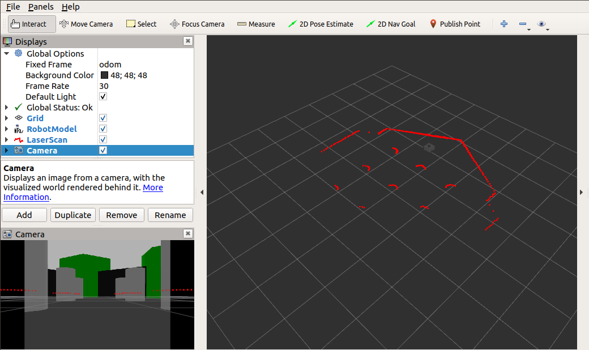

## Build a Map
Very useful aspect to perform autonoumus navigation is build a map of the environment in which the robot moves.  
Navigation maps in ROS are represented by a 2D grid, where each grid cell contains a value that corresponds to how likely it is to be occupied: white is open space, black is occupied, and the grayish color is unknown. Map files are stored as image (```*.png```,```*.jpg```, ```*.pmg```). Associated with each map is a
```*.yaml``` file that holds additional information, such as the resolution (the length of each grid cell in meters), where the origin of the map is, and thresholds for deciding if a cell is occupied or unoccupied.  
To build a map, ROS makes available several packages (such as ```gmapping```), that record data from sensors and simultaneously localize the robot in the enviorment reading the odometry informations. For construct a good map is needed to perform slow movement (in particular the turn movement) and cover the whole area many times.
Using the ```slam_gmapping``` node from ```gmapping``` package, it's possible to build the map of the environment.

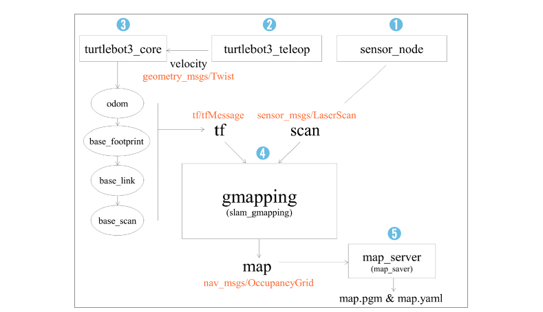

Before run the ```slam_gmapping``` node set the dimension of the map that you would to build specifying in the parameter server the following parameters:
```bash
$ rosparam set /slam_gmapping/xmax 10  
$ rosparam set /slam_gmapping/xmin -10
$ rosparam set /slam_gmapping/ymax 10  
$ rosparam set /slam_gmapping/ymin -10
```
then run the node
```bash
$ rosrun gmapping slam_gmapping
```
Try now to add a display of type _Map_ on Rviz, and set the topic name to ```/map```. Make sure that the fixed
frame is also set to ```/map```. After this try to move the Turtlebot around the world with the teleoperation node and see in Rviz the building process of the map.  

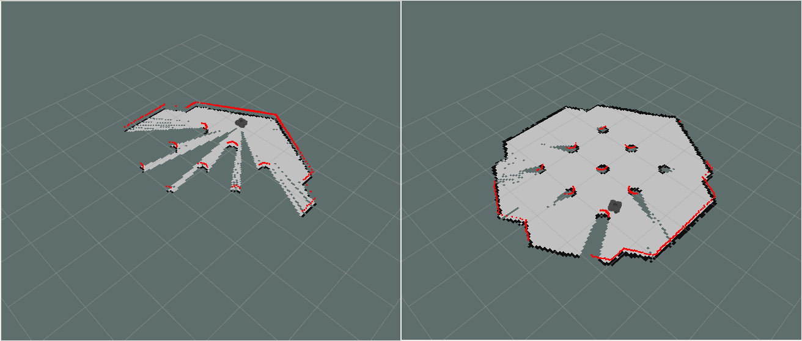

When you think that the builded map is aceptable, use the ```map_saver``` node from the ```map_server``` package for save the map and his configuration file on the disk, in another terminal types:
```bash
$ rosrun map_server map_saver
```
and see the two files saved in your user's home folder. The ```map_saver``` node generates an image that contains the map and a ```*.yaml``` file that contains the information about the map resolution, the coordinates frame and the treshold values for classify free, occuped or unknown grid cells.  
```
image: map.pgm
resolution: 0.050000
origin: [-10.000000, -10.000000, 0.000000]
negate: 0
occupied_thresh: 0.65
free_thresh: 0.196
```
Move this files in a ```map/``` folder in the package for use it in autonomous navigation.  
You can use the ```gmapping``` package also on your own robot to reconstruct a map of your custom environment.

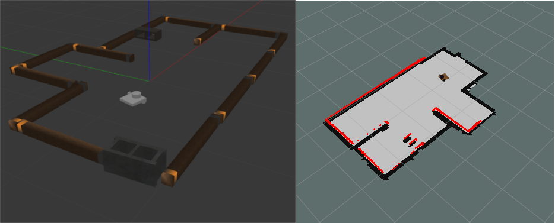

## Autonomous Navigation
One of the most basic things that a robot can do is to autonomously move around the world. To do this effectively, the robot needs to know where it is and where it should be going. This is usually acheived by giving the robot a map of the world, a starting location and a goal location.

> #### :scroll: CURIOSITY
> It's interesting to analyze the etymology of the words _autonomous vehicle_ for indentify the main purpose of a mobile robot.  
"Vehicle", from Latin _vehicŭlum_, derived from _vehĕre_ "to transport". This word identifies an object that carries something (or itself) from one point of space to another. Hence, it must consist of a locomotion system that allows the object to move.  
"Autonomous", from Ancient Greek _αὐτόνομος_, that can be translate with the locution "that governs itself". Combined with the previous word, is needed to perform the automation of the movement together with the ability to locate itself within the space, using a set of sensors.

### Localization
To localize the robot in a map, different algorithms can be used. Turtlebot 3 use the ROS ```amcl``` package that provides a node that implements a set of probabilistic localization algorithms, collectively known as **Adaptive Monte Carlo Localization**. A theoretical explanation of these algorithms can be found in the book _Probabilistic Robotics_ by Sebsastian Thrun, Wolfram Burgard and Dieter Fox, whereas an intuitive explanation of how the algorithm works will be presented below.  
The ```amcl``` node maintains a set of poses, representing where it thinks the robot might be. Each of these candidate poses has associated with it a probability: higher-probability poses are more likely to be where the robot actually is. When the robot moves
around the world, the sensor readings are compared to the readings that would be expected for each pose of the set, according to the map. For each candidate pose, if the readings are consistent with the map, then the probability of that pose increases and decreases otherwise. Over time, candidate poses with very low probability are discarded, so the set converge to the actual pose of the robot. As the robot moves around the world, the candidate poses move with it, following the odometry estimates that the robot generates.  
The AMCL algorithm involve five main phases:
- **Initialization**: if the robot's initial pose is unknown, the  particles are randomly choosed in the space, each one with a weight of . If the initial position is known, particles are placed near the robot.
- **Prediction**: based on the kinematic and dynamic models of the robot, its moves each particle as amount of observed movement with odometry information and noise.
- **Update**: based on the measured sensor information, the probability of each particle is calculated and the weight value of each particle is updated based on the calculated probability.
- **Pose estimation**: the position, orientation, and weight of all particles are used to calculate the average weight, median value, and the maximum weight value for estimating pose of the robot.
- **Resampling**: the step of generating new particles is to remove the less weighed particles and to create new particles that inherit the pose information of the weighted particles. Here, the number of particles must be maintained.

On the Turtlebot is possible to run this localization algorithm running the ```amcl``` node of the same package. In order to launch the simulation and the localization algorithm on the pre-builded map create a launch file (in this example located in the ```turtlebot3_navigation``` package) that contains the following lines:
```xml
<launch>
  <!-- Turtlebot3 Gazebo Simulation-->
  <include file="$(find turtlebot3_gazebo)/launch/turtlebot3_world.launch"/>
  <node name="robot_state_publisher" pkg="robot_state_publisher" type="robot_state_publisher"/>

  <!-- Map server -->
  <node pkg="map_server" name="map_server" type="map_server" args="$(find turtlebot3_navigation)/maps/map.yaml"/>

  <!-- AMCL -->
  <include file="$(find turtlebot3_navigation)/launch/amcl.launch"/>

  <!-- Rviz -->
  <node name="rviz" pkg="rviz" type="rviz" args="-d $(find turtlebot3_gazebo)/rviz/turtlebot3_localization.rviz"/>
</launch>
```
First run the simulation environment (using the ```*.launch``` file seen before) and the ```robot_state_publisher```
```xml
<!-- Turtlebot3 Gazebo Simulation-->
<include file="$(find turtlebot3_gazebo)/launch/turtlebot3_world.launch"/>
<node name="robot_state_publisher" pkg="robot_state_publisher" type="robot_state_publisher"/>
  ```
next load the map builded in the previous section using the ```map_server``` node
```xml
<!-- Map server -->
<node pkg="map_server" name="map_server" type="map_server" args="$(find turtlebot3_navigation)/maps/map.yaml"/>
```
At this point, include the ```amcl.launch``` file in the ```turtlebot3_navigation``` package that contains all the parameters for the localization algorithm
```xml
<!-- AMCL -->
<include file="$(find turtlebot3_navigation)/launch/amcl.launch"/>
```
Finally, run Rviz with a configuration file that store the visual object for display the main desidered informations (optional, save a previous session of Rviz in the ```rviz``` folder in the ```turtlebot3_gazebo``` package).
```xml
<!-- Rviz -->
<node name="rviz" pkg="rviz" type="rviz" args="-d $(find turtlebot3_gazebo)/rviz/turtlebot3_localization.rviz"/>
```
Use the "2D Pose Estimate" button on Rviz for give at the robot a good initial pose estimation, see the overlap between the sensors data and the map.

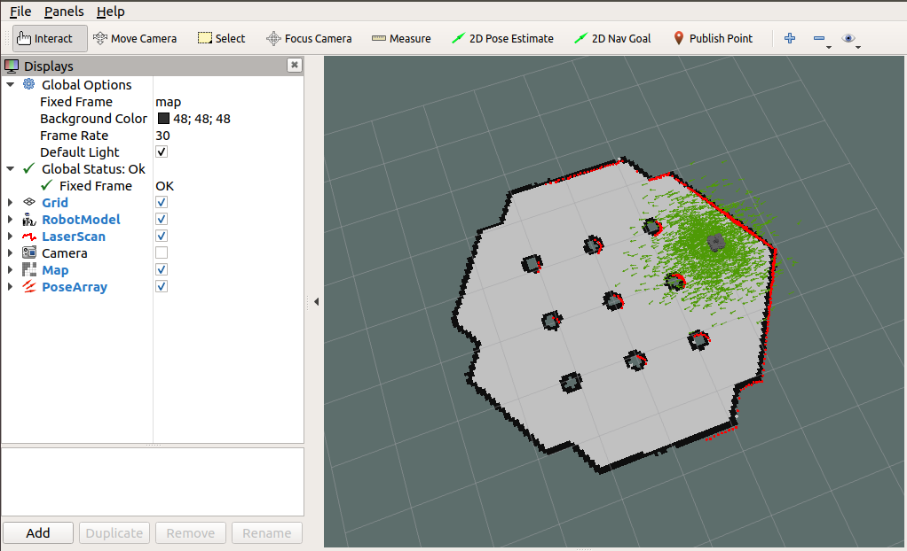

Launch the ```turtlebot3_teleop.launch``` for move the robot in the environment and see how the _particle filter_ increses its knowdleges and improves its estimation of the pose (the cloud of pose is more compact and near the real pose of the robot).  

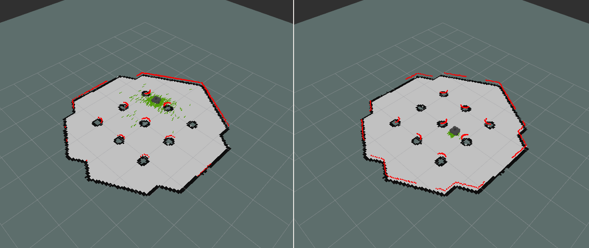

### Navigation
The purpose of the navigation system, also called **navigation stack** (or _nav stack_) from ROS users, is integrate information from the map, localization system, sensors, and odometry to plan a good path from the current position to the goal position, and then follows it to the best of the robot’s ability, avoiding unmapped obstacles.  
Next figure illustrates the main relationship between the essential nodes and topics to run the ROS _nav stack_.

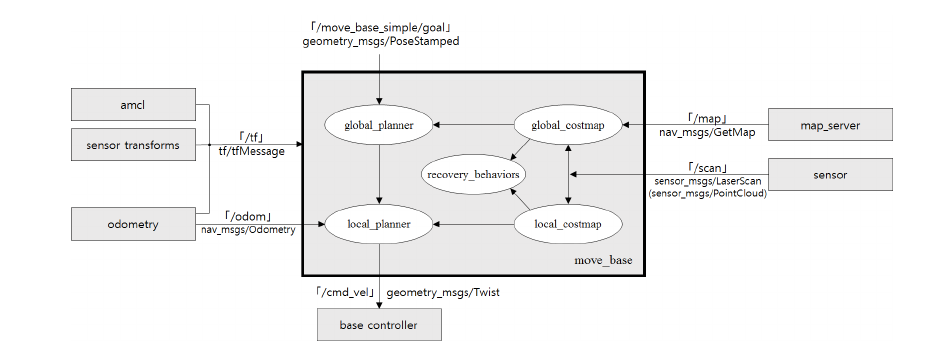

At a high level, the _navigation stack_ works like this:
1. A navigation goal is sent to the _nav stack_. This is done using an action call with a goal of type ```MoveBaseGoal```, which specifies a goal pose (position and orientation) in some coordinate frame (commonly the map frame).
2. The _nav stack_ uses a _path-planning_ algorithm in the global planner to plan the shortest path from the current location to the goal, using the map.
3. This path is passed to the local planner, which tries to drive the robot along the path. The local planner uses information from the sensors in order to avoid obstacles that appear in front of the robot but that are not in the map. If the local planner gets stuck and cannot make progress, it can ask the global planner to make a new plan and then attempt to follow that.
4. When the robot gets close to the goal pose, the action terminates and the task are considered done.

Examples of algorithms for path planning are
- Dijkstra’s algorithm
- A*
- Artificial potential field method

Path planning algorithms may be based on graph or occupancy grid or both.  
Methods that are using occupancy grid divide area into cells (e.g. map pixels) and assign them as occupied or free. One of cells is marked as robot position and another as a destination. Finding the trajectory is based on finding shortest line that do not cross any of occupied cells. This can be done using graph search-based alghoritms, where each edge that connct two cells has assigned a weight representing difficulty of traversing the path (e.g. the nearness from the obstacles).  
The ```move_base``` node is the main component to perform the autonomous navigation, it creates a _cost map_, that is a grid in which every cell gets assigned value determining distance to obstacle, where higher value means closer distance. With this map, trajectory passing cells with lowest cost is generated. The ```move_base``` node uses two cost maps, local for determining current motion and global for trajectory with longer range. Both cost maps are available on topic: ```/move_base/global_costmap/costmap```, ```/move_base/local_costmap/costmap```, and both have type ```nav_msgs/OccupancyGrid```.

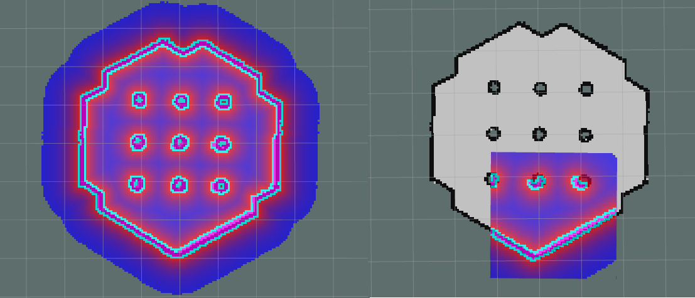

The parameters for build the costmap are stored in ```*.yaml``` files. One to the parameters that will be common to both global and local costmaps, others two to define the parameters for each map.    
For the TurtleBot 3 Waffle Pi model, the common parameters are defined in the ```costmap_common_params_waffle_pi.yaml``` file:

```
obstacle_range: 3.0
raytrace_range: 3.5

footprint: [[-0.205, -0.155], [-0.205, 0.155], [0.077, 0.155], [0.077, -0.155]]

inflation_radius: 1.0
cost_scaling_factor: 3.0

map_type: costmap
observation_sources: scan
scan: {sensor_frame: base_scan, data_type: LaserScan, topic: scan, marking: true, clearing: true}
```
An exhaustive explanation of all parameters can be found on http://wiki.ros.org/costmap_2d, next a brief explanation is given: 
```
obstacle_range: 3.0
```
represent the maximum range in meters at which to insert obstacles into the costmap using sensor data, in this range obstacles will be considered during path planning.
```
raytrace_range: 3.5
```
This parameter defines range in which area could be considered as free.
```
footprint: [[-0.205, -0.155], [-0.205, 0.155], [0.077, 0.155], [0.077, -0.155]]
```
Defines the shape of the robot's footprint as a 2D polygon, that will considered during collision detecting.
```
inflation_radius: 1.0
cost_scaling_factor: 3.0
```
Are the parameters used for propagating cost values out from occupied cells that decrease with distance.
```
map_type: costmap
```
Specify a 2D view of the world.
```
observation_sources: scan
scan: {sensor_frame: base_scan, data_type: LaserScan, topic: scan, marking: true, clearing: true}
```
Define the type of sensor used to provide data and its properties
- _sensor_frame_ - coordinate frame tied to sensor
- _data_type_ - type of message published by sensor
- _topic_ - name of topic where sensor data is published
- _marking_ - true if sensor can be used to mark area as occupied
- _clearing_ - true if sensor can be used to mark area as clear.

To build the _global costmap_ are used the parameters contained in the ```global_costmap_params.yaml```:
```
global_costmap:
  global_frame: map
  robot_base_frame: base_footprint

  update_frequency: 10.0
  publish_frequency: 10.0
  transform_tolerance: 0.5

  static_map: true
```
Analyzing the single lines:
```
global_frame: map
robot_base_frame: base_footprint
```
this parameter defines coordinate frames tied to occupancy grid map and to the robot.
```
update_frequency: 10.0
publish_frequency: 10.0
```
These parameters define how often cost should be recalculated and how often cost map should be published on the topic.
```
transform_tolerance: 0.5
```
This parameter define the maximum latency in published transforms (in seconds), if the tf tree is not updated at this expected rate, the navigation stack stops the robot.
```
static_map: true
```
Specify that the map not change in time.  
The parameter for the _local costmap_ are defined in the ```local_costmap_params.yaml```:
```
local_costmap:
  global_frame: odom
  robot_base_frame: base_footprint

  update_frequency: 10.0
  publish_frequency: 10.0
  transform_tolerance: 0.5  

  static_map: false  
  rolling_window: true
  width: 3
  height: 3
  resolution: 0.05
```
That have the same means of the previous, but different values. In addition are specified 
```
rolling_window: true
```
to indicate that the local costmap use a small rolling window: the robot always remains at the center of the window, discarding all is outside the local map, whose size is defined by the following parameters
```
width: 3
height: 3
resolution: 0.05
```
In ```move_base_params.yaml``` and ```dwa_local_planner_params_waffle_pi.yaml``` can be found the parameters used by the trajectory planner such as 
```
# The velocity when robot is moving in a straight line
  max_vel_trans:  0.26
  min_vel_trans:  0.13

  max_vel_theta: 1.82
  min_vel_theta: 0.9

  acc_lim_x: 2.5
  acc_lim_y: 0.0
  acc_lim_theta: 3.2 

# Goal Tolerance Parametes
  xy_goal_tolerance: 0.05
  yaw_goal_tolerance: 0.17
```
The ```move_base``` node with its parameters can be execute using the ```*.launch``` file in the ```turtlebot3_navigation``` package.
Modify the initial position in the ```amcl.launch``` file, setting the correct initial position used for spawn the robot's model in Gazebo
```xml
<arg name="initial_pose_x" default="-2.0"/>
<arg name="initial_pose_y" default="-0.5"/> 
```
and launch the simulation environment typing
```
$ roslaunch tutlebot3_navigation turtlebot3_localization.launch
```
then launch ```move_base``` typing in a new terminal
```
$ roslaunch tutlebot3_navigation move_base.launch
```
On Rviz, using the "Add" button, add in the view a _Map_ for display the _local costmap_, a _Pose_ to visualize the current target point published on the ```/move_base_simple/goal```, and a _Path_ object to display the desidered trajectory computed by the global planner.

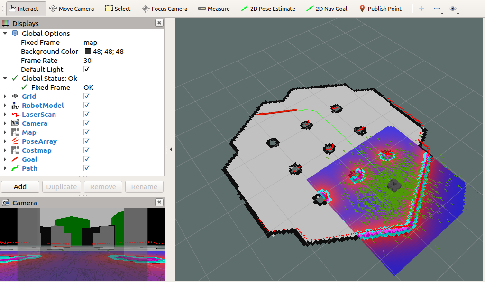

Using the "2D Nav Goal" button in Rviz, publish a goal for the robot and see the computed path. During the simulation you can publish a new goal in each moment, deleting the previous target. See how the localization improve during the movement.

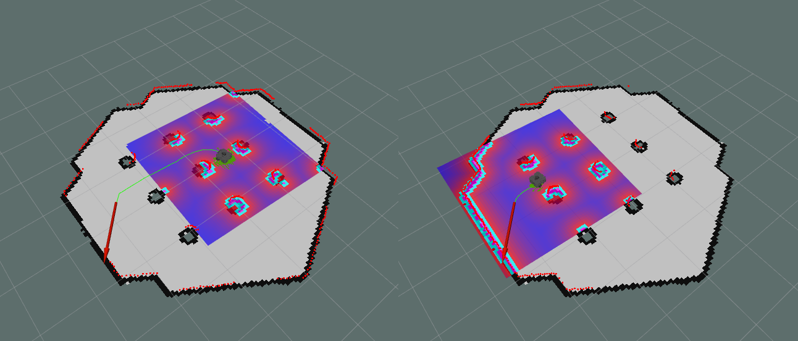

> #### :warning: COMMANDS CONFLICT
> If you want to improve the localization estimation, before start the autonomous navigation, you can teleoperate the robot around the world. Before switch in autonomous mode, be sure that the ```turtlebot3_teleop_key``` node are shutdown to avoid conflict between the velocities commands sent on the ```/cmd_vel``` topic.
