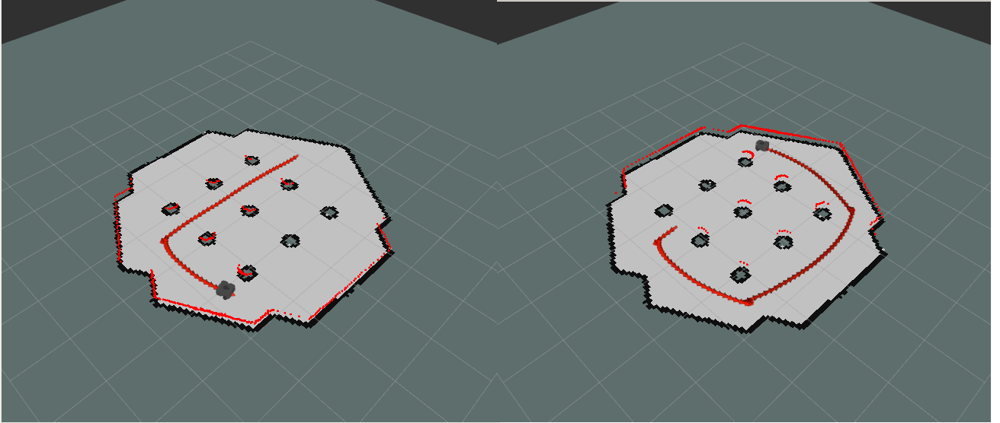
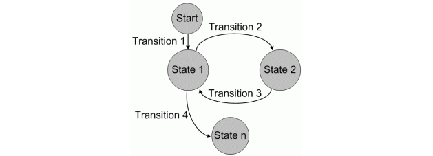
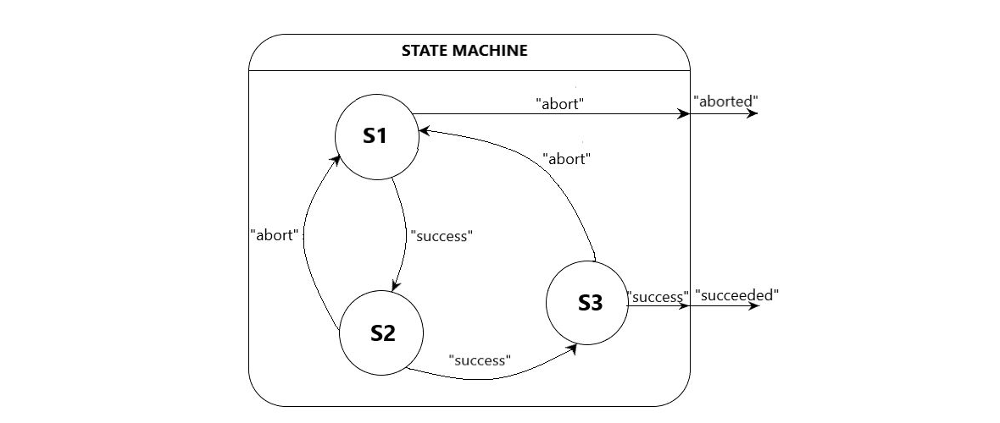
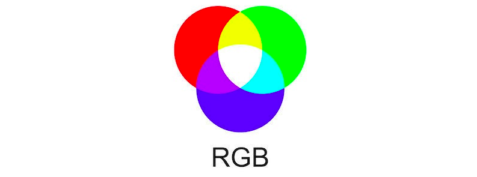
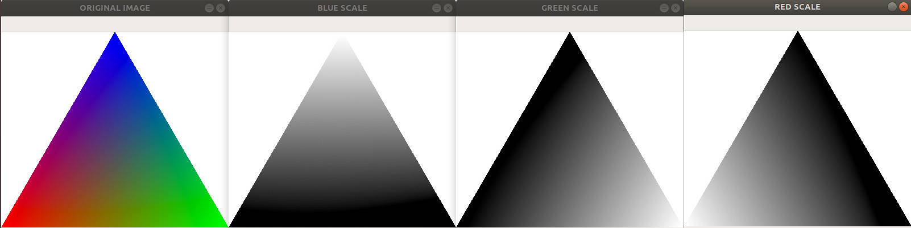
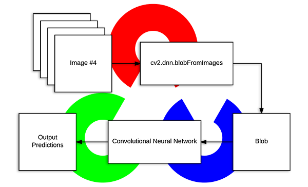

# Applicazioni per un Robot Autonomo
Lo scopo delle scorse esercitazioni è stato quello di integrare le funzioni necessarie e sufficienti affinché un veicolo possa essere considerato autonomo. A questo punto risulta interessante aggiungere al robot un livello di intelligenza che gli permetta di sfruttare tali capacità al fine di eseguire task più articolati in maniera del tutto indipendente.
> :mag: ETIMOLOGIA  
> Prima di proseguire risulta interessante analizzare l'etimologia di _"veicolo autonomo"_ al fine di comprendere quali sono le capacità di cui un veicolo necessita affinché possa essere considerato tale.  
> **Veicolo**: dal lat. _vehicŭlum_, der. di _vehĕre_ «trasportare». Identifica un mezzo che trasporti qualcosa (o qualcuno), o in ogni caso se stesso, da un punto dello spazio a l'altro: un oggetto dotato dunque di un sistema di locomozione (attuatori ed eventuali organi di trasmissione) che gli permetta di spostarsi da un punto A a un punto B.  
> **Autonomo**: dal gr. _αὐτόνομος_, a cui si può far corrispondere la locuzione «che si governa da sé». Associato al veicolo, si richiede che questo sia in grado non solo di azionare il relativo sistema di locomozione, ma che sia inoltre dotato di sensori che gli permettano di localizzarsi all'interno dell'ambiente entro cui si muove.

È possibile creare un nuovo package (`turtlebot3_app`) che contenga gli esempi di applicazioni autonome per il Turtlebot 3.
```bash
$ catkin_create_pkg turtlebot3_app rospy roscpp std_msgs geometry_msgs nav_msgs
```

## Pattugliamento
Una delle applicazioni più comuni per un robot mobile è quella di pattugliare un'area predefinita. Ciò viene fatto principalmente per scopi di sorveglianza (militare o civile) o per la ricerca di oggetti d'interesse (ordigni, persone, animali) o, ancora, per scopi di monitoraggio ambientale, raccogliendo dati di aria, acqua o altro durante il pattugliamento.  
Il pattugliamento consiste di fatto nella circolazione del robot all'interno di un'area predefinita (nota a priori o non), e può essere effettuato utilizzando diverse strategie e algoritmi: spostarsi fra una serie di _waypoints_ o effettuando spostamenti casuali (_random walk_).    
Si supponga ad esempio di voler eseguire una missione di pattugliamento sfruttando una serie di _waypoints_ distribuiti all'interno della mappa, e che si voglia visitarli in successione in maniera ciclica. Nella cartella `scripts/` del package verrà creato il file `patrol.py` riportato di seguito:
```python
#! /usr/bin/env python
# - *- coding: utf- 8 - *
import rospy
import tf
import actionlib
from move_base_msgs.msg import MoveBaseAction, MoveBaseGoal

class Patrol():
    def __init__(self):
        rospy.init_node('patrol')
        # ------ PARAMETERS ------
        # list of waypoint:
        # [(x1,y1,ϑ1),(x2,y2,ϑ2),(x3,y3,ϑ3)]
        self.waypoints = [( 1.6,-0.6, 0.7199),\
                          ( 1.5, 1.5, 2.7586),\
                          (-1.5, 1.5,-2.0984),\
                          (-1.5,-1.5,-0.4026)]
        # ------ ACTIONS ------
        self.client = actionlib.SimpleActionClient('move_base', MoveBaseAction)
        self.client.wait_for_server()

    def loop(self):
        while not rospy.is_shutdown():
            for w in self.waypoints:
                # Create Goal
                goal = MoveBaseGoal()
                goal.target_pose.header.frame_id = 'map'
                goal.target_pose.pose.position.x = w[0]
                goal.target_pose.pose.position.y = w[1]
                q = tf.transformations.quaternion_from_euler(0,0,w[2])
                goal.target_pose.pose.orientation.x = q[0]
                goal.target_pose.pose.orientation.y = q[1]
                goal.target_pose.pose.orientation.z = q[2]
                goal.target_pose.pose.orientation.w = q[3]
                # Send Goal
                self.client.send_goal(goal)
                print('Raeaching the pose: '+str(w))
                self.client.wait_for_result()
                print('Pose reached')

if __name__ == '__main__':
    p = Patrol()
    p.loop()
```

Poiché la libreria `tf` di Python non supporta ancora Python 3 lo script viene implementato utilizzando l'interprete di Python 2.7 (questo è un esempio lampante dell'interoperabilità di ROS: il programmatore può utilizzare contemporaneamente differenti linguaggi di programmazione nelle sue applicazioni, senza doversi preoccupare di farli interfacciare se non tramite ROS).  
È necessario importare inizialmente i messaggi associati all'azione implementata dal nodo `move_base`
```python
import actionlib
from move_base_msgs.msg import MoveBaseAction, MoveBaseGoal
```
Per prima cosa definire la classe `Patrol` e nel costruttore inizializzare il nodo `patrol` contenente la lista dei _waypoints_, in cui ogni punto è contenuto in una tupla di tre elementi rappresentante la posizione cartesiana (x,y) e l'orientamento desiderato . Sempre nel costruttore creare un client dell'azione `move_base` (`SimpleActionClient`) e aspettare che il server venga posto in esecuzione.  
```python
def __init__(self):
    rospy.init_node('patrol')
    # ------ PARAMETERS ------
    # list of waypoint:
    # [(x1,y1,ϑ1),(x2,y2,ϑ2),(x3,y3,ϑ3)]
    self.waypoints = [( 1.6,-0.6, 0.7199),\
                      ( 1.5, 1.5, 2.7586),\
                      (-1.5, 1.5,-2.0984),\
                      (-1.5,-1.5,-0.4026)]
    # ------ ACTIONS ------
    self.client = actionlib.SimpleActionClient('move_base', MoveBaseAction)
    self.client.wait_for_server()
```
> #### :pushpin: SCELTA DEI WAYPOINTS
> Per la scelta dei _waypoints_ è necessario stabilire le coordinate e l'orientamento dei punti all'interno della mappa. È possibile fare ricorso a Rviz per aiutarsi in tale compito e sfruttare il tasto "2D Nav Goal" per assegnare i target corrispondenti ai waypoints e visualizzae il `MoveBaseActionGoal` pubblicato sul topic `/move_base/goal`.
> ```bash
> $ rostopic echo /move_base/goal
> header: 
>   seq: 1
>   stamp: 
>     secs: 24
>     nsecs:  32000000
>   frame_id: ''
> goal_id: 
>   stamp: 
>     secs: 0
>     nsecs:         0
>   id: ''
> goal: 
>   target_pose: 
>     header: 
>       seq: 1
>       stamp: 
>         secs: 24
>         nsecs:  32000000
>       frame_id: "map"
>     pose: 
>       position: 
>         x: 1.5964217186
>         y: -0.57045352459
>         z: 0.0
>       orientation: 
>         x: 0.0
>         y: 0.0
>         z: 0.350111938055
>         w: 0.936707868458
> ---
> ```
> Nel campo `goal.target_pose.pose` è possibile consultare il sottocampo `position` per ottenere le coordinate cartesiane (x,y) del punto selezionato, e il sottocampo `orientation` per l'orientamento. L'orientamento è espresso da un _quaternione_, che è possibile trasformare nei corrispettivi _angoli di Eulero_ aprendo un interprete Python 2.7 su terminale e facendo ricorso alla funzione `tf.transformations.euler_from_quaternion`.
> ```bash
> $ python
> Python 2.7.17 (default, Apr 15 2020, 17:20:14) 
> [GCC 7.5.0] on linux2
> Type "help", "copyright", "credits" or "license" for more information.
> >>> import tf
> >>> q = tf.transformations.euler_from_quaternion([0,0,0.35,0.93])
> >>> q
> (0.0, -0.0, 0.719897052054812)

Nella funzione `loop` si cicla sui _waypoints_, inviando un `MoveBaseGoal` al server per ogni waypoints da raggiungere. L'orientamento contenuto in ogni _waypoint_ è espresso per comodità in termini dell'angolo intorno a _z_, e deve essere trasformato in un quaternione prima di essere inviato all'interno del `MoveBaseGoal`. Per la documentazione completa dei campi di `MoveBaseGoal` si consiglia di consultare la documentazione ufficiale: http://docs.ros.org/fuerte/api/move_base_msgs/html/msg/MoveBaseActionGoal.html.  
Eseguire a questo punto il Turtlebot nella sua configurazione autonoma:  
```
$ roslaunch tutlebot3_navigation turtlebot3_localization.launch
```
dunque, in un nuovo terminale, eseguire
```
$ roslaunch tutlebot3_navigation move_base.launch
```
A questo punto è possibile eseguire il nodo `patrol` digitando
```bash
$ chmod +x ~/ros_ws_src/turtlebot3_app/scripts/patrol.py
$ rosrun turtlebot3_app patrol.py
```
Provare ad aggiungere un oggetto _Odometry_ in Rviz per visualizzare il path seguito dal robot durante il pattugliamaento.



## Robot sempre più _intelligenti_
Al fine di rendere un robot più _intelligente_ e renderlo in grado di eseguire task sempre più complessi e sofisticati, è necessario modellare ogni comportamento che il robot deve avere nelle varie situazioni e come reagire alle diverse situazioni. Il comportamento che il robot deve tenere durante il suo funzionamento può divenire molto complesso, specie se dipendente dalle interazioni con l'ambiente circostante. Per modellare tutte le possibili casistiche in cui il robot può trovarsi e schedulare correttamente i suoi cambi di comportamento in realzaione al verificarsi di un evento proveniente dal mondo esterno, risulta utile l'utilizzo di uno degli strumenti cardine dell'informatica: le **macchine a stati finiti**.  
L'idea alla base è quella che un robot si possa trovare in ogni istante in un particolare **stato** di un possibile insieme finito di questi. Ogni stato rappresenta un possibile comportamento che il robot deve tenere (ad esempio _moving_, _waiting_, *collecting_data*, ecc). Quando un robot esegue il task associato allo stato, immediatamente si sposta in uno dei possibili stati successivi in funzione del risultato con cui è stato terminato il task (ad esempio dallo stato di _waiting_ si può passare a quello di _moving_ non appena si riceve un goal da raggiungere).  
A differenza della comune interpretazione che si da a una macchina a stati, gli stati in cui può trovarsi il robot non devono essere considerati come degli _stati statici_, in cui il robot assume una certa configurazione, bensì devono rappresentare un _comportamento dinamico_ del robot, ovvero l'esecuzione di un task che potrebbe includere ad esempio il suo mobìvimento verso il punto desiderato.
Le **transizioni** che permettono il passaggio da uno stato al successivo specificano la struttura della macchina a stati, e permettono di modellare l'evoluzione comportamentale del robot nel tempo. In funzione del successo o meno dell'azione che si sta eseguendo viene generata una transizione verso un'altro stato, associando ad ognuna di esse una _etichetta_ (_label_) che permette di identificare quando quella transizione deve essere percorsa (ad esempio: _success_, _aborted_, _failed_).  



### SMACH
È possibile ricorrere al framework `smach` ("SMACH is a contraction derived from StateMACHine and pronounced like “smash”." [Bohren and Cousins, 2010]) e alla sua estensione per ROS `smach_ros`. Il core di `smach` è indipendente da ROS e consiste in una manciata di librerie scritte in Python. Questo framework, in accordo al _software design pattern composite_, esporta due principali interfacce (_State_ e _Container_), le quali permettono la costruzione di entità per la modellazione di macchine a stati gerarchiche.
#### State
Un oggetto _State_ rappresenta lo "stato di esecuzione"  per il robot e ognuno di essi specifica tutte le possibili uscite (_outcomes_) dello stato verso un altro. L'oggetto `State` deve implementare il metodo `execute` che è il responsabile dell'implementazione del comportamento che il robot deve tenere fintanto che si trova nel suddetto stato. Tale funzione deve inoltre restituire come valore di ritorno l'_outcome_ che identifica come è terminato lo stato in esecuzione. Di seguito si riporta l'esempio di implementazione per un oggetto `State`:
```python
import time
from smach import State, StateMachine

class State1(State):
    def __init__(self):
        State.__init__(self, outcomes=['success','abort'])

    def execute(self, userdata):
        print('One')
        try:
            time.sleep(1)
            return 'success'
        except:
            return 'abort'
```
#### Container
Un _Container_ è una collezione di uno o più stati che devono essere eseguiti secondo una politica ben precisa. Il _Container_ più semplice è  `StateMachine` che permette di modellare la macchina a stati come un diagramma di flusso, in cui ogno `State` è concatenato ai successivi in funzione degli _outcomes_ generati. Un oggetto `StateMachine` è a sua volta uno `State` in quanto implementa la sua interfaccia, il che implica che anch'esso dovrà produrre un insieme di _outcomes_.



```python
# Create StateMachine
sm = StateMachine(outcomes=['succeeded', 'aborted'])
# Add States
with sm:
    StateMachine.add('S1', State1(), transitions={'success':'S2', 'abort':'aborted'})
    StateMachine.add('S2', State2(), transitions={'success':'S3', 'abort':'S1'})
    StateMachine.add('S3', State3(), transitions={'success':'succeeded', 'abort':'S1'})
```

Un altro _Container_ molto utile è `Concurrence`, la cui politica prevede l'esecuzione simultanea di tutti gli stati che contiene. Quando un _Container_ viene inizializzato è possibile definire all'interno di un dizionario Python la mappa degli _outcomes_ (`outcome_map`) che specifica le transizioni fra stati: ad ogni transizione (chiave) viene associato lo stato successivo (valore). Vengono specificate inoltre le transizioni verso gli _outcomes_ del Container in quanto anch'esso uno stato a sua volta.
Nei Container `Concurrence` è possibile inoltre definire due _callback_: `child_termination_cb` e `outcome_cb`, che specificano rispettivamente un'azione che il Container deve compiere dopo che ogni _stato figlio_ o l'ultimo di essi termina.
È inoltre possibile specificare all'interno dei Container un dizionario i variabili denominato `userdata`, il quale contiene un insieme di variabili condivise tra i vari stati.  
Segue un esempio di una semplice macchina astati implementata con `smach`.

```python
#! /usr/bin/env python3
import time
from smach import State, StateMachine

class State1(State):
    def __init__(self):
        State.__init__(self, outcomes=['success','abort'])
    
    def execute(self, userdata):
        print('One')
        try:
            time.sleep(1)
            return 'success'
        except:
            return 'abort'
    
class State2(State):
    def __init__(self):
        State.__init__(self, outcomes=['success','abort'])
        self.retry = True
    
    def execute(self, userdata):
        print('Two')
        try:
            time.sleep(1)
            if self.retry:
                self.retry = False
                raise Exception('RETRY')
            return 'success'
        except:
            return 'abort'

class State3(State):
    def __init__(self):
        State.__init__(self, outcomes=['success','abort'])
    
    def execute(self, userdata):
        print('Three')
        try:
            time.sleep(1)
            return 'success'
        except:
            return 'abort'
        
if __name__ == '__main__':
    # Create StateMachine
    sm = StateMachine(outcomes=['succeeded', 'aborted'])
    # Add States
    with sm:
        StateMachine.add('S1', State1(), transitions={'success':'S2', 'abort':'aborted'})
        StateMachine.add('S2', State2(), transitions={'success':'S3', 'abort':'S1'})
        StateMachine.add('S3', State3(), transitions={'success':'succeeded', 'abort':'S1'})
    
    sm.execute()
```
Provando ad eseguire lo script precedente si ottiene un risultato simile  aquello riportato di seguito:
```bash
$ python automa.py
[ DEBUG ] : ...
[  INFO ] : State machine starting in initial state 'S1' with userdata: 
	[]
One
[  INFO ] : State machine transitioning 'S1':'success'-->'S2'
Two
[  INFO ] : State machine transitioning 'S2':'abort'-->'S1'
One
[  INFO ] : State machine transitioning 'S1':'success'-->'S2'
Two
[  INFO ] : State machine transitioning 'S2':'success'-->'S3'
Three
[  INFO ] : State machine terminating 'S3':'success':'succeeded'

```

### Patrol with SMACH
È possibile implementare il task di pattugliamento utilizzando `smach` per modellare tale attività tramite una macchina a stati. Questo può essere fatto poiché è possibile pensare al pattugliamento come al susseguirsi di azioni di _"raggiungimento di un waypoint"_. Per realizzare una macchina a stati in grado di eseguire tale task, basta implementare un unica classe `State` a cui è associata l'aione di raggiungimento di un singolo waypoint. È possibile successivamente comporre il pattugliamento come più istanze di tale classe, ognuna delle quali specifica un waypoint diverso, connesse fra loro in maniera sequenziale e ciclica.
```python
#! /usr/bin/env python
# - *- coding: utf- 8 - *
import rospy
import actionlib
import tf
from move_base_msgs.msg import MoveBaseAction, MoveBaseGoal
from smach import State, StateMachine

class Waypoint(State):
    def __init__(self, w):
        State.__init__(self,outcomes=['success','stopped'])
        self.client = actionlib.SimpleActionClient('move_base',MoveBaseAction)
        self.client.wait_for_server()
        # Create Goal
        self.goal = MoveBaseGoal()
        self.goal.target_pose.header.frame_id = 'map'
        self.goal.target_pose.pose.position.x = w[0]
        self.goal.target_pose.pose.position.y = w[1]
        q = tf.transformations.quaternion_from_euler(0,0,w[2])
        self.goal.target_pose.pose.orientation.x = q[0]
        self.goal.target_pose.pose.orientation.y = q[1]
        self.goal.target_pose.pose.orientation.z = q[2]
        self.goal.target_pose.pose.orientation.w = q[3]

    def execute(self, userdata):
        # Send Goal
        self.client.send_goal(self.goal)
        self.client.wait_for_result()
        if self.client.get_result() == None:
            return 'stopped'
        return 'success'


class PatrolAutoma():
    def __init__(self):
        rospy.init_node('patrol')

        # ------ PARAMETERS ------
        # waypoints:
        # [(x,y,ϑ),(x,y,ϑ),(x,y,ϑ)]
        self.waypoints = [(1.6,-0.6,0.7199),(1.5,1.5,2.7586),(-1.5,1.5,-2.0984),(-1.5,-1.5,-0.4026)]
        
        self.sm = StateMachine(outcomes=['terminated'])
        with self.sm:
            for i in range(len(self.waypoints)):
                # Add states: (name, Waypoint, transitions)
                StateMachine.add('W'+str(i),Waypoint(self.waypoints[i]),transitions={'success':'W'+str((i+1)%len(self.waypoints)), 'stopped':'terminated'})

    def loop(self):
        self.sm.execute()
        
        
if __name__ == '__main__':
    pa = PatrolAutoma()
    pa.loop()
```

La classe `Waypoint` implementa l'interfaccia di `State` realizzando lo stato di _"guida verso il waypoint `w`"_. Per ogni isanza della classe, nel metodo `__init__`, viene pasato lo specifico waypoint da raggiungere, il quale verrà utilizzato per costruire il punto target come `MoveBaseGoal`. Sempre nel costruttore è instanziato un _client_ della `MoveBaseAction`. Nel metodo `execute` il `goal` viene inviato al _server_ `move_base` e, se verrà raggiunto, verrà generato  l'_outcome_ `success` come valore di uscita dello stato.  
La classe `PatrolAutoma` realizza il nodo ROS e costruisce la macchina a stati che contiene uno stato `Waypoint` per ogni punto da raggiungere: ogni qualvolta il punto corrente viene raggiunto si transita nello stato successivo che guida il robot verso il nuovo waypoint. Il meccanismo può essere ripetutto fino alla visita di tutti i waypoint e ripetuto ciclicamente all'infinito.  
Eseguire un'istanza del Turtlebot 3
```
$ roslaunch tutlebot3_navigation turtlebot3_localization.launch
```
dopodiché eseguire il `move_base` _server_
```
$ roslaunch tutlebot3_navigation move_base.launch
```
ed eseguire il nodo `patrol`
```bash
$ chmod +x ~/ros_ws_src/turtlebot3_app/scripts/patrol_automa.py
$ rosrun turtlebot3_app patrol_automa.py
```

Un altro modo per implementare il task di pattugliamento attraverso un automa a stati finiti e SMACH, è quello di utilizzare la classe `SimpleActionState` del package `smach_ros`, la quale permette di instanziare uno oggetto `State` che fa uso di una azione `actionlib`. Per uno stato di tipo `SimpleActionState` il valore degli _outcomes_ è generato in automatico a partire dai risultati dell'azione.
```python
#!/usr/bin/env python
# - *- coding: utf- 8 - *

import rospy
import tf
from smach import StateMachine
from smach_ros import SimpleActionState
from move_base_msgs.msg import MoveBaseAction, MoveBaseGoal

class PatrolAutoma2():
    def __init__(self):
        rospy.init_node('patrol')

        # ------ PARAMETERS ------
        # waypoints:
        # [(x,y,ϑ),(x,y,ϑ),(x,y,ϑ)]
        self.waypoints = [(1.6,-0.6,0.7199),(1.5,1.5,2.7586),(-1.5,1.5,-2.0984),(-1.5,-1.5,-0.4026)]
        
        self.sm = StateMachine(['succeeded','aborted','preempted'])
        with self.sm:
            for i,w in enumerate(self.waypoints):
                # Create Goal
                goal = MoveBaseGoal()
                goal.target_pose.header.frame_id = 'map'
                goal.target_pose.pose.position.x = w[0]
                goal.target_pose.pose.position.y = w[1]
                q = tf.transformations.quaternion_from_euler(0,0,w[2])
                goal.target_pose.pose.orientation.x = q[0]
                goal.target_pose.pose.orientation.y = q[1]
                goal.target_pose.pose.orientation.z = q[2]
                goal.target_pose.pose.orientation.w = q[3]

                StateMachine.add('W'+str(i),SimpleActionState('move_base',MoveBaseAction,goal=goal),transitions={'succeeded':'W'+str((i+1)%len(self.waypoints))})
                            
    def loop(self):
        self.sm.execute()
        
if __name__ == '__main__':
    pa2 = PatrolAutoma2()
    pa2.loop()
```

## VISIONE ARTIFICIALE
Un'altra funzionalità emblematica della robotica (soprattutto quella mobile) è l'integrazione di sistemi di **visione artificiale**. La _visione arificiale_ è una branca dell'**intelligenza artificiale** i cui task principali sono quelli di acquisizione, processamento, analisi e comprensione di dati sotto forma di immagini digitali, a partire dalle quali viene estratta una grande mole di informazioni sul mondo circostante, al fine di creare modelli numerici usati successivamente per prendere decisioni.  
L'obiettivo che si propone di perseguire la visione artificiale è _"rendere una macchina capace di osservare l'ambiente circostante nello stesso modo in cui farebbe un essere umano"_.
> "Make the robot (or, in general, the machines) able to see the environment as human visual system can do."

I computer acquisiscono le immagini sottoforma di un insieme di numeri contenuti all'interno di una matrice; ogni cella della griglia è detta _pixel_ e corrisponde all'unità elementare di un'immagine. Il numero totale di pixel contenuti in un'immagine è detto _risoluzione_, per una matrice di 600x480 celle, il numero totale di pixel è 288000. Un singolo pixel contiene le informazioni in merito all'intensità di colore di quel punto specifico dell'immagine; questo può avere un valore compreso nell'intervallo [0;255] nel caso in cui l'immagine sia in scala di grigi, o, per immagini a colori, ogni pixel contiene una tupla di tre elementi, ognuno corrispondente all'intensità di uno di tre colori primari: rosso, verde e blu (RGB).



Dunque un'immagine in scala di grigi può essere rappresentata da una matrice bidimensionale dove ogni pixel rappresenta l'intensità di luce: 0 codifica il nero, 255 il bianco. Per un'immagine a colori la rappresentazione può essere ottenuta attraverso una matrice tridimensionale o, equivalentemente, da tre matrici bidimensionali, una per ogni canale di colore.

### OpenCV
**OpenCV** (_Open Source Computer Vision Library_) è una libreria _open-source_ che contiene algoritmi e strumenti per l'acquisizione e l'elaborazione di immagini e il _machine learnig_. OpenCV è progettata per fornire un'infrsattuttura unica per la manipolazione delle immagini e l'applicazione di algoritmi di visione artificiale. La libreria contiene oltre 2500 algoritmi ottimizzati che includono un vasto insieme sia di tecniche classiche di elaborazione che algoritmi di recente sviluppo e allo stato dell'arte nei settori del _machine learning_. Questi algoritmi possono essere utilizzati per gran numero di scopi: riconoscimento di oggetti, riconoscimento facciale, classificazione di movimenti umani a partire da un video, estrazione di modelli 3D dell'ambiente circostante, inseguimento di oggetti in un video, produzione di nuvole di punti 3D a partire dai dati di una stereocamera, fusione di immagini provenienti da diverse camere, ricerca di immagini simili all'interno di un database e tanto altro.
OpenCV è distribuita per diversi linguaggi di programmazione (C++, Python, Java, Matlab) ed è supportata dai principali sistemi operativi: Windows, Linux, Android, MacOS.

#### Installazione di OpenCV
Il codice sorgente di OpenCV può essere scaricato dal [sito ufficiale](https://opencv.org/releases/) o dal suo [repository github](https://github.com/opencv/opencv/tree/4.3.0); in alternativa è possibile installare una versione non ufficiale precompilata per Python direttamente usando `pip`.
Per Python 2 o Python 3, eseguire:
```bash
$ python -m pip install opencv-contrib-python
$ python3 -m pip install opencv-contrib-python
```

#### Utilizzare OpenCV con Python
Di seguito sono riportati alcuni semplici script Python per la lettura, la manipolazione e la visualizzazione delle immagini attraverso i metodi offerti dalla libreria OpenCV.  
OpenCV può leggere un immagine a partire da un file, supportando le principali estensioni: `png`, `jpg`, `pgm`, `bmp`, `tif`, ecc.
```python
import cv2

# Load image
img = cv2.imread('colors_triangle.jpg')

# Display image
cv2.imshow('ORIGINAL IMAGE',img)
cv2.waitKey()
cv2.destroyAllWindows()
```
Come accenato in precedenza, un'immagine a colori può essere scomposta in tre matrici bidimensionali, ognuna rappresentante l'intensità di un diverso canale di colore. Quando viene invocata la funzione `cv2.imread` l'immagine viene letta dal file e salvata all'interno di una struttura dati che immagazzina le informazini secondo il formato di colori BGR, ciò implica che la prima matrice è associata all'intensità del colore blu, la seconda al verde e l'ultima al rosso. È possibile estrarre le matrici di intensità per ogni singolo canale facendo ricorso allo _slicing_ di Python:
```python
b = img[:,:,0]
g = img[:,:,1]
r = img[:,:,2]
```
o utilizzando la funzione `cv2.split`:
```python
b,g,r = cv2.split(img)
```


OpenCV permette di modificare i singoli pixel di un'immagine, o ad esempio copiare e incollare una porzione di questa in un altro punto. Inoltre sono presenti diverse funzioni nella libreria che permettono di effettuare manipolazioni grafiche come ad esempio la _binarizzazione_ dell'imagine: se l'intensità di un pixel è al disotto di una certa soglia, il pixel viene settato a 0, altrimenti viene saturato al valore 255; tale processo riduce la gamma di colori ai soli due valori estremi (binarizzazione), ma è possibile utilizzare diversi tipi di soglie per saturare solo verso il nero o verso il bianco lasciando invarianta l'altra gamma di sfumature. 
```python
# Binary saturation
ret,thresh1 = cv2.threshold(r,64,255,cv2.THRESH_BINARY)
cv2.imshow('BINARY SATURATION',thresh1)
cv2.waitKey()

# Lower saturation
ret,thresh2 = cv2.threshold(r,64,255,cv2.THRESH_TOZERO)
cv2.imshow('BINARY SATURATION',thresh2)
cv2.waitKey()

# Upper saturation
ret,thresh3 = cv2.threshold(r,64,255,cv2.THRESH_TRUNC)
cv2.imshow('BINARY SATURATION',thresh3)
cv2.waitKey()
cv2.destroyAllWindows()
```
Nell'esempio precedente viene utilizzato un valore di soglia globale per discriminare i valori da saturare; col termine _globale_ si intende che a stessa soglia è applicata ad ogni pixel dell'immagine, senza discriminare se ad esempio nell'immagine vi sono zone con esposizione luminosa diversa. In tali situazioni può essere opportuno l'utilizzo di soglie adattative, le quali consistono nell'applicazione di un algoritmo per determinare la soglia da applicare a un pixel in funzione del contenuto dei pixel adiacenti (un piccolo intorno configurabile del pixel). Ciò permette di applizare soglie differenti per aree dell'immagine con caratteristiche cromatiche differenti, permettondo di ottenere risultati miglior per imaagini che presentano variazioni di esposizione alla luce.
```python
import cv2

# Load image
img = cv2.imread('beer.jpg')
img_gray = cv2.cvtColor(img, cv2.COLOR_BGR2GRAY)

# Display image
cv2.imshow('GRAYSCALE',img_gray)
cv2.waitKey()

# Adaptive median threshold
th1 = cv2.adaptiveThreshold(img_gray,255,cv2.ADAPTIVE_THRESH_MEAN_C,cv2.THRESH_BINARY,11,2)
cv2.imshow('ADAPTIVE MEAN THRESHOLD',th1)
cv2.waitKey()

# Adaptive Gaussian threshold
th2 = cv2.adaptiveThreshold(img_gray,255,cv2.ADAPTIVE_THRESH_GAUSSIAN_C,cv2.THRESH_BINARY,11,2)
cv2.imshow('ADAPTIVE GAUSSIAN THRESHOLD',th2)
cv2.waitKey()
cv2.destroyAllWindows()
```

Questo tipo di _threshold_ possono essere utilizziata per migliorare il rilevamento dei contorni delle figure all'interno di un'immagine. Un altro strumento molto utile per elaborare le immagini sono i _filtri_. Come per i segnali, le immagini possono essere filtrate attraverso filtri _passa-basso_ (LPF), _passa-alto_ (HPF), ecc. I filtri passa basso possono essere utilizzati per eliminare rumori, effettuare sfocature, ecc. Filtri passa alto trovano applicazione nell'accentuazione dei contorni (_edges_) delle figure.  
L'_Image Blurring_ (o _Image Smoothing_) consiste nell'effettuare una sfocatura dell'imagine effentuando una convoluzione dell'immagine con un filtro passa-basso. Tale procedura permette la riduzione del rumore ad alta frequenza in un'immagine, ovvero lo smussamento dei contorni. Il filtro può essere rappresentato da una matrice quadrata normalizzata che permette di modificare il valore di un pixel andando ad effettuare una media di un suo intorno di pixel. Tale operazione è effettuata dalla funzione `blur` che riceve come input la dimensione del filtro e provvede alla costruzione della matrice normalizzata. Ad esempio, per una filtro a finestra di dimensione 3x3 il _kernel_ del filtro sarà:


Anziché utilizzare un filtro di questo tipo, è possibile scegliere un _filtro Gaussiano_ il cui kernel è costruito in maniera tale da effettuare una media pesata dell'intorno del pixel. Tale filtraggio èpuò essere effettuato utilizzando la funzione `GaussianBlur`. Di seguito è riportato il kernel di un filtro Gaussiano di dimensione 3x3.  


```python
# Blurring
img_ab = cv2.blur(img,(5,5))
img_gb = cv2.GaussianBlur(img,(5,5),0)
cv2.imshow('FILTERING',img_ab)
cv2.waitKey()
cv2.imshow('FILTERING',img_gb)
cv2.waitKey()
cv2.destroyAllWindows()
```
Un'altra analisi che può essere effettuata su un'immagine prevede la verifica e la quantizzazione di quanto velocemente varia l'intensità di colore tra un pixel e un suo vicino (in un'immagine in scala di grigi tale misura corrisponde al gradiente dell'intensità). Tale analisi risulta utile durante l'operazione di rilevamento dei contorni in un'immagine (_edge detection_). Per effettuare tale analisi OpenCV mette a disposizione tre tipologie di  _filtri gradiente_ (che in sostanza sono degli HPF): Sobel, Scharr e Laplacian. Di seguito sono proposti i risultati ottenuti dall'applicazione di diversi tipi di filtraggio del gradiente per un'immagine in scala di grigi.
```python
# Gradient
img_laplacian = cv2.Laplacian(img_gray,cv2.CV_8U)
img_sobelx = cv2.Sobel(img_gray,cv2.CV_8U,1,0,ksize=5)
img_sobely = cv2.Sobel(img_gray,cv2.CV_8U,0,1,ksize=5)
img_sobelxy = cv2.Sobel(img_gray,cv2.CV_8U,1,1,ksize=5)
cv2.imshow('EDGE',img_laplacian)
cv2.waitKey()
cv2.imshow('EDGE',img_sobelx)
cv2.waitKey()
cv2.imshow('EDGE',img_sobely)
cv2.waitKey()
cv2.imshow('EDGE',img_sobelxy)
cv2.waitKey()
cv2.destroyAllWindows()
```
Il processo di _edge detection_ è uno dei più usati nella fase preliminare del processo di identificazione di oggetti (_object detection_). Un metodo molto diffuso per effettuare il riconoscimento dei bordi è basato sul _Canny Detection Alghoritm_. Tale algoritmo consiste nell'applicazione di diversi passaggi:
- **Noise Reduction**: poiché il processo di _edge detection_ risulta essere suscettibile alla presenza di rumori ad alta frequenza, viene preliminarmente effettuata un'operazione di filtraggio dell'immagine attraverso un filtro Gaussiano di dimensione 5x5.
- **Compute Intensity Gradient**: all'immagine filtrata vengono applicati dei filtri di _Sobel_ in entrambe le direzioni (orizzontale e verticale) al fine di ricavare le derivate lungo le due direzioni (Gx e Gy). A partire dalle due immagini ottenute è possibile ottenere la direzione del gradiente per un qualsiasi pixel.
- **Non-maximum Suppression**: dopo aver ottenuto l'ampiezza e la direzione del gradiente per ciascun pixel, viene effettuata una scansione dell'intera immagine andando ad eliminare i pixel che non costituiscono un bordo (cambio improvviso del gradiente). Per valutare ciò viene verificato per ogni pixel se questo è un massimo locale nel suo vicinato lungo la direzione del gradiente.
- **Hysteresis Thresholding**: in questa fase viene deciso quali pixel corrispondono realmente a dei bordi e quali possono essere considerati dei falsi positivi. Ciò viene effettuato utilizzando due valori di soglia: uno massimo e uno minimo; ogni pixel viene classificato come appartenente al bordo se la sua intensità supera la soglia superiore e punto interno se inferiore alla soglia inferiore; i punti che stanno fra le due soglie sono possibili punti del bordo e la decisione a quale insieme associarli è presa valutando la loro posizione all'interno della griglia:se sono confinanti con dei pixel classificati come bordo, anche essi vengono considerati tali, in caso contrario sono considerati punti interni.
```python
# Edge Detection
img_edges = cv2.Canny(img,100,200)
cv2.imshow('EDGE',img_edges)
cv2.waitKey()
cv2.destroyAllWindows()
```
### ROS e OpenCV
Per applicare gli algoritmi di processamento delle immagini vistoi sinora a un'immagine acquisita da una camera attraverso un nodo ROS, OpenCV fornisce una _bridge interface_ che converte il messaggio ROS di tipo `sensor_msgs/Image` in una immagine nel formato utilizzato da OpenCV.  
Di seguito è proposto un semplice esempio che mostra come leggere un'immagine da un topic ROS, convertirla in scala di grigi con l'ausilio di OpenCV, e pubblicarla su un nuovo topic ROS per la visualizzazione.
```python
#!/usr/bin/env python
import rospy
from sensor_msgs.msg import Image
import cv2, cv_bridge

class CameraGrayscale:
    def __init__(self):
        rospy.init_node('camera_grayscale')
        # ------ VARIABLES ------
        self.bridge = cv_bridge.CvBridge()
        # ------ TOPICS ------
        self.image_sub = rospy.Subscriber('/camera/rgb/image_raw',Image, self.image_callback)
        self.image_pub = rospy.Publisher('camera/rgb/image_gray', Image, queue_size=1)
    
    def loop(self):
        rospy.spin()

    def image_callback(self, msg):
        # Convert ROS image in OpenCV image
        img_CV = self.bridge.imgmsg_to_cv2(msg,desired_encoding='passthrough')
        # Convert rgb image in grayscale
        img_gray = cv2.cvtColor(img_CV, cv2.COLOR_BGR2GRAY)
        # Convert OpenCV image in ROS image
        img_ROS = self.bridge.cv2_to_imgmsg(img_gray, encoding='passthrough')
        # Add the camera reference frame
        img_ROS.header.frame_id = 'camera_rgb_frame'
        # Publish the image on the topic
        self.image_pub.publish(img_ROS)

if __name__ == '__main__':
    cg = CameraGrayscale()
    cg.loop()
``` 

### Objects Detection
Sicuramente uno dei task più richiesti per i dispositivi di visione artificiale è l'identificazione e il riconoscimento di ciò che viene registrato dalla camera. Per realizzare tali task vengono effettuate analisi sui dettagli di un'immagine, punti angolosi o sui bordi che compongono l'immagine, al fine di riscontrare analogie morfologiche con immagini di riferimento contenute all'interno di un database.  
Tali algoritmi possono avvalersi di tecniche basate sull'**apprendimento supervisionato**, **reti neurali artificiali** o altri algoritmi di classificazione allo stato dell'arte.  
I principali passi che seguono queste metodologie possono essere riassunti dai seguenti punti:
- Caricare in un database un insieme di immagini campione (_dataset_) precedentemene classificate, associando perciò ad ognuna un'opportuna etichetta.  
- Addestrare il sistema di intelligenza artificiale costruendo dei criteri di classificazione sulla base delle proprietà comuni fra immagini appartenenti al _dataset_ iniziale e aventi la stessa etichetta.
- Analizzare le nuove immagini di cui non si conosce la classe di appartenenza ed inferirla a partire dai criteri ricavati.  

OpenCV non nasce per istruire algoritmi di classificazione (esistono già software ideati a questo scopo), ma permette di utilizzare modelli pre-addestrati permettendo così di risparmiare una notevole mole di lavoro nello sviluppo di applicazioni che ne fanno uso.  
Dalla versione 3.3 di OpenCV ad oggi il modulo di _deep learning_ `dnn` è migliorato notevolmente, arrivando ad includere un vasto numero di framework specializzati, tra cui **Caffe**, **TensorFlow**, e **Torch/PyTorch**. Tale modulo permette di caricare un modello pre-esistente dal disco, pre-processare le immagini in input, dopodiché far percorrere all'immagine la rete neurale al fine di ottenere l'output di classificazione.  
Il modello per il riconoscimento di oggetti noti che verrà utilizzato negli esempi successivi è il `MobileNetSSD`, addestrato sul **dataset COCO** (_Common Objects in Context_) e affinato attraverso l'utilizzo di **PASCAL VOC** (_Pascal Visual Object Classes_), raggiungendo una precisione di riconoscimento degli oggetti di circa il 72.7%.
Tale modello permette di discriminare 20 tipologie di oggetti (+1 per la classe _background_) tra cui: aerei, biciclette, uccelli, barche, bottiglie, autobus, automobili, gatti, sedie, mucche, tavoli, cani, cavalli, moto, persone, piante in vaso, pecore, divani, treni e monitor TV.  
La rete addestrata è contenuta in due file: `MobileNetSSD_deploy.prototxt.txt` e `MobileNetSSD_deploy.caffemodel`; i uali possono essere importati dal modulo OpenCV `dnn`.  
Ogni immagine registrata dalla camera del robot verrà processata dalla rete neurale artificiale la quale restituirà come output dei puntatori ad eventuali oggetti noti identificati all'interno della stessa.
```python
#!/usr/bin/env python
import rospy
from sensor_msgs.msg import Image
import cv2, cv_bridge
import numpy as np

class ObjectDetector:
    def __init__(self):
        rospy.init_node('object_detector')
        # ------ PARAMETERS ------
        prototxt_file = rospy.get_param('/prototxt', 'MobileNetSSD_deploy.prototxt.txt')
        model_file = rospy.get_param('/model_file', 'MobileNetSSD_deploy.caffemodel')
        self.confidence = rospy.get_param('/confidence', 0.5)

        # initialize the list of class labels MobileNet SSD was trained to
        # detect, then generate a set of bounding box colors for each class
        self.CLASSES = ["background", "aeroplane", "bicycle", "bird", "boat",\
                        "bottle", "bus", "car", "cat", "chair", "cow", "diningtable",\
                        "dog", "horse", "motorbike", "person", "pottedplant", "sheep",\
                        "sofa", "train", "tvmonitor"]
        self.COLORS = np.random.uniform(0, 255, size=(len(self.CLASSES), 3))

        # load our serialized model from disk
        print("[INFO] loading model...")
        self.net = cv2.dnn.readNetFromCaffe(prototxt_file, model_file)

        self.bridge = cv_bridge.CvBridge()

        # ------ TOPICS ------
        self.image_sub = rospy.Subscriber('camera/rgb/image_raw', Image, self.image_callback)
        self.detect_pub = rospy.Publisher('camera/rgb/object_detect', Image, queue_size=1)
    
    def loop(self):
        rospy.spin()

    def image_callback(self, msg):
        image = self.bridge.imgmsg_to_cv2(msg,desired_encoding='bgr8')
        # load the input image and construct an input blob for the image
        # by resizing to a fixed 300x300 pixels and then normalizing it
        # (note: normalization is done via the authors of the MobileNet SSD
        # implementation)
        (h, w) = image.shape[:2]
        blob = cv2.dnn.blobFromImage(cv2.resize(image, (300, 300)), 0.007843, (300, 300), 127.5)
        
        # pass the blob through the network and obtain the detections and
        # predictions
        print("[INFO] computing object detections...")
        self.net.setInput(blob)
        detections = self.net.forward()

        # loop over the detections
        for i in np.arange(0, detections.shape[2]):
            # extract the confidence (i.e., probability) associated with the
            # prediction
            confidence = detections[0, 0, i, 2]
            # filter out weak detections by ensuring the `confidence` is
            # greater than the minimum confidence
            if confidence > self.confidence:
                # extract the index of the class label from the `detections`,
                # then compute the (x, y)-coordinates of the bounding box for
                # the object
                idx = int(detections[0, 0, i, 1])
                box = detections[0, 0, i, 3:7] * np.array([w, h, w, h])
                (startX, startY, endX, endY) = box.astype("int")
                # display the prediction
                label = "{}: {:.2f}%".format(self.CLASSES[idx], confidence * 100)
                print("[INFO] {}".format(label))
                cv2.rectangle(image, (startX, startY), (endX, endY), self.COLORS[idx], 2)
                y = startY - 15 if startY - 15 > 15 else startY + 15
                cv2.putText(image, label, (startX, y), cv2.FONT_HERSHEY_SIMPLEX, 0.5, self.COLORS[idx], 2)

        # Display the resulting frame
        image = self.bridge.cv2_to_imgmsg(image, encoding='bgr8')
        image.header.frame_id = 'camera_rgb_frame'
        self.detect_pub.publish(image)

if __name__ == '__main__':
    od = ObjectDetector()
    od.loop()
```
Come prima cosa è necessario importare le librerie richieste ed inizializzare il nodo che ha il compito di eseguire il riconoscimento automatico di immagini.

```python
#!/usr/bin/env python
import rospy
from sensor_msgs.msg import Image
import cv2, cv_bridge
import numpy as np

class ObjectDetector:
    def __init__(self):
        rospy.init_node('object_detector')
```
Vengono a questo punto specificati i file da utilizzare per caricare il modello pre-addestrato della rete neurale che verrà utilizzata per eseguire la ricerca di elementi noti. Viene impostato in tale fase un valore di confidenza (`confidence`)utilizzato come _threshold_ per determinare se un oggetto può essere considerato appartenente ad una data classe (0.5 = 50%).
```python
# ------ PARAMETERS ------
prototxt_file = rospy.get_param('/prototxt', 'MobileNetSSD_deploy.prototxt.txt')
model_file = rospy.get_param('/model_file', 'MobileNetSSD_deploy.caffemodel')
self.confidence = rospy.get_param('/confidence', 0.5)
```
Viene in seguito inizzializzata la lista di etichette da associare ad ogni classe di quelle che il _MobileNetSSD_ è in grado di riconoscere, e si genera un colore differente per ciascuna di esse, che sarà utilizzato per tracciare un riquadro intorno ad un oggetto appartenente a tale classe identificato nell'immagine.
```python
self.CLASSES = ["background", "aeroplane", "bicycle", "bird", "boat",\
                "bottle", "bus", "car", "cat", "chair", "cow", "diningtable",\
                "dog", "horse", "motorbike", "person", "pottedplant", "sheep",\
                "sofa", "train", "tvmonitor"]
self.COLORS = np.random.uniform(0, 255, size=(len(self.CLASSES), 3))
```
Si carica il modello _Caffe_ della rete a partire dai file di configurazione e utilizzando il modulo `dnn`
```python
self.net = cv2.dnn.readNetFromCaffe(prototxt_file, model_file)
```
A questo punto è possibile inizzializzare il `CvBridge` necessario a trasformare le immagini provenienti da ROS in un formato compatibile con OpenCV
```python
self.bridge = cv_bridge.CvBridge()
```
In fine si effettua la sottoscrizione del nodo al topic su cui viene pubblicata l'immagine proveniente dalla camera, su cui vengono pubblicati i singoli frame registrati
```python
self.image_sub = rospy.Subscriber('camera/rgb/image_raw', Image, self.image_callback)
```
e si crea un `Publisher` per pubblicare sul nuovo topic `camera/rgb/object_detect` l'immagine elaborata e contenente gli eventuali riquadri colorati con le apposite etichette in prossimità degli oggetti identificati.
```python
self.detect_pub = rospy.Publisher('camera/rgb/object_detect', Image, queue_size=1)
```
Il ciclo di vita del nodo consiste semplicemente nell'attendere la ricezione di immagini da parte della camera sul topic `camera/rgb/image_raw` e scoprire eventuali oggetti noti presenti, ripubblicando l'immagine elaborata sul topic 'camera/rgb/object_detect'


Il processo di identificazione di oggetti viene effettuato su ogni frame acquisito dalla camera e richiede che questo sia preprocessato (trasformazione in un _blob_) prima di essere dato in pasto alla rete neurale artificiale. L'operazione principale consiste nel calcolare l'intensità media dei diversi canali per ogni immagine presente nel _training set_ e sottrarlo ai singoli canali (Red, Green, Blue). In questo modo è possibile combattere e ridurre le discrepanze date dai cambi di illuminazione tra le immagini con cui la rete è stata addestrata e quelle ricevute in input. Successivamente l'immagine viene scalata di un fattore desiderato (anche per velocizzare il passaggio attraverso la rete neurale artificiale), vengono invertiti i canali assocciati al rosso e al blu (il formato usato dall'algoritmo è BGR) e viene ridimensionata l'immagine a un formato di 300x300 pixel.
```python
blob = cv2.dnn.blobFromImage(cv2.resize(image, (300, 300)), 0.007843, (300, 300), 127.5)
```
Il _blob_ può essere passato alla rete che provvede ad identificare eventuali oggetti noti e ne inferisce la classe di appartenenza
```python
self.net.setInput(blob)
detections = self.net.forward()
```
È bene tenere a mente che all'interno di un frame possono essere riconosciuti contemporaneamente più oggetti noti appartenenti anche a classi differenti. Per ogni oggetto rilevato viene valutato se la _threshold_ di confidenza è stata superata e se quindi l'oggetto in esame può essere realmente considerato appartenente alla classe inferita. Se la confidenza ha un valore alto, allora verrà disegnato un contorno opportunamente colorato intorno all'oggetto rilevato, oltre che all'etichetta indicante la classe di appartenenza.
```python
for i in np.arange(0, detections.shape[2]):
    confidence = detections[0, 0, i, 2]
    if confidence > self.confidence:
        idx = int(detections[0, 0, i, 1]) # get the label
```
Di seguito sono riportate alcune righe di codice necessarie al tracciamento della cornice intorno all'oggetto identificato.
```python
box = detections[0, 0, i, 3:7] * np.array([w, h, w, h])
(startX, startY, endX, endY) = box.astype("int")
# display the prediction
label = "{}: {:.2f}%".format(self.CLASSES[idx], confidence * 100)
print("[INFO] {}".format(label))
cv2.rectangle(image, (startX, startY), (endX, endY), self.COLORS[idx], 2)
y = startY - 15 if startY - 15 > 15 else startY + 15
cv2.putText(image, label, (startX, y), cv2.FONT_HERSHEY_SIMPLEX, 0.5, self.COLORS[idx], 2)
```
Infine l'immagine elaborata viene inviata sul topic ROS
```python
image = self.bridge.cv2_to_imgmsg(image, encoding='bgr8')
image.header.frame_id = 'camera_rgb_frame'
self.detect_pub.publish(image)
```
È possibile eseguire tale applicazione all'interno di uno scenario Gazebo personalizzato che contiene alcuni degli oggetti in grado di essere riconosciuti dal modello di apprendimento utilizzato dalla rete neurale utilizzata.  
Eseguire il file `*.launch` che carica in Gazebo il mondo personalizzato
```bash
$ roslaunch turtlebot3_app city.launch
```
dopodiché eseguire in un nuovo terminale il nodo `object_detector`
```bash
$ rosrun turtlebot3_app object_detector.py
```
e, utilizzando il nodo `turtlebot3_teleop_key` per guidare il Turtlebot, effettuare qualche giro nel mondo Gazebo creato. Per visualizzare il risultato della ricerca di immagini visualizzare su Rviz il contenuto del topic `camera/rgb/object_detect` attraverso un oggetto `Camera`.